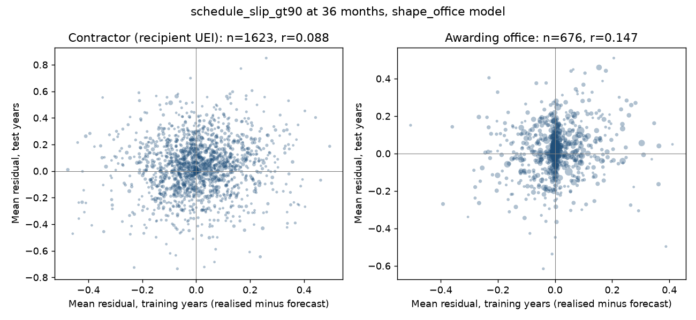
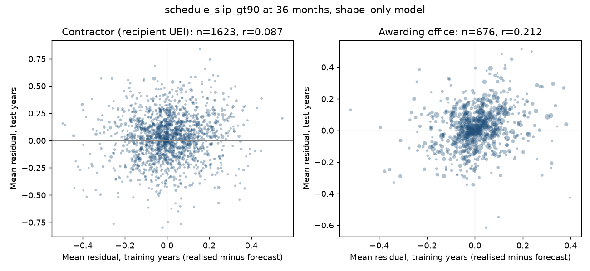
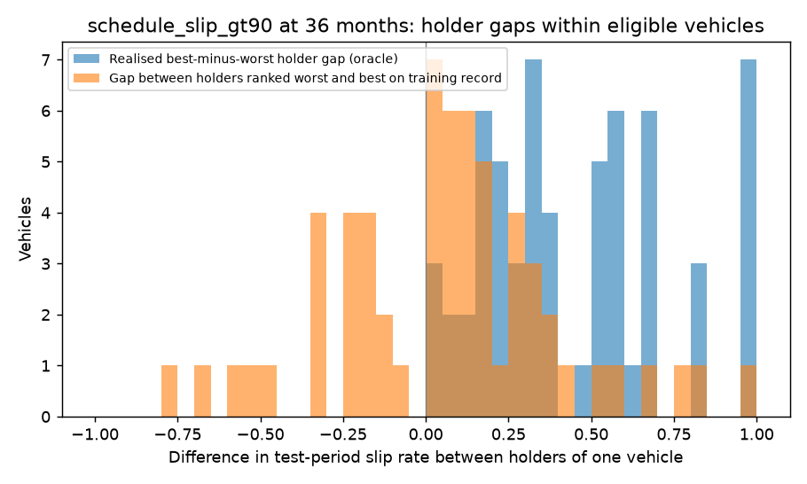
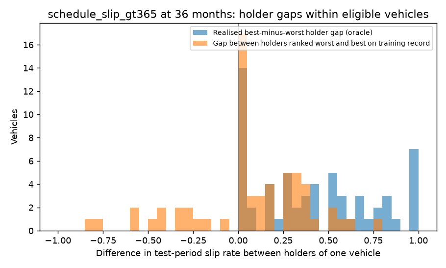
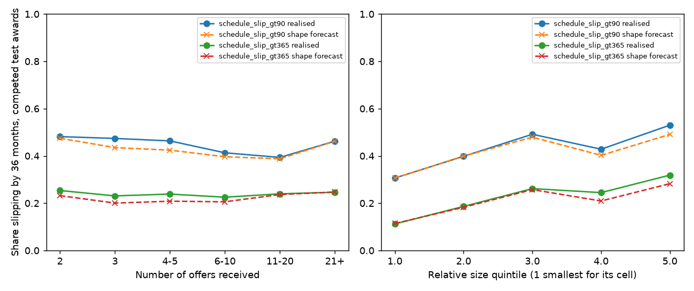

# How much of schedule slip is the bidder?

Two experiments on US federal contract data asking whether the identity of the contractor carries schedule-slip information once the contract is known, plus one look at the two pre-award numbers a losing bidder would also have had. Built 2026-09-16 on the definitive-contract panel of `usaspending/` and a new delivery-order extract. Every number is produced by a script in `bidders_us/src/` and reproduced by `make -C bidders_us all` from the repository root.

**Roughly 1 to 2 percent of the forecastable schedule-slip signal is the contractor, and the estimate is imprecise.** Once contract shape and the contracting office are known, the part of a contractor's mean residual that persists from the training years into the test years is 0.6 to 2.0 percent of the variance the contract-shape model already explains, per test award, across the four label-horizon cells (bootstrap intervals over contractors run from -0.2 to 3.2 percent; counting each contractor once instead of each award gives 1.4 to 2.7 percent). That is measured on the 1,623 contractors with at least five training and three test awards, who hold 37 percent of test awards. The office effect the model leaves behind is of the same size (0.8 to 1.1 percent). A contractor's training-period record ranks its own test awards at AUC 0.53 to 0.54 against a placebo of 0.50 to 0.51, and adding it to the model moves out-of-sample Brier skill by -0.4 to 0.3 percent of the model's skill. Within the test years alone the between-contractor share is larger (6 to 11 percent net of the within-office null), but most of that does not carry across years and so is not forecastable at award. Extending each contractor's record through the validation years (FY2018 to FY2019, still before every test award) roughly doubles the persistence: correlation 0.08 to 0.18, share of signal 1.2 to 4.0 percent, AUC of the record alone 0.55 to 0.57, and a skill gain of 0.0 to 1.2 percent of the model's skill. So a recent record carries a little more than a stale one, and the contractor is still a small part of the signal.

## What was built

1. **Experiment 1**, on the existing definitive-contract panel: a contract-shape forecast of schedule slip with nothing that identifies the recipient, and then four measurements of whether the residual it leaves has a contractor component that persists across the forward-chained split: residual persistence per contractor and per office, a variance decomposition with permutation nulls, within-office paired contrasts, and a placebo with contractor identities permuted within office.
2. **Experiment 2**, on a new extract of delivery orders (award type C) FY2010 to FY2026: the holders of a multiple-award vehicle as the observable competition set, order-level slip labels built with the same code as the definitive-contract panel, and forward-chained forecasts with and without each holder's record under the vehicle, scored within vehicle.
3. **Experiment 3**, on the existing panel: number of offers received and award size relative to its reference class as predictors of slip on competed awards.

## Labels and definitions

Schedule slip at horizon H months is `period_of_performance_current_end_date` on the latest action dated at or before the base action date plus H months, minus the same field on the base action, in days; the binary labels are slip over 90 days and over 365 days, at 24 and 36 months (Experiment 2 also at 12). The action ordering, the base-row rule and the qualification rule are those of `usaspending/src/panel.py`, imported unchanged. A residual is realised minus forecast on one award. The split is by base action fiscal year: train FY2010 to FY2017, validate FY2018 to FY2019, test FY2020 to FY2022; every model's iteration count, category map, quantile edge and shrinkage weight is chosen on the training or validation years. No test OUTCOME enters any choice; the one place test-year information enters at all is Experiment 2's vehicle eligibility rule, which counts test-year orders per vehicle, as the brief specifies, and is stated where it is used.

## Experiment 1: is there a contractor effect on slip, given the contract?

Setting. The definitive-contract panel from `usaspending/` (192,377 awards, base action FY2010 to FY2022, base obligation at least 250,000 dollars), split by base fiscal year into training (FY2010 to FY2017), validation (FY2018 to FY2019) and test (FY2020 to FY2022). A gradient boosting model is fitted on contract shape with nothing that identifies the recipient, and the question is whether the residual it leaves, realised minus forecast, has a contractor component that persists from the training years into the test years.

Two feature variants. `shape_office` is the usaspending `gbm_no_history` feature set minus the two recipient-keyed columns (the aggregate-recipient flag and the contracting officer's business size determination of the recipient); it keeps the awarding office as a feature, as the brief specifies. `shape_only` also drops the awarding office and sub-agency codes so the contractor and the office can be compared as residual effects on the same footing. Training-year predictions are five-fold cross-fitted within the training window (folds over awards, at the iteration count chosen on the validation years) so that the training residual of a large office is not understated by an in-sample fit. Validation and test predictions come from the model fitted on all training years.

### The contract-shape models

| Model | Label | H | n train | n test | Iterations | Train base rate | Test base rate | AUC train (cross-fit) | AUC test | BSS test | ECE test |
|---|---|---|---|---|---|---|---|---|---|---|---|
| contract shape with office identity | slip over 90 days | 24 | 123,233 | 39,917 | 280 | 0.402 | 0.456 | 0.840 | 0.838 | 0.350 | 0.024 |
| contract shape without office identity | slip over 90 days | 24 | 123,233 | 39,917 | 137 | 0.402 | 0.456 | 0.833 | 0.839 | 0.351 | 0.026 |
| contract shape with office identity | slip over 90 days | 36 | 123,233 | 39,917 | 258 | 0.442 | 0.502 | 0.842 | 0.838 | 0.354 | 0.023 |
| contract shape without office identity | slip over 90 days | 36 | 123,233 | 39,917 | 217 | 0.442 | 0.502 | 0.837 | 0.836 | 0.351 | 0.026 |
| contract shape with office identity | slip over 365 days | 24 | 123,233 | 39,917 | 106 | 0.162 | 0.207 | 0.867 | 0.860 | 0.363 | 0.020 |
| contract shape without office identity | slip over 365 days | 24 | 123,233 | 39,917 | 108 | 0.162 | 0.207 | 0.861 | 0.857 | 0.358 | 0.018 |
| contract shape with office identity | slip over 365 days | 36 | 123,233 | 39,917 | 133 | 0.224 | 0.281 | 0.864 | 0.856 | 0.382 | 0.023 |
| contract shape without office identity | slip over 365 days | 36 | 123,233 | 39,917 | 189 | 0.224 | 0.281 | 0.858 | 0.852 | 0.376 | 0.021 |

Source: `bidders_us/src/shape_model.py`, run from the repository root as `.venv/bin/python -m bidders_us.src.shape_model`.

The `shape_office` test AUCs match the usaspending `gbm_no_history` model to within 0.0008 (largest absolute difference over the four cells, read from `usaspending/results/model_results.json`), which is the check that removing the two recipient-keyed columns cost nothing.

### Contractor residual persistence

For each group with at least 5 training-year awards and at least 3 test-year awards, the mean residual in each period. Correlation across groups, unweighted and weighted by the group's test awards, with a 95 percent percentile bootstrap interval over groups (2,000 draws). The AUC columns score, on the test awards of those groups, the training-period mean residual alone, the model alone, and the model with the shrunk training residual added on the probability scale; the shrinkage weight k (residual times n/(n+k)) is chosen by Brier score on the validation years. The placebo repeats the correlation with contractor labels permuted within office over every award, 100 times.

#### Contract shape with office identity

| Label | H | Group | Groups | Test awards | r unweighted [95%] | r weighted [95%] | Spearman | AUC residual alone | AUC model | AUC model + residual | BSS model | BSS model + residual | k | Placebo r, mean [95% range] |
|---|---|---|---|---|---|---|---|---|---|---|---|---|---|---|
| slip over 90 days | 24 | recipient UEI | 1,623 | 14,708 | 0.078 [0.022, 0.136] | 0.070 [0.017, 0.130] | 0.063 | 0.532 | 0.864 | 0.864 | 0.3837 | 0.3840 | 50 | 0.005 [-0.040, 0.049] |
| slip over 90 days | 24 | recipient UEI, record through FY2019 | 2,100 | 18,331 | 0.160 [0.115, 0.205] | 0.161 [0.115, 0.209] |  | 0.563 | 0.861 | 0.863 | 0.3796 | 0.3833 | 50 |  |
| slip over 90 days | 24 | recipient parent UEI | 1,446 | 15,874 | 0.085 [0.031, 0.139] | 0.070 [0.013, 0.126] | 0.073 | 0.529 | 0.862 | 0.862 | 0.3832 | 0.3831 | 50 |  |
| slip over 90 days | 24 | recipient name | 1,579 | 15,349 | 0.076 [0.019, 0.132] | 0.071 [0.015, 0.127] | 0.066 | 0.526 | 0.863 | 0.863 | 0.3814 | 0.3820 | 50 |  |
| slip over 90 days | 24 | awarding office | 676 | 34,380 | 0.150 [0.064, 0.239] | 0.145 [0.067, 0.226] | 0.123 | 0.552 | 0.844 | 0.844 | 0.3558 | 0.3573 | 50 |  |
| slip over 90 days | 24 | awarding office, record through FY2019 | 812 | 37,280 | 0.241 [0.157, 0.325] | 0.343 [0.250, 0.432] |  | 0.572 | 0.841 | 0.843 | 0.3512 | 0.3575 | 50 |  |
| slip over 90 days | 36 | recipient UEI | 1,623 | 14,708 | 0.088 [0.032, 0.147] | 0.094 [0.036, 0.155] | 0.088 | 0.541 | 0.868 | 0.868 | 0.4013 | 0.4026 | 50 | 0.005 [-0.040, 0.050] |
| slip over 90 days | 36 | recipient UEI, record through FY2019 | 2,100 | 18,331 | 0.178 [0.132, 0.222] | 0.183 [0.135, 0.231] |  | 0.575 | 0.865 | 0.866 | 0.3957 | 0.4004 | 50 |  |
| slip over 90 days | 36 | recipient parent UEI | 1,446 | 15,874 | 0.092 [0.034, 0.148] | 0.084 [0.024, 0.143] | 0.093 | 0.545 | 0.864 | 0.864 | 0.3956 | 0.3958 | 50 |  |
| slip over 90 days | 36 | recipient name | 1,579 | 15,349 | 0.093 [0.035, 0.146] | 0.099 [0.040, 0.155] | 0.101 | 0.529 | 0.865 | 0.866 | 0.3964 | 0.3978 | 50 |  |
| slip over 90 days | 36 | awarding office | 676 | 34,380 | 0.147 [0.051, 0.238] | 0.153 [0.068, 0.239] | 0.159 | 0.532 | 0.843 | 0.844 | 0.3618 | 0.3635 | 50 |  |
| slip over 90 days | 36 | awarding office, record through FY2019 | 812 | 37,280 | 0.279 [0.198, 0.357] | 0.341 [0.252, 0.428] |  | 0.568 | 0.840 | 0.843 | 0.3546 | 0.3610 | 50 |  |
| slip over 365 days | 24 | recipient UEI | 1,623 | 14,708 | 0.055 [0.009, 0.104] | 0.038 [-0.010, 0.085] | 0.058 | 0.528 | 0.876 | 0.874 | 0.3573 | 0.3559 | 50 | 0.003 [-0.037, 0.037] |
| slip over 365 days | 24 | recipient UEI, record through FY2019 | 2,100 | 18,331 | 0.082 [0.030, 0.132] | 0.070 [0.022, 0.116] |  | 0.549 | 0.871 | 0.870 | 0.3475 | 0.3477 | 50 |  |
| slip over 365 days | 24 | recipient parent UEI | 1,446 | 15,874 | 0.053 [0.001, 0.106] | 0.043 [-0.008, 0.093] | 0.058 | 0.518 | 0.875 | 0.875 | 0.3672 | 0.3674 | 100 |  |
| slip over 365 days | 24 | recipient name | 1,579 | 15,349 | 0.052 [0.002, 0.101] | 0.036 [-0.013, 0.084] | 0.046 | 0.521 | 0.875 | 0.872 | 0.3567 | 0.3554 | 50 |  |
| slip over 365 days | 24 | awarding office | 676 | 34,380 | 0.095 [0.011, 0.177] | 0.134 [0.058, 0.212] | 0.120 | 0.557 | 0.866 | 0.866 | 0.3705 | 0.3712 | 200 |  |
| slip over 365 days | 24 | awarding office, record through FY2019 | 812 | 37,280 | 0.150 [0.059, 0.243] | 0.310 [0.196, 0.417] |  | 0.572 | 0.862 | 0.866 | 0.3648 | 0.3689 | 200 |  |
| slip over 365 days | 36 | recipient UEI | 1,623 | 14,708 | 0.064 [0.012, 0.115] | 0.066 [0.013, 0.118] | 0.069 | 0.534 | 0.865 | 0.865 | 0.3585 | 0.3587 | 100 | 0.006 [-0.038, 0.051] |
| slip over 365 days | 36 | recipient UEI, record through FY2019 | 2,100 | 18,331 | 0.148 [0.099, 0.195] | 0.151 [0.106, 0.199] |  | 0.560 | 0.864 | 0.865 | 0.3590 | 0.3614 | 100 |  |
| slip over 365 days | 36 | recipient parent UEI | 1,446 | 15,874 | 0.080 [0.025, 0.138] | 0.076 [0.024, 0.133] | 0.077 | 0.537 | 0.863 | 0.863 | 0.3682 | 0.3687 | 100 |  |
| slip over 365 days | 36 | recipient name | 1,579 | 15,349 | 0.076 [0.026, 0.130] | 0.071 [0.021, 0.124] | 0.077 | 0.530 | 0.863 | 0.863 | 0.3560 | 0.3553 | 50 |  |
| slip over 365 days | 36 | awarding office | 676 | 34,380 | 0.142 [0.056, 0.226] | 0.132 [0.015, 0.242] | 0.115 | 0.535 | 0.861 | 0.862 | 0.3874 | 0.3886 | 50 |  |
| slip over 365 days | 36 | awarding office, record through FY2019 | 812 | 37,280 | 0.249 [0.165, 0.334] | 0.356 [0.235, 0.474] |  | 0.557 | 0.858 | 0.862 | 0.3825 | 0.3896 | 50 |  |

The rows marked "record through FY2019" extend the group's record to the validation years, which all precede the test awards; k is unchanged. They are the closer analogue of a live forecaster using everything on file at award.

#### Contract shape without office identity

| Label | H | Group | Groups | Test awards | r unweighted [95%] | r weighted [95%] | Spearman | AUC residual alone | AUC model | AUC model + residual | BSS model | BSS model + residual | k | Placebo r, mean [95% range] |
|---|---|---|---|---|---|---|---|---|---|---|---|---|---|---|
| slip over 90 days | 24 | recipient UEI | 1,623 | 14,708 | 0.086 [0.031, 0.143] | 0.090 [0.036, 0.147] | 0.076 | 0.546 | 0.864 | 0.864 | 0.3814 | 0.3827 | 50 | 0.014 [-0.038, 0.063] |
| slip over 90 days | 24 | recipient UEI, record through FY2019 | 2,100 | 18,331 | 0.179 [0.132, 0.224] | 0.189 [0.143, 0.235] |  | 0.572 | 0.861 | 0.863 | 0.3775 | 0.3829 | 50 |  |
| slip over 90 days | 24 | recipient parent UEI | 1,446 | 15,874 | 0.099 [0.043, 0.152] | 0.092 [0.036, 0.145] | 0.094 | 0.538 | 0.862 | 0.863 | 0.3821 | 0.3829 | 50 |  |
| slip over 90 days | 24 | recipient name | 1,579 | 15,349 | 0.087 [0.033, 0.140] | 0.092 [0.038, 0.147] | 0.081 | 0.541 | 0.862 | 0.862 | 0.3782 | 0.3798 | 50 |  |
| slip over 90 days | 24 | awarding office | 676 | 34,380 | 0.217 [0.135, 0.301] | 0.273 [0.194, 0.347] | 0.217 | 0.554 | 0.844 | 0.845 | 0.3575 | 0.3609 | 50 |  |
| slip over 90 days | 24 | awarding office, record through FY2019 | 812 | 37,280 | 0.285 [0.205, 0.364] | 0.401 [0.327, 0.473] |  | 0.569 | 0.841 | 0.845 | 0.3534 | 0.3612 | 50 |  |
| slip over 90 days | 36 | recipient UEI | 1,623 | 14,708 | 0.087 [0.033, 0.146] | 0.105 [0.050, 0.162] | 0.080 | 0.550 | 0.865 | 0.866 | 0.3958 | 0.3973 | 50 | 0.014 [-0.037, 0.065] |
| slip over 90 days | 36 | recipient UEI, record through FY2019 | 2,100 | 18,331 | 0.190 [0.144, 0.235] | 0.203 [0.153, 0.253] |  | 0.580 | 0.861 | 0.864 | 0.3898 | 0.3953 | 50 |  |
| slip over 90 days | 36 | recipient parent UEI | 1,446 | 15,874 | 0.106 [0.050, 0.161] | 0.106 [0.047, 0.163] | 0.099 | 0.544 | 0.861 | 0.862 | 0.3907 | 0.3914 | 50 |  |
| slip over 90 days | 36 | recipient name | 1,579 | 15,349 | 0.096 [0.039, 0.147] | 0.110 [0.057, 0.166] | 0.094 | 0.544 | 0.862 | 0.863 | 0.3895 | 0.3912 | 50 |  |
| slip over 90 days | 36 | awarding office | 676 | 34,380 | 0.212 [0.122, 0.302] | 0.281 [0.197, 0.358] | 0.238 | 0.565 | 0.842 | 0.844 | 0.3594 | 0.3632 | 50 |  |
| slip over 90 days | 36 | awarding office, record through FY2019 | 812 | 37,280 | 0.321 [0.241, 0.399] | 0.410 [0.321, 0.493] |  | 0.578 | 0.838 | 0.842 | 0.3520 | 0.3602 | 50 |  |
| slip over 365 days | 24 | recipient UEI | 1,623 | 14,708 | 0.059 [0.012, 0.109] | 0.048 [0.001, 0.096] | 0.065 | 0.533 | 0.872 | 0.870 | 0.3483 | 0.3472 | 50 | 0.013 [-0.024, 0.052] |
| slip over 365 days | 24 | recipient UEI, record through FY2019 | 2,100 | 18,331 | 0.103 [0.051, 0.152] | 0.092 [0.045, 0.139] |  | 0.554 | 0.867 | 0.866 | 0.3386 | 0.3391 | 50 |  |
| slip over 365 days | 24 | recipient parent UEI | 1,446 | 15,874 | 0.056 [0.004, 0.109] | 0.049 [-0.001, 0.097] | 0.069 | 0.522 | 0.872 | 0.871 | 0.3610 | 0.3608 | 50 |  |
| slip over 365 days | 24 | recipient name | 1,579 | 15,349 | 0.056 [0.004, 0.107] | 0.044 [-0.006, 0.090] | 0.060 | 0.527 | 0.871 | 0.869 | 0.3488 | 0.3476 | 50 |  |
| slip over 365 days | 24 | awarding office | 676 | 34,380 | 0.118 [0.040, 0.196] | 0.228 [0.138, 0.321] | 0.162 | 0.534 | 0.863 | 0.864 | 0.3656 | 0.3686 | 100 |  |
| slip over 365 days | 24 | awarding office, record through FY2019 | 812 | 37,280 | 0.186 [0.098, 0.271] | 0.377 [0.286, 0.457] |  | 0.565 | 0.859 | 0.864 | 0.3597 | 0.3671 | 100 |  |
| slip over 365 days | 36 | recipient UEI | 1,623 | 14,708 | 0.062 [0.011, 0.114] | 0.066 [0.014, 0.120] | 0.069 | 0.531 | 0.861 | 0.861 | 0.3523 | 0.3522 | 100 | 0.017 [-0.029, 0.058] |
| slip over 365 days | 36 | recipient UEI, record through FY2019 | 2,100 | 18,331 | 0.151 [0.101, 0.197] | 0.152 [0.104, 0.201] |  | 0.554 | 0.859 | 0.861 | 0.3506 | 0.3526 | 100 |  |
| slip over 365 days | 36 | recipient parent UEI | 1,446 | 15,874 | 0.082 [0.028, 0.139] | 0.076 [0.023, 0.133] | 0.082 | 0.536 | 0.861 | 0.861 | 0.3648 | 0.3649 | 100 |  |
| slip over 365 days | 36 | recipient name | 1,579 | 15,349 | 0.071 [0.021, 0.125] | 0.068 [0.016, 0.122] | 0.072 | 0.528 | 0.859 | 0.859 | 0.3495 | 0.3492 | 100 |  |
| slip over 365 days | 36 | awarding office | 676 | 34,380 | 0.170 [0.091, 0.248] | 0.229 [0.134, 0.322] | 0.167 | 0.529 | 0.858 | 0.860 | 0.3821 | 0.3855 | 50 |  |
| slip over 365 days | 36 | awarding office, record through FY2019 | 812 | 37,280 | 0.271 [0.192, 0.345] | 0.421 [0.319, 0.509] |  | 0.545 | 0.854 | 0.859 | 0.3767 | 0.3861 | 50 |  |

The rows marked "record through FY2019" extend the group's record to the validation years, which all precede the test awards; k is unchanged. They are the closer analogue of a live forecaster using everything on file at award.

Source: `bidders_us/src/exp1.py`, run from the repository root as `.venv/bin/python -m bidders_us.src.exp1`.





### Variance decomposition of the test residual

Three estimators of the between-group variance of the residual on the test rows, each divided by (model explained variance + itself) to give a share of the forecastable signal. Model explained variance is the variance of the outcome minus the model's Brier score. Every permutation null shuffles contractor labels within office (20 draws), so a pseudo-contractor inherits its office's residual; a null far from zero therefore measures how much office effect a contractor grouping picks up by construction, and the contractor estimate is to be read against it. The one-way ANOVA (method of moments) also assumes equal within-group variance, which the residual of a binary outcome does not have, and its null is the largest of the three. The split-half estimator is the covariance of two random half-means within the test period (groups with at least two test awards) and needs no such assumption, but it counts effects that hold within FY2020 to FY2022 and vanish afterwards. The cross-period estimator is the covariance of the training-period and test-period group means over the persistence table, which is the part a forecaster at award could use; its bootstrap interval over groups is in the persistence tables below and is wide.

| Model | Label | H | n test | Var(y) | Model explained | Contractor cross-period cov | Contractor share, per contractor | Contractor share, per award [95% bootstrap] | Null share [95%] | Office cross-period cov | Office share, per contractor | Office share, per award [95% bootstrap] | Contractor split-half share | Null split-half share [95%] | Office split-half share | Contractor ANOVA share | Null ANOVA share [95%] | Office ANOVA share |
|---|---|---|---|---|---|---|---|---|---|---|---|---|---|---|---|---|---|---|
| contract shape with office identity | slip over 90 days | 24 | 39,917 | 0.2481 | 0.0849 | 0.00207 | 0.024 | 0.015 [0.004, 0.027] | 0.001 [-0.010, 0.013] | 0.00216 | 0.025 | 0.010 [0.004, 0.017] | 0.130 | 0.041 [0.020, 0.069] | 0.128 | 0.176 | 0.111 [0.098, 0.123] | 0.073 |
| contract shape with office identity | slip over 90 days | 36 | 39,917 | 0.2500 | 0.0862 | 0.00241 | 0.027 | 0.020 [0.008, 0.032] | 0.002 [-0.008, 0.016] | 0.00227 | 0.026 | 0.011 [0.005, 0.019] | 0.149 | 0.039 [0.023, 0.059] | 0.124 | 0.189 | 0.109 [0.096, 0.121] | 0.076 |
| contract shape with office identity | slip over 365 days | 24 | 39,917 | 0.1639 | 0.0582 | 0.00083 | 0.014 | 0.006 [-0.002, 0.014] | 0.001 [-0.008, 0.009] | 0.00091 | 0.015 | 0.008 [0.004, 0.014] | 0.092 | 0.034 [-0.004, 0.071] | 0.103 | 0.154 | 0.117 [0.101, 0.132] | 0.063 |
| contract shape with office identity | slip over 365 days | 36 | 39,917 | 0.2023 | 0.0753 | 0.00140 | 0.018 | 0.013 [0.003, 0.023] | 0.002 [-0.007, 0.008] | 0.00164 | 0.021 | 0.008 [0.001, 0.017] | 0.122 | 0.037 [0.013, 0.058] | 0.106 | 0.156 | 0.092 [0.078, 0.105] | 0.063 |
| contract shape without office identity | slip over 90 days | 24 | 39,917 | 0.2481 | 0.0852 | 0.00239 | 0.027 | 0.020 [0.008, 0.032] | 0.003 [-0.010, 0.016] | 0.00351 | 0.040 | 0.023 [0.015, 0.032] | 0.137 | 0.042 [0.022, 0.071] | 0.133 | 0.178 | 0.110 [0.096, 0.121] | 0.076 |
| contract shape without office identity | slip over 90 days | 36 | 39,917 | 0.2500 | 0.0854 | 0.00250 | 0.028 | 0.024 [0.011, 0.036] | 0.005 [-0.005, 0.019] | 0.00357 | 0.040 | 0.025 [0.016, 0.035] | 0.159 | 0.040 [0.022, 0.062] | 0.135 | 0.196 | 0.111 [0.099, 0.123] | 0.082 |
| contract shape without office identity | slip over 365 days | 24 | 39,917 | 0.1639 | 0.0574 | 0.00091 | 0.016 | 0.008 [0.000, 0.017] | 0.003 [-0.007, 0.012] | 0.00118 | 0.020 | 0.017 [0.010, 0.026] | 0.099 | 0.038 [0.003, 0.076] | 0.109 | 0.158 | 0.121 [0.104, 0.135] | 0.073 |
| contract shape without office identity | slip over 365 days | 36 | 39,917 | 0.2023 | 0.0740 | 0.00139 | 0.018 | 0.013 [0.003, 0.024] | 0.004 [-0.005, 0.011] | 0.00208 | 0.027 | 0.017 [0.009, 0.026] | 0.128 | 0.042 [0.018, 0.065] | 0.113 | 0.161 | 0.098 [0.083, 0.113] | 0.073 |

Fixed-effects regressions of the same residual, R squared and adjusted R squared, with the permutation null for the two-way fit:

| Model | Label | H | Contractor FE R2 / adj | Office FE R2 / adj | Both R2 / adj | Both, null R2 / adj | Contractors | Offices |
|---|---|---|---|---|---|---|---|---|
| contract shape with office identity | slip over 90 days | 24 | 0.445 / 0.111 | 0.075 / 0.040 | 0.488 / 0.136 | 0.461 / 0.092 | 14,921 | 1,441 |
| contract shape with office identity | slip over 90 days | 36 | 0.452 / 0.123 | 0.077 / 0.043 | 0.496 / 0.150 | 0.462 / 0.093 | 14,921 | 1,441 |
| contract shape with office identity | slip over 365 days | 24 | 0.438 / 0.101 | 0.072 / 0.037 | 0.481 / 0.124 | 0.466 / 0.100 | 14,921 | 1,441 |
| contract shape with office identity | slip over 365 days | 36 | 0.444 / 0.110 | 0.074 / 0.040 | 0.488 / 0.137 | 0.458 / 0.086 | 14,921 | 1,441 |
| contract shape without office identity | slip over 90 days | 24 | 0.447 / 0.114 | 0.077 / 0.043 | 0.490 / 0.141 | 0.461 / 0.092 | 14,921 | 1,441 |
| contract shape without office identity | slip over 90 days | 36 | 0.455 / 0.127 | 0.081 / 0.046 | 0.499 / 0.155 | 0.463 / 0.095 | 14,921 | 1,441 |
| contract shape without office identity | slip over 365 days | 24 | 0.439 / 0.101 | 0.076 / 0.042 | 0.483 / 0.129 | 0.469 / 0.104 | 14,921 | 1,441 |
| contract shape without office identity | slip over 365 days | 36 | 0.444 / 0.110 | 0.080 / 0.045 | 0.489 / 0.139 | 0.461 / 0.091 | 14,921 | 1,441 |

Source: `bidders_us/src/exp1.py`, run from the repository root as `.venv/bin/python -m bidders_us.src.exp1`.

### Within-office contrasts

Test awards in the same awarding office, PSC letter and base fiscal year, within one training-period decile of log10 base obligation of each other, from different contractors, where one slipped and the other did not. A pair is correct when the contractor with the lower training-period mean residual (contractors with at least 5 training awards) is the one that did not slip; ties count one half. The null shuffles contractor labels within office among the test awards that carry a signal, 200 times.

| Model | Label | H | Test awards with a signal | Pairs | Discordant pairs | Accuracy | Null mean [95% range] | p (one-sided) | Same decile only |
|---|---|---|---|---|---|---|---|---|---|
| contract shape with office identity | slip over 90 days | 24 | 16,520 | 351,089 | 28,544 | 0.519 | 0.500 [0.472, 0.524] | 0.114 | 0.529 (n=13,987) |
| contract shape with office identity | slip over 90 days | 36 | 16,520 | 351,089 | 25,197 | 0.551 | 0.500 [0.469, 0.533] | < 0.005 | 0.555 (n=12,441) |
| contract shape with office identity | slip over 365 days | 24 | 16,520 | 351,089 | 16,062 | 0.508 | 0.501 [0.467, 0.533] | 0.308 | 0.526 (n=6,863) |
| contract shape with office identity | slip over 365 days | 36 | 16,520 | 351,089 | 22,402 | 0.528 | 0.501 [0.475, 0.527] | 0.030 | 0.545 (n=11,067) |
| contract shape without office identity | slip over 90 days | 24 | 16,520 | 351,089 | 28,544 | 0.535 | 0.501 [0.471, 0.528] | 0.010 | 0.543 (n=13,987) |
| contract shape without office identity | slip over 90 days | 36 | 16,520 | 351,089 | 25,197 | 0.559 | 0.501 [0.465, 0.532] | < 0.005 | 0.563 (n=12,441) |
| contract shape without office identity | slip over 365 days | 24 | 16,520 | 351,089 | 16,062 | 0.521 | 0.501 [0.471, 0.533] | 0.149 | 0.535 (n=6,863) |
| contract shape without office identity | slip over 365 days | 36 | 16,520 | 351,089 | 22,402 | 0.535 | 0.501 [0.476, 0.526] | 0.010 | 0.547 (n=11,067) |

Source: `bidders_us/src/exp1.py`, run from the repository root as `.venv/bin/python -m bidders_us.src.exp1`.

### Placebo: contractor identities permuted within office

Step 2 repeated with recipient UEIs shuffled among the awards of each office (all periods), 100 times. The pseudo-contractors inherit their office's residual and nothing else.

| Model | Label | H | r unweighted, real | r unweighted, placebo [95%] | r weighted, real | r weighted, placebo [95%] | AUC residual alone, real | AUC, placebo [95%] |
|---|---|---|---|---|---|---|---|---|
| contract shape with office identity | slip over 90 days | 24 | 0.078 | 0.005 [-0.040, 0.049] | 0.070 | 0.007 [-0.029, 0.047] | 0.532 | 0.506 [0.492, 0.521] |
| contract shape with office identity | slip over 90 days | 36 | 0.088 | 0.005 [-0.040, 0.050] | 0.094 | 0.008 [-0.028, 0.055] | 0.541 | 0.507 [0.496, 0.522] |
| contract shape with office identity | slip over 365 days | 24 | 0.055 | 0.003 [-0.037, 0.037] | 0.038 | 0.007 [-0.030, 0.044] | 0.528 | 0.503 [0.489, 0.518] |
| contract shape with office identity | slip over 365 days | 36 | 0.064 | 0.006 [-0.038, 0.051] | 0.066 | 0.009 [-0.034, 0.052] | 0.534 | 0.502 [0.489, 0.518] |
| contract shape without office identity | slip over 90 days | 24 | 0.086 | 0.014 [-0.038, 0.063] | 0.090 | 0.020 [-0.022, 0.060] | 0.546 | 0.515 [0.504, 0.530] |
| contract shape without office identity | slip over 90 days | 36 | 0.087 | 0.014 [-0.037, 0.065] | 0.105 | 0.021 [-0.023, 0.072] | 0.550 | 0.516 [0.504, 0.530] |
| contract shape without office identity | slip over 365 days | 24 | 0.059 | 0.013 [-0.024, 0.052] | 0.048 | 0.018 [-0.010, 0.060] | 0.533 | 0.507 [0.493, 0.521] |
| contract shape without office identity | slip over 365 days | 36 | 0.062 | 0.017 [-0.029, 0.058] | 0.066 | 0.022 [-0.021, 0.061] | 0.531 | 0.506 [0.492, 0.522] |

Source: `bidders_us/src/exp1.py`, run from the repository root as `.venv/bin/python -m bidders_us.src.exp1`.

## Experiment 2: holders of the same multiple-award vehicle as a competition set

### The delivery-order extract

| Fiscal year | Archive rows, all types | Delivery-order actions | Base-action rows | Base share of actions | Base-action rows >= 250,000 | Share >= 250,000 | Distinct vehicles, all sizes | Orders with a qualifying base row this year | Rows kept | Zip GB | Parquet MB |
|---|---|---|---|---|---|---|---|---|---|---|---|
| 2010 | 3,543,905 | 1,955,587 | 1,436,026 | 0.73 | 72,579 | 0.051 | 76,505 | 72,239 | 120,781 | n/a | 7.8 |
| 2011 | 3,408,506 | 1,761,089 | 1,204,055 | 0.68 | 65,506 | 0.054 | 70,138 | 65,199 | 186,214 | n/a | 11.3 |
| 2012 | 3,129,630 | 1,599,188 | 1,071,915 | 0.67 | 61,939 | 0.058 | 61,182 | 61,718 | 206,792 | n/a | 12.5 |
| 2013 | 2,515,087 | 1,209,246 | 731,215 | 0.60 | 53,475 | 0.073 | 56,132 | 53,325 | 210,871 | n/a | 12.7 |
| 2014 | 2,528,542 | 1,228,713 | 769,261 | 0.63 | 58,602 | 0.076 | 55,212 | 58,441 | 216,510 | n/a | 13.2 |
| 2015 | 4,375,319 | 2,866,091 | 2,387,512 | 0.83 | 57,264 | 0.024 | 57,638 | 57,078 | 224,544 | n/a | 13.9 |
| 2016 | 4,821,964 | 3,248,823 | 2,761,732 | 0.85 | 58,071 | 0.021 | 55,874 | 57,873 | 227,674 | n/a | 14.2 |
| 2017 | 4,913,345 | 3,287,371 | 2,740,703 | 0.83 | 58,798 | 0.021 | 56,577 | 58,561 | 237,984 | n/a | 15.4 |
| 2018 | 5,619,630 | 4,041,224 | 3,543,307 | 0.88 | 64,135 | 0.018 | 57,938 | 63,862 | 247,364 | n/a | 16.8 |
| 2019 | 6,488,828 | 4,389,440 | 3,888,167 | 0.89 | 65,077 | 0.017 | 60,647 | 64,913 | 250,129 | n/a | 17.4 |
| 2020 | 6,306,607 | 4,138,818 | 3,611,666 | 0.87 | 65,318 | 0.018 | 60,619 | 65,170 | 268,660 | n/a | 18.7 |
| 2021 | 6,405,488 | 4,309,560 | 3,797,785 | 0.88 | 63,057 | 0.017 | 66,809 | 62,932 | 274,240 | n/a | 19.1 |
| 2022 | 6,668,009 | 4,491,218 | 3,959,896 | 0.88 | 65,902 | 0.017 | 65,942 | 65,768 | 278,439 | 1.99 | 19.4 |
| 2023 | 6,693,769 | 4,535,168 | 4,027,228 | 0.89 | 69,605 | 0.017 | 63,471 | 69,479 | 282,429 | 1.96 | 19.8 |
| 2024 | 6,692,741 | 4,535,885 | 4,008,344 | 0.88 | 69,800 | 0.017 | 60,806 | 69,662 | 292,726 | 1.94 | 20.5 |
| 2025 | 6,639,176 | 4,498,972 | 3,989,592 | 0.89 | 64,564 | 0.016 | 58,186 | 64,430 | 290,150 | 1.91 | 20.2 |
| 2026 | 4,705,099 | 3,128,084 | 2,778,829 | 0.89 | 42,645 | 0.015 | 48,325 | 42,576 | 188,366 | 1.38 | 13.4 |

Totals over the years fetched: 55,224,477 delivery-order actions, 46,707,233 base-action rows of any size, 1,053,217 distinct orders kept at or above the threshold (the union of the per-year kept-key files; an order whose qualifying base row appears in two years is counted once). Zip sizes ran from 1.38 to 1.99 GB where recorded. The parquet extract is 0.27 GB.

Base-action rows are counted per transaction row, so a base action reported in several transaction rows counts once per row. The base share of delivery-order actions is 0.60 to 0.73 in FY2010 to FY2014 and 0.83 to 0.89 from FY2015, and the share of base-action rows at or above the threshold is 0.051 to 0.076 before FY2015 and 0.015 to 0.024 from FY2015. That is a change in the reporting of delivery orders at FY2015 whose cause was not investigated here; the definitive-contract counts in the usaspending report show no comparable jump.

The archive file for each fiscal year is whatever `list_monthly_files` returned on the day; the date stamps observed in the file names are 20260906, 20260907, so the extract is a snapshot as of those dates, not a first print.

Source: `bidders_us/src/fetch_orders.py`, run from the repository root as `.venv/bin/python -m bidders_us.src.fetch_orders`.

### Order panel funnel

The filter names are those of `usaspending/src/panel.py`, which built this panel; "award" there means a delivery order here.

| Filter | Orders remaining |
|---|---|
| start: one base row per delivery order (award_type_code C) | 1,053,217 |
| award has an action with an explicit modification_number of zero | 1,053,217 |
| that modification-zero action is the award's first action | 1,053,214 |
| base action_date in FY2010-FY2022 | 807,073 |
| exactly one action carries a modification_number of zero | 798,984 |
| base federal_action_obligation >= 250,000 | 798,984 |
| base period_of_performance_current_end_date is not null | 798,984 |
| base_and_all_options_value > 0 and not null | 798,977 |

Fiscal years loaded 2010 to 2026; data end 2026-09-04; 4,003,873 actions loaded; history source 807,073 orders, of which 4,113 booked to an aggregate placeholder recipient; panel 798,977 orders under 104,993 distinct vehicles.

Source: `bidders_us/src/orders_panel.py`, run from the repository root as `.venv/bin/python -m bidders_us.src.orders_panel`.

### What a vehicle is

An order's `parent_award_id_piid` names the holder's own contract. Measured on the order panel, 103,491 of 104,993 distinct parent PIIDs carry exactly one recipient (the count is in `orders_funnel.json` and `logs/exp2_run.out` of the first run), so grouping orders by parent PIID gives no competition set: one vehicle passed the eligibility rule on that definition. In FPDS a multiple-award vehicle is one contract per awardee, and the holders that compete for an order are the holders of the sibling contracts awarded from the same solicitation. The sibling link lives on the IDV records, fetched separately: an IDV whose multiple-or-single-award flag is M and whose solicitation identifier passes a shape test (at least eight characters, a letter and a digit, not a placeholder) is assigned to the program keyed on its FPDS agencyID and normalised solicitation; a program with at least two contracts and two recipients is a sibling set. This is an inference from two FPDS fields, not FPDS's own notion of a vehicle, and its coverage is measured below.

| Fiscal year | IDV actions | Distinct IDVs | Parquet MB | Error |
|---|---|---|---|---|
| 2005 | 82,727 | 62,962 | 4.2 |  |
| 2006 | 81,754 | 56,565 | 4.4 |  |
| 2007 | 108,770 | 65,109 | 5.7 |  |
| 2008 | 117,978 | 71,615 | 5.8 |  |
| 2009 | 155,253 | 83,177 | 7.3 |  |
| 2010 | 177,342 | 88,380 | 8.1 |  |
| 2011 | 186,592 | 92,921 | 9.7 |  |
| 2012 | 186,580 | 93,632 | 9.6 |  |
| 2013 | 204,967 | 101,799 | 10.6 |  |
| 2014 | 204,159 | 102,365 | 10.6 |  |
| 2015 | 204,704 | 101,205 | 9.0 |  |
| 2016 | 207,319 | 100,649 | 9.6 |  |
| 2017 | 207,107 | 102,189 | 9.5 |  |
| 2018 | 222,099 | 98,017 | 9.7 |  |
| 2019 | 201,776 | 97,364 | 9.0 |  |
| 2020 | 266,972 | 110,268 | 11.4 |  |
| 2021 | 228,754 | 110,910 | 10.3 |  |
| 2022 | 252,733 | 106,031 | 11.4 |  |
| 2023 | 244,608 | 107,531 | 11.2 |  |
| 2024 | 260,985 | 105,440 | 11.7 |  |
| 2025 | 311,919 | 111,710 | 13.3 |  |
| 2026 | 250,466 | 97,960 | 11.2 |  |

Source: `bidders_us/src/fetch_idvs.py`, run from the repository root as `.venv/bin/python -m bidders_us.src.fetch_idvs`.

| Quantity | Value |
|---|---|
| IDV actions loaded | 4,365,564 |
| Distinct IDVs | 838,888 |
| Multiple-or-single flag counts | S: 495,659, M: 293,188, NA: 50,040, A: 1 |
| IDV type counts | B: 501,940, E: 240,816, C: 60,202, D: 29,029, A: 6,901 |
| IDVs with a solicitation identifier | 396,878 |
| Of which usable under the shape test | 391,043 |
| IDVs in a sibling set | 145,502 |
| Sibling sets (programs) | 11,569 |
| Contracts per program: median, p75, max | 4, 6, 8888 |
| Recipients per program: median, p75, max | 4, 6, 8735 |
| Panel orders with a parent | 798,975 |
| Of which the parent is matched to an IDV record | 789,884 |
| Of which the parent is in a sibling set | 195,604 |

Source: `bidders_us/src/vehicle_map.py`, run from the repository root as `.venv/bin/python -m bidders_us.src.vehicle_map`.

### Eligible vehicles

Rule: a sibling set whose orders carry the multiple-award flag, with at least 30 in-scope orders from at least 3 distinct holders in the training years, and at least 10 in-scope orders in the test years.

| Quantity | Value |
|---|---|
| Orders in panel | 798,977 |
| Orders with a parent vehicle | 798,975 |
| Orders with an identified holder (not an aggregate placeholder) | 794,865 |
| Distinct vehicles in panel | 82,868 |
| Vehicles passing the count rule | 81 |
| Of those, not a sibling set or not flagged multiple-award on their orders (set aside) | 0 () |
| Eligible vehicles | 81 |
| Their training orders | 33,143 |
| Their test orders | 21,605 |
| Median holders per eligible vehicle, in-scope orders, training years | 21.0 |
| Median holders per eligible vehicle, base-action rows of any size, training years | 57.0 |
| Referenced IDV type of eligible vehicles | B: 40, C: 36, A: 5 |
| Single or multiple award flag of eligible vehicles | M: 81 |

The twelve largest eligible programs by training-year orders (the key is FPDS agencyID and normalised solicitation identifier; the holder counts are on in-scope orders and, in the last column, on base-action rows of any size):

| Program | IDV type | Train orders | Train holders | Test orders | Test holders | Holders, any size, train |
|---|---|---|---|---|---|---|
| SOL|4730|FCISJB980001B | C | 4,693 | 465 | 142 | 48 | 929 |
| SOL|8000|NNG13451284R | A | 4,379 | 131 | 9,011 | 137 | 144 |
| SOL|4730|TFTPMC000874B | C | 2,571 | 337 | 74 | 34 | 626 |
| SOL|4732|FCISJB980001B | C | 2,239 | 526 | 2,389 | 802 | 1,374 |
| SOL|4730|3QSAJB100001B | C | 1,727 | 117 | 23 | 10 | 287 |
| SOL|4732|QTA0015MDA2001 | A | 1,410 | 314 | 559 | 239 | 363 |
| SOL|4730|FCO00CORP0000C | C | 1,117 | 188 | 45 | 21 | 350 |
| SOL|9700|FA877108R0016 | B | 981 | 15 | 14 | 5 | 15 |
| SOL|4732|FCO00CORP0000C | C | 899 | 261 | 1,280 | 489 | 468 |
| SOL|4730|7FCIL3030084B | C | 860 | 171 | 35 | 17 | 478 |
| SOL|4730|TFTPMC990871B | C | 678 | 129 | 17 | 9 | 204 |
| SOL|7001|HSHQDC12R00005 | B | 660 | 21 | 551 | 15 | 21 |

The full list is in `exp2_eligible_vehicles.csv`.

### Forecasts on test orders under eligible vehicles

All models fitted on the training rows of every in-scope order with a vehicle; scored on test orders under eligible vehicles with an identified holder. Within-vehicle AUC counts only pairs of test orders under the same vehicle from different holders. Brier skill is against the vehicle's own training-period slip rate unless the column says otherwise.

#### Slip over 90 days at 12 months

Training rows 478,150, evaluation rows 21,605 under 81 vehicles from 2,671 holders; training base rate 0.172, evaluation rate 0.285.

| Forecast | n | AUC | Within-vehicle AUC | Cross-holder pairs | Brier | BSS vs vehicle rate | BSS vs train base rate | ECE |
|---|---|---|---|---|---|---|---|---|
| a. contract shape | 21,605 | 0.856 | 0.857 | 14,494,684 | 0.1300 | 0.3028 | 0.3991 | 0.0096 |
| b. a plus holder's record under this vehicle | 21,605 | 0.858 | 0.858 | 14,494,684 | 0.1294 | 0.3063 | 0.4021 | 0.0115 |
| c. a plus holder's record on all orders and contracts | 21,605 | 0.856 | 0.857 | 14,494,684 | 0.1299 | 0.3032 | 0.3994 | 0.0113 |
| d. a plus the vehicle's own record | 21,605 | 0.857 | 0.857 | 14,494,684 | 0.1297 | 0.3042 | 0.4003 | 0.0142 |
| e. a plus b, c and d | 21,605 | 0.857 | 0.858 | 14,494,684 | 0.1295 | 0.3053 | 0.4013 | 0.0131 |
| holder's as-of rate under the vehicle, alone | 19,205 | 0.658 | 0.598 | 12,818,825 | 0.1962 | -0.0845 | n/a | n/a |
| holder's as-of rate on all its awards, alone | 21,001 | 0.672 | 0.597 | 14,054,069 | 0.1950 | -0.0509 | n/a | n/a |
| vehicle's as-of rate, alone | 21,605 | 0.681 | 0.484 | 14,494,684 | 0.1852 | 0.0066 | n/a | n/a |
| vehicle's training-period rate (the reference forecast) | 21,605 | 0.683 | n/a | n/a | 0.1865 | n/a | 0.1381 | n/a |

Holder persistence within vehicle (holders with at least 3 training and 3 test orders under the vehicle; 563 holder-vehicle rows):

| Quantity | Value |
|---|---|
| Vehicles with at least 3 such holders | 43 |
| Spearman, training-period rate vs test-period rate, weighted by test orders | 0.227 |
| Same, unweighted mean over vehicles | 0.103 |
| Share of vehicles with a positive Spearman | 0.605 |
| Pooled within-vehicle weighted Pearson | 0.250 |
| Placebo (holders shuffled within vehicle among test orders), weighted Spearman mean [95% range] | 0.019 [-0.100, 0.160] |
| Placebo, pooled Pearson mean [95% range] | 0.004 [-0.106, 0.091] |
| Training-period rate under the vehicle as a forecast of the holder's test orders: n, AUC, within-vehicle AUC | 14,401, 0.663, 0.572 |

Gap between best and worst holder, per vehicle (holders with at least 3 training and 3 test orders; the oracle gap is the realised spread of test slip rates, the recovered gap is the test rate of the holder ranked worst on its training record minus that of the holder ranked best):

| Quantity | Value |
|---|---|
| Vehicles | 61 |
| Oracle gap: mean, median, p25, p75 | 0.434, 0.375, 0.190, 0.667 |
| Recovered gap: mean, median, p25, p75 | 0.051, 0.000, 0.000, 0.167 |
| Training-period gap between the same two holders: mean | 0.371 |
| Share of vehicles where the recovered gap is positive | 0.492 |
| Mean recovered gap over mean oracle gap | 0.118 |
| Placebo recovered gap mean [95% range] | 0.000 [-0.063, 0.062] |

#### Slip over 90 days at 24 months

Training rows 478,150, evaluation rows 21,605 under 81 vehicles from 2,671 holders; training base rate 0.249, evaluation rate 0.373.

| Forecast | n | AUC | Within-vehicle AUC | Cross-holder pairs | Brier | BSS vs vehicle rate | BSS vs train base rate | ECE |
|---|---|---|---|---|---|---|---|---|
| a. contract shape | 21,605 | 0.889 | 0.879 | 16,593,426 | 0.1196 | 0.4079 | 0.5200 | 0.0122 |
| b. a plus holder's record under this vehicle | 21,605 | 0.891 | 0.879 | 16,593,426 | 0.1190 | 0.4111 | 0.5226 | 0.0113 |
| c. a plus holder's record on all orders and contracts | 21,605 | 0.891 | 0.881 | 16,593,426 | 0.1187 | 0.4122 | 0.5235 | 0.0092 |
| d. a plus the vehicle's own record | 21,605 | 0.889 | 0.877 | 16,593,426 | 0.1199 | 0.4066 | 0.5189 | 0.0197 |
| e. a plus b, c and d | 21,605 | 0.891 | 0.881 | 16,593,426 | 0.1189 | 0.4111 | 0.5227 | 0.0150 |
| holder's as-of rate under the vehicle, alone | 17,979 | 0.704 | 0.615 | 13,859,073 | 0.2081 | -0.0635 | n/a | n/a |
| holder's as-of rate on all its awards, alone | 20,600 | 0.708 | 0.612 | 15,822,349 | 0.2136 | -0.0673 | n/a | n/a |
| vehicle's as-of rate, alone | 21,605 | 0.719 | 0.513 | 16,593,426 | 0.2001 | 0.0093 | n/a | n/a |
| vehicle's training-period rate (the reference forecast) | 21,605 | 0.715 | n/a | n/a | 0.2020 | n/a | 0.1894 | n/a |

Holder persistence within vehicle (holders with at least 3 training and 3 test orders under the vehicle; 563 holder-vehicle rows):

| Quantity | Value |
|---|---|
| Vehicles with at least 3 such holders | 45 |
| Spearman, training-period rate vs test-period rate, weighted by test orders | 0.243 |
| Same, unweighted mean over vehicles | 0.180 |
| Share of vehicles with a positive Spearman | 0.622 |
| Pooled within-vehicle weighted Pearson | 0.343 |
| Placebo (holders shuffled within vehicle among test orders), weighted Spearman mean [95% range] | 0.016 [-0.125, 0.149] |
| Placebo, pooled Pearson mean [95% range] | 0.004 [-0.090, 0.088] |
| Training-period rate under the vehicle as a forecast of the holder's test orders: n, AUC, within-vehicle AUC | 14,401, 0.705, 0.598 |

Gap between best and worst holder, per vehicle (holders with at least 3 training and 3 test orders; the oracle gap is the realised spread of test slip rates, the recovered gap is the test rate of the holder ranked worst on its training record minus that of the holder ranked best):

| Quantity | Value |
|---|---|
| Vehicles | 61 |
| Oracle gap: mean, median, p25, p75 | 0.446, 0.400, 0.212, 0.643 |
| Recovered gap: mean, median, p25, p75 | 0.030, 0.067, -0.188, 0.250 |
| Training-period gap between the same two holders: mean | 0.383 |
| Share of vehicles where the recovered gap is positive | 0.607 |
| Mean recovered gap over mean oracle gap | 0.067 |
| Placebo recovered gap mean [95% range] | -0.002 [-0.070, 0.058] |

#### Slip over 90 days at 36 months

Training rows 478,150, evaluation rows 21,605 under 81 vehicles from 2,671 holders; training base rate 0.268, evaluation rate 0.386.

| Forecast | n | AUC | Within-vehicle AUC | Cross-holder pairs | Brier | BSS vs vehicle rate | BSS vs train base rate | ECE |
|---|---|---|---|---|---|---|---|---|
| a. contract shape | 21,605 | 0.891 | 0.877 | 16,786,102 | 0.1198 | 0.4061 | 0.5224 | 0.0135 |
| b. a plus holder's record under this vehicle | 21,605 | 0.891 | 0.880 | 16,786,102 | 0.1198 | 0.4059 | 0.5222 | 0.0157 |
| c. a plus holder's record on all orders and contracts | 21,605 | 0.891 | 0.877 | 16,786,102 | 0.1198 | 0.4060 | 0.5223 | 0.0135 |
| d. a plus the vehicle's own record | 21,605 | 0.891 | 0.877 | 16,786,102 | 0.1199 | 0.4053 | 0.5217 | 0.0173 |
| e. a plus b, c and d | 21,605 | 0.891 | 0.880 | 16,786,102 | 0.1195 | 0.4077 | 0.5237 | 0.0136 |
| holder's as-of rate under the vehicle, alone | 16,507 | 0.705 | 0.618 | 12,839,358 | 0.2108 | -0.0818 | n/a | n/a |
| holder's as-of rate on all its awards, alone | 20,181 | 0.713 | 0.615 | 15,646,483 | 0.2156 | -0.0809 | n/a | n/a |
| vehicle's as-of rate, alone | 21,487 | 0.724 | 0.518 | 16,775,210 | 0.2012 | 0.0045 | n/a | n/a |
| vehicle's training-period rate (the reference forecast) | 21,605 | 0.715 | n/a | n/a | 0.2017 | n/a | 0.1957 | n/a |

Holder persistence within vehicle (holders with at least 3 training and 3 test orders under the vehicle; 563 holder-vehicle rows):

| Quantity | Value |
|---|---|
| Vehicles with at least 3 such holders | 45 |
| Spearman, training-period rate vs test-period rate, weighted by test orders | 0.257 |
| Same, unweighted mean over vehicles | 0.114 |
| Share of vehicles with a positive Spearman | 0.578 |
| Pooled within-vehicle weighted Pearson | 0.374 |
| Placebo (holders shuffled within vehicle among test orders), weighted Spearman mean [95% range] | 0.009 [-0.132, 0.140] |
| Placebo, pooled Pearson mean [95% range] | 0.002 [-0.081, 0.078] |
| Training-period rate under the vehicle as a forecast of the holder's test orders: n, AUC, within-vehicle AUC | 14,401, 0.715, 0.601 |

Gap between best and worst holder, per vehicle (holders with at least 3 training and 3 test orders; the oracle gap is the realised spread of test slip rates, the recovered gap is the test rate of the holder ranked worst on its training record minus that of the holder ranked best):

| Quantity | Value |
|---|---|
| Vehicles | 61 |
| Oracle gap: mean, median, p25, p75 | 0.454, 0.400, 0.214, 0.667 |
| Recovered gap: mean, median, p25, p75 | 0.058, 0.083, -0.168, 0.250 |
| Training-period gap between the same two holders: mean | 0.406 |
| Share of vehicles where the recovered gap is positive | 0.574 |
| Mean recovered gap over mean oracle gap | 0.128 |
| Placebo recovered gap mean [95% range] | -0.001 [-0.071, 0.061] |

#### Slip over 365 days at 12 months

Training rows 478,150, evaluation rows 21,605 under 81 vehicles from 2,671 holders; training base rate 0.028, evaluation rate 0.066.

| Forecast | n | AUC | Within-vehicle AUC | Cross-holder pairs | Brier | BSS vs vehicle rate | BSS vs train base rate | ECE |
|---|---|---|---|---|---|---|---|---|
| a. contract shape | 21,605 | 0.843 | 0.848 | 4,578,648 | 0.0570 | 0.0622 | 0.0939 | 0.0281 |
| b. a plus holder's record under this vehicle | 21,605 | 0.843 | 0.849 | 4,578,648 | 0.0571 | 0.0602 | 0.0919 | 0.0287 |
| c. a plus holder's record on all orders and contracts | 21,605 | 0.844 | 0.849 | 4,578,648 | 0.0571 | 0.0606 | 0.0923 | 0.0291 |
| d. a plus the vehicle's own record | 21,605 | 0.841 | 0.846 | 4,578,648 | 0.0571 | 0.0602 | 0.0920 | 0.0274 |
| e. a plus b, c and d | 21,605 | 0.845 | 0.850 | 4,578,648 | 0.0570 | 0.0620 | 0.0937 | 0.0287 |
| holder's as-of rate under the vehicle, alone | 19,205 | 0.545 | 0.529 | 4,000,496 | 0.0689 | -0.1851 | n/a | n/a |
| holder's as-of rate on all its awards, alone | 21,001 | 0.577 | 0.544 | 4,422,258 | 0.0645 | -0.0700 | n/a | n/a |
| vehicle's as-of rate, alone | 21,605 | 0.618 | 0.292 | 4,578,648 | 0.0609 | -0.0016 | n/a | n/a |
| vehicle's training-period rate (the reference forecast) | 21,605 | 0.646 | n/a | n/a | 0.0608 | n/a | 0.0338 | n/a |

Holder persistence within vehicle (holders with at least 3 training and 3 test orders under the vehicle; 563 holder-vehicle rows):

| Quantity | Value |
|---|---|
| Vehicles with at least 3 such holders | 24 |
| Spearman, training-period rate vs test-period rate, weighted by test orders | 0.062 |
| Same, unweighted mean over vehicles | 0.186 |
| Share of vehicles with a positive Spearman | 0.667 |
| Pooled within-vehicle weighted Pearson | 0.035 |
| Placebo (holders shuffled within vehicle among test orders), weighted Spearman mean [95% range] | 0.054 [-0.110, 0.193] |
| Placebo, pooled Pearson mean [95% range] | 0.010 [-0.088, 0.099] |
| Training-period rate under the vehicle as a forecast of the holder's test orders: n, AUC, within-vehicle AUC | 14,401, 0.540, 0.537 |

Gap between best and worst holder, per vehicle (holders with at least 3 training and 3 test orders; the oracle gap is the realised spread of test slip rates, the recovered gap is the test rate of the holder ranked worst on its training record minus that of the holder ranked best):

| Quantity | Value |
|---|---|
| Vehicles | 61 |
| Oracle gap: mean, median, p25, p75 | 0.132, 0.050, 0.000, 0.250 |
| Recovered gap: mean, median, p25, p75 | 0.027, 0.000, 0.000, 0.000 |
| Training-period gap between the same two holders: mean | 0.142 |
| Share of vehicles where the recovered gap is positive | 0.213 |
| Mean recovered gap over mean oracle gap | 0.200 |
| Placebo recovered gap mean [95% range] | -0.001 [-0.025, 0.026] |

#### Slip over 365 days at 24 months

Training rows 478,150, evaluation rows 21,605 under 81 vehicles from 2,671 holders; training base rate 0.095, evaluation rate 0.212.

| Forecast | n | AUC | Within-vehicle AUC | Cross-holder pairs | Brier | BSS vs vehicle rate | BSS vs train base rate | ECE |
|---|---|---|---|---|---|---|---|---|
| a. contract shape | 21,605 | 0.907 | 0.919 | 11,852,561 | 0.0875 | 0.4213 | 0.5159 | 0.0112 |
| b. a plus holder's record under this vehicle | 21,605 | 0.907 | 0.919 | 11,852,561 | 0.0876 | 0.4204 | 0.5152 | 0.0101 |
| c. a plus holder's record on all orders and contracts | 21,605 | 0.907 | 0.919 | 11,852,561 | 0.0878 | 0.4189 | 0.5140 | 0.0126 |
| d. a plus the vehicle's own record | 21,605 | 0.907 | 0.919 | 11,852,561 | 0.0878 | 0.4191 | 0.5142 | 0.0120 |
| e. a plus b, c and d | 21,605 | 0.907 | 0.919 | 11,852,561 | 0.0875 | 0.4212 | 0.5158 | 0.0137 |
| holder's as-of rate under the vehicle, alone | 17,979 | 0.675 | 0.624 | 9,668,779 | 0.1565 | -0.1097 | n/a | n/a |
| holder's as-of rate on all its awards, alone | 20,600 | 0.684 | 0.622 | 11,194,126 | 0.1588 | -0.0690 | n/a | n/a |
| vehicle's as-of rate, alone | 21,605 | 0.707 | 0.521 | 11,852,561 | 0.1498 | 0.0088 | n/a | n/a |
| vehicle's training-period rate (the reference forecast) | 21,605 | 0.701 | n/a | n/a | 0.1512 | n/a | 0.1636 | n/a |

Holder persistence within vehicle (holders with at least 3 training and 3 test orders under the vehicle; 563 holder-vehicle rows):

| Quantity | Value |
|---|---|
| Vehicles with at least 3 such holders | 39 |
| Spearman, training-period rate vs test-period rate, weighted by test orders | 0.118 |
| Same, unweighted mean over vehicles | 0.200 |
| Share of vehicles with a positive Spearman | 0.641 |
| Pooled within-vehicle weighted Pearson | 0.264 |
| Placebo (holders shuffled within vehicle among test orders), weighted Spearman mean [95% range] | 0.010 [-0.119, 0.144] |
| Placebo, pooled Pearson mean [95% range] | -0.001 [-0.080, 0.090] |
| Training-period rate under the vehicle as a forecast of the holder's test orders: n, AUC, within-vehicle AUC | 14,401, 0.671, 0.595 |

Gap between best and worst holder, per vehicle (holders with at least 3 training and 3 test orders; the oracle gap is the realised spread of test slip rates, the recovered gap is the test rate of the holder ranked worst on its training record minus that of the holder ranked best):

| Quantity | Value |
|---|---|
| Vehicles | 61 |
| Oracle gap: mean, median, p25, p75 | 0.343, 0.333, 0.030, 0.500 |
| Recovered gap: mean, median, p25, p75 | 0.037, 0.000, 0.000, 0.230 |
| Training-period gap between the same two holders: mean | 0.296 |
| Share of vehicles where the recovered gap is positive | 0.443 |
| Mean recovered gap over mean oracle gap | 0.107 |
| Placebo recovered gap mean [95% range] | -0.002 [-0.051, 0.041] |

#### Slip over 365 days at 36 months

Training rows 478,150, evaluation rows 21,605 under 81 vehicles from 2,671 holders; training base rate 0.123, evaluation rate 0.257.

| Forecast | n | AUC | Within-vehicle AUC | Cross-holder pairs | Brier | BSS vs vehicle rate | BSS vs train base rate | ECE |
|---|---|---|---|---|---|---|---|---|
| a. contract shape | 21,605 | 0.931 | 0.934 | 13,000,592 | 0.0768 | 0.5352 | 0.6321 | 0.0133 |
| b. a plus holder's record under this vehicle | 21,605 | 0.931 | 0.935 | 13,000,592 | 0.0768 | 0.5349 | 0.6318 | 0.0143 |
| c. a plus holder's record on all orders and contracts | 21,605 | 0.931 | 0.934 | 13,000,592 | 0.0771 | 0.5329 | 0.6302 | 0.0131 |
| d. a plus the vehicle's own record | 21,605 | 0.931 | 0.934 | 13,000,592 | 0.0770 | 0.5337 | 0.6308 | 0.0112 |
| e. a plus b, c and d | 21,605 | 0.931 | 0.936 | 13,000,592 | 0.0770 | 0.5337 | 0.6308 | 0.0143 |
| holder's as-of rate under the vehicle, alone | 16,507 | 0.691 | 0.630 | 9,686,195 | 0.1699 | -0.1020 | n/a | n/a |
| holder's as-of rate on all its awards, alone | 20,181 | 0.703 | 0.634 | 11,964,749 | 0.1772 | -0.0974 | n/a | n/a |
| vehicle's as-of rate, alone | 21,487 | 0.726 | 0.529 | 12,993,929 | 0.1652 | 0.0031 | n/a | n/a |
| vehicle's training-period rate (the reference forecast) | 21,605 | 0.721 | n/a | n/a | 0.1652 | n/a | 0.2083 | n/a |

Holder persistence within vehicle (holders with at least 3 training and 3 test orders under the vehicle; 563 holder-vehicle rows):

| Quantity | Value |
|---|---|
| Vehicles with at least 3 such holders | 39 |
| Spearman, training-period rate vs test-period rate, weighted by test orders | 0.193 |
| Same, unweighted mean over vehicles | 0.265 |
| Share of vehicles with a positive Spearman | 0.769 |
| Pooled within-vehicle weighted Pearson | 0.313 |
| Placebo (holders shuffled within vehicle among test orders), weighted Spearman mean [95% range] | 0.012 [-0.117, 0.156] |
| Placebo, pooled Pearson mean [95% range] | -0.000 [-0.078, 0.073] |
| Training-period rate under the vehicle as a forecast of the holder's test orders: n, AUC, within-vehicle AUC | 14,401, 0.695, 0.610 |

Gap between best and worst holder, per vehicle (holders with at least 3 training and 3 test orders; the oracle gap is the realised spread of test slip rates, the recovered gap is the test rate of the holder ranked worst on its training record minus that of the holder ranked best):

| Quantity | Value |
|---|---|
| Vehicles | 61 |
| Oracle gap: mean, median, p25, p75 | 0.419, 0.400, 0.100, 0.667 |
| Recovered gap: mean, median, p25, p75 | 0.058, 0.030, 0.000, 0.278 |
| Training-period gap between the same two holders: mean | 0.340 |
| Share of vehicles where the recovered gap is positive | 0.508 |
| Mean recovered gap over mean oracle gap | 0.137 |
| Placebo recovered gap mean [95% range] | -0.003 [-0.061, 0.061] |

Source: `bidders_us/src/exp2.py`, run from the repository root as `.venv/bin/python -m bidders_us.src.exp2`.





### Calibration, slip over 90 days at 36 months, model e

| Bin | n | Mean forecast | Observed rate |
|---|---|---|---|
| [0.0,0.1) | 4,581 | 0.062 | 0.061 |
| [0.1,0.2) | 4,848 | 0.144 | 0.119 |
| [0.2,0.3) | 2,482 | 0.245 | 0.214 |
| [0.3,0.4) | 1,540 | 0.347 | 0.319 |
| [0.4,0.5) | 980 | 0.447 | 0.435 |
| [0.5,0.6) | 736 | 0.550 | 0.531 |
| [0.6,0.7) | 664 | 0.649 | 0.651 |
| [0.7,0.8) | 614 | 0.750 | 0.761 |
| [0.8,0.9) | 1,402 | 0.862 | 0.869 |
| [0.9,1.0] | 3,758 | 0.938 | 0.937 |

## Experiment 3: the bid-side numbers a losing bidder would have had

Competed definitive contracts (extent_competed_code A or D, at least 2 offers received), test years. Relative size is the award's log10 base ceiling minus the leave-one-out mean over the other awards in the same (awarding agency, full PSC, base fiscal year) cell, cells of at least five awards; quintile edges from the training years. The residual column is realised minus the `shape_office` forecast of Experiment 1, which already uses the offer count and the award's own size and duration. Partial dependence is computed on competed validation rows and is in the model's decision-function units (log odds), from a model that includes relative size.

### Slip over 90 days at 24 months

Competed test awards 17,650, slip rate 0.391. Univariate test AUC: offers received 0.470, relative size 0.562.

By number of offers received:

| Offers | n | Slip rate | Shape forecast | Mean residual |
|---|---|---|---|---|
| 2 | 2,895 | 0.425 | 0.410 | 0.0152 |
| 3 | 2,781 | 0.416 | 0.376 | 0.0407 |
| 4-5 | 3,718 | 0.408 | 0.372 | 0.0363 |
| 6-10 | 3,532 | 0.360 | 0.346 | 0.0137 |
| 11-20 | 1,824 | 0.338 | 0.334 | 0.0044 |
| 21+ | 2,900 | 0.380 | 0.378 | 0.0013 |

By relative-size quintile (1 is smallest for its cell):

| Quintile | n | Slip rate | Shape forecast | Mean residual |
|---|---|---|---|---|
| 1 | 3,705 | 0.281 | 0.277 | 0.0038 |
| 2 | 2,764 | 0.348 | 0.337 | 0.0113 |
| 3 | 2,928 | 0.419 | 0.405 | 0.0138 |
| 4 | 2,905 | 0.366 | 0.348 | 0.0178 |
| 5 | 3,273 | 0.434 | 0.401 | 0.0330 |

Ablation on the competed test awards:

| Model | AUC | Brier | BSS vs train base rate |
|---|---|---|---|
| shape without offer count | 0.8677 | 0.1439 | 0.3956 |
| shape office experiment1 | 0.8666 | 0.1443 | 0.3940 |
| shape plus relative size | 0.8670 | 0.1443 | 0.3942 |

Partial dependence (log odds):

| Feature | 2 | 3 | 4 | 5 | 7 | 10 | 15 | 20 | 30 |
|---|---|---|---|---|---|---|---|---|---|
| offers received | -0.613 | -0.613 | -0.614 | -0.615 | -0.616 | -0.616 | -0.616 | -0.616 | -0.617 |

| Feature | -1.50 | -1.00 | -0.50 | -0.25 | 0.00 | 0.25 | 0.50 | 1.00 | 1.50 |
|---|---|---|---|---|---|---|---|---|---|
| relative size | -0.660 | -0.660 | -0.656 | -0.654 | -0.652 | -0.645 | -0.575 | -0.531 | -0.512 |

### Slip over 90 days at 36 months

Competed test awards 17,650, slip rate 0.451. Univariate test AUC: offers received 0.479, relative size 0.588.

By number of offers received:

| Offers | n | Slip rate | Shape forecast | Mean residual |
|---|---|---|---|---|
| 2 | 2,895 | 0.482 | 0.475 | 0.0068 |
| 3 | 2,781 | 0.474 | 0.435 | 0.0389 |
| 4-5 | 3,718 | 0.463 | 0.424 | 0.0391 |
| 6-10 | 3,532 | 0.413 | 0.396 | 0.0168 |
| 11-20 | 1,824 | 0.394 | 0.388 | 0.0058 |
| 21+ | 2,900 | 0.462 | 0.462 | -0.0000 |

By relative-size quintile (1 is smallest for its cell):

| Quintile | n | Slip rate | Shape forecast | Mean residual |
|---|---|---|---|---|
| 1 | 3,705 | 0.306 | 0.306 | 0.0002 |
| 2 | 2,764 | 0.398 | 0.399 | -0.0009 |
| 3 | 2,928 | 0.491 | 0.479 | 0.0122 |
| 4 | 2,905 | 0.428 | 0.402 | 0.0259 |
| 5 | 3,273 | 0.530 | 0.491 | 0.0392 |

Ablation on the competed test awards:

| Model | AUC | Brier | BSS vs train base rate |
|---|---|---|---|
| shape without offer count | 0.8692 | 0.1439 | 0.4187 |
| shape office experiment1 | 0.8702 | 0.1435 | 0.4204 |
| shape plus relative size | 0.8709 | 0.1431 | 0.4220 |

Partial dependence (log odds):

| Feature | 2 | 3 | 4 | 5 | 7 | 10 | 15 | 20 | 30 |
|---|---|---|---|---|---|---|---|---|---|
| offers received | -0.536 | -0.536 | -0.536 | -0.536 | -0.538 | -0.538 | -0.538 | -0.538 | -0.538 |

| Feature | -1.50 | -1.00 | -0.50 | -0.25 | 0.00 | 0.25 | 0.50 | 1.00 | 1.50 |
|---|---|---|---|---|---|---|---|---|---|
| relative size | -0.571 | -0.571 | -0.568 | -0.568 | -0.566 | -0.548 | -0.500 | -0.464 | -0.387 |

### Slip over 365 days at 24 months

Competed test awards 17,650, slip rate 0.157. Univariate test AUC: offers received 0.488, relative size 0.595.

By number of offers received:

| Offers | n | Slip rate | Shape forecast | Mean residual |
|---|---|---|---|---|
| 2 | 2,895 | 0.172 | 0.149 | 0.0236 |
| 3 | 2,781 | 0.152 | 0.126 | 0.0263 |
| 4-5 | 3,718 | 0.160 | 0.134 | 0.0257 |
| 6-10 | 3,532 | 0.148 | 0.133 | 0.0149 |
| 11-20 | 1,824 | 0.164 | 0.159 | 0.0053 |
| 21+ | 2,900 | 0.150 | 0.131 | 0.0196 |

By relative-size quintile (1 is smallest for its cell):

| Quintile | n | Slip rate | Shape forecast | Mean residual |
|---|---|---|---|---|
| 1 | 3,705 | 0.085 | 0.073 | 0.0120 |
| 2 | 2,764 | 0.120 | 0.104 | 0.0166 |
| 3 | 2,928 | 0.163 | 0.140 | 0.0225 |
| 4 | 2,905 | 0.159 | 0.133 | 0.0263 |
| 5 | 3,273 | 0.200 | 0.179 | 0.0218 |

Ablation on the competed test awards:

| Model | AUC | Brier | BSS vs train base rate |
|---|---|---|---|
| shape without offer count | 0.8763 | 0.0881 | 0.3353 |
| shape office experiment1 | 0.8763 | 0.0881 | 0.3353 |
| shape plus relative size | 0.8759 | 0.0884 | 0.3331 |

Partial dependence (log odds):

| Feature | 2 | 3 | 4 | 5 | 7 | 10 | 15 | 20 | 30 |
|---|---|---|---|---|---|---|---|---|---|
| offers received | -0.956 | -0.956 | -0.956 | -0.956 | -0.956 | -0.956 | -0.956 | -0.956 | -0.956 |

| Feature | -1.50 | -1.00 | -0.50 | -0.25 | 0.00 | 0.25 | 0.50 | 1.00 | 1.50 |
|---|---|---|---|---|---|---|---|---|---|
| relative size | -1.018 | -1.018 | -1.016 | -0.985 | -0.968 | -0.968 | -0.900 | -0.801 | -0.801 |

### Slip over 365 days at 36 months

Competed test awards 17,650, slip rate 0.239. Univariate test AUC: offers received 0.497, relative size 0.620.

By number of offers received:

| Offers | n | Slip rate | Shape forecast | Mean residual |
|---|---|---|---|---|
| 2 | 2,895 | 0.254 | 0.232 | 0.0216 |
| 3 | 2,781 | 0.231 | 0.200 | 0.0305 |
| 4-5 | 3,718 | 0.239 | 0.208 | 0.0302 |
| 6-10 | 3,532 | 0.225 | 0.206 | 0.0195 |
| 11-20 | 1,824 | 0.240 | 0.237 | 0.0030 |
| 21+ | 2,900 | 0.246 | 0.247 | -0.0012 |

By relative-size quintile (1 is smallest for its cell):

| Quintile | n | Slip rate | Shape forecast | Mean residual |
|---|---|---|---|---|
| 1 | 3,705 | 0.112 | 0.114 | -0.0018 |
| 2 | 2,764 | 0.186 | 0.183 | 0.0036 |
| 3 | 2,928 | 0.262 | 0.257 | 0.0042 |
| 4 | 2,905 | 0.245 | 0.209 | 0.0355 |
| 5 | 3,273 | 0.319 | 0.283 | 0.0362 |

Ablation on the competed test awards:

| Model | AUC | Brier | BSS vs train base rate |
|---|---|---|---|
| shape without offer count | 0.8620 | 0.1191 | 0.3449 |
| shape office experiment1 | 0.8606 | 0.1196 | 0.3424 |
| shape plus relative size | 0.8613 | 0.1195 | 0.3430 |

Partial dependence (log odds):

| Feature | 2 | 3 | 4 | 5 | 7 | 10 | 15 | 20 | 30 |
|---|---|---|---|---|---|---|---|---|---|
| offers received | -0.852 | -0.852 | -0.854 | -0.856 | -0.856 | -0.856 | -0.856 | -0.856 | -0.856 |

| Feature | -1.50 | -1.00 | -0.50 | -0.25 | 0.00 | 0.25 | 0.50 | 1.00 | 1.50 |
|---|---|---|---|---|---|---|---|---|---|
| relative size | -0.931 | -0.931 | -0.931 | -0.931 | -0.899 | -0.885 | -0.825 | -0.756 | -0.756 |

Source: `bidders_us/src/exp3.py`, run from the repository root as `.venv/bin/python -m bidders_us.src.exp3`.



## Caveats

- **Contractor identity is unstable.** The usaspending report measured RAYTHEON COMPANY under 54 distinct UEIs. Experiment 1 therefore reports every persistence statistic under three keys: recipient UEI, recipient parent UEI (filled on 0.9987 of panel awards, equal to the UEI on 0.742), and the upper-cased whitespace-normalised recipient name. None of the three changes the conclusion. Name matching merges distinct legal entities that share a name; UEI splitting divides one firm's record; neither is resolved here. Experiment 2 keys holders on recipient UEI only.
- **Aggregate placeholder recipients** (MISCELLANEOUS FOREIGN AWARDEES and the like, identified by the name rule in `usaspending/src/panel.py`, an inference) carry a null contractor key in both experiments and are neither a contractor nor pooled into one.
- **The office is a feature of the primary model.** In `shape_office` the awarding office is a model input, so the office residual persistence measured under it is what the model failed to absorb, not the whole office effect; `shape_only` gives the two effects on equal footing.
- **Training-period residuals are cross-fitted, not forward-chained within the training years.** Five random folds over awards inside FY2010 to FY2017 give every training award an out-of-sample forecast. That uses later training-year awards to forecast earlier ones, which is fine for constructing a contractor's training-period record but is not what a live forecaster would have had at the time; the test-year evaluation is unaffected.
- **The ANOVA share is biased upward here** and is kept only because the brief asks for it; its permutation null is printed beside it. The split-half and cross-period covariances are the estimates to read.
- **The bootstrap resamples contractors as if independent.** Contractors nest in offices, and an office-wide shock in the test years moves every contractor in it the same way, so the intervals on the persistence correlations and covariances are, if anything, too narrow.
- **The headline is a share of explained variance, not of outcome variance,** and it is measured on the contractors with enough awards on both sides of the split. Contractors with fewer awards are where a record would be thinnest, so the number is not a lower bound for them.
- **Delivery orders are size-restricted at conversion.** Only orders whose base action obligated at least 250,000 dollars are in the extract, so a holder's record under a vehicle is its record on such orders, and the competition set is measured on both in-scope orders and all-sizes base actions. Small orders under the same vehicle are invisible to the labels.
- **Competition codes on orders may be inherited from the parent vehicle.** The research memo reports, from FPDS guidance rather than from a measurement, that competition codes on orders have been inherited from the parent since October 2009; the data dictionary lists CDO and NDO as order-level extent-competed codes. Neither was measured here. The order-level competition fields are used as model inputs as they stand.
- **The all-sizes competition set counts base-action rows, not orders.** The per-vehicle, per-holder counts kept at conversion count every base-action transaction row, so a base action reported in several transaction rows counts once per row; the distinct-holder count is unaffected.
- **Rows of an order dated before the fiscal year of its qualifying base action are not in the extract.** The conversion keeps an order from the year its base action clears the threshold onward, so an earlier-dated row of the same order (which the definitive-contract panel uses to exclude awards whose modification zero is not their first action) is not visible here. On definitive contracts that rule removed 6 of 559,001 awards.
- **Relative size in Experiment 3 uses same-fiscal-year peers**, including awards made later in the year, so it is a reference class a forecaster at award would have had only in part.
- **Nothing here is causal.** Contract type, ceiling and duration respond to anticipated risk, and which holder gets an order under a vehicle is itself a choice by the contracting officer.

## What could not be verified

- Whether a recipient name carrying several UEIs is one firm or several; no entity-resolution source was used.
- Whether the referenced-IDV competition set observed here matches the vehicle's actual awardee list. The holders are inferred from who received orders; a holder that never won an in-scope order in the training years is not in the set.
- Whether the bulk-download API would have delivered a full delivery-order year inside 60 minutes: the one-month probe (311,783 rows in 375 seconds server side, `logs/size_probe.log`) was the measurement on which the archive path was chosen, and no full-year job was submitted.
- The restatement behaviour of `period_of_performance_current_end_date` on delivery orders. It was measured on definitive contracts in the usaspending report (a non-final action carries the award's final end date 0.170 of the time on awards whose end date moved) and is assumed to be similar for orders; it was not re-measured here.

## Tests and reproduction

`pytest bidders_us/tests`: 45 passed in 5.94s, exit code 0 (run 2026-09-16T11:33:02, recorded by `bidders_us/src/run_tests.py`).

| Step | Seconds | Finished |
|---|---|---|
| shape_model | 292 | 2026-09-16T08:25:52 |
| exp1 | 1621 | 2026-09-16T09:26:53 |
| exp3 | 124 | 2026-09-16T08:56:24 |
| report | 0 | 2026-09-16T10:34:39 |
| orders_panel | 48 | 2026-09-16T10:46:15 |
| vehicle_map | 826 | 2026-09-16T11:00:01 |
| exp2 | 1971 | 2026-09-16T11:32:55 |

Disk held under `data/raw/bidders_us/`: 0.91 GB against a 6 GB budget.

```
make -C bidders_us all
make -C bidders_us test
```

Files written next to this report: `exp1_model_metrics.json`, `exp1_results.json`, `exp1_persistence_tables.csv`, `exp2_results.json`, `exp2_eligible_vehicles.csv`, `exp2_holder_gaps.csv`, `exp2_holder_rates_*.csv`, `exp3_results.json`, `orders_fetch_manifest.json`, `orders_funnel.json`, `tests.json`, `timings.json`, and the PNGs.
