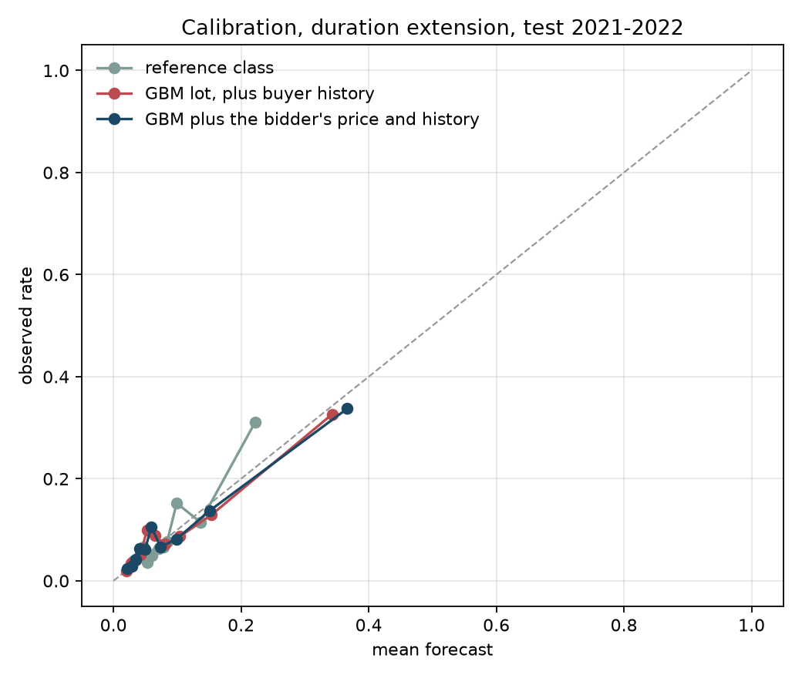
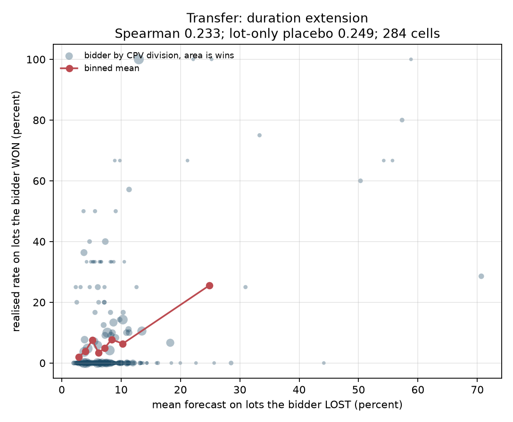
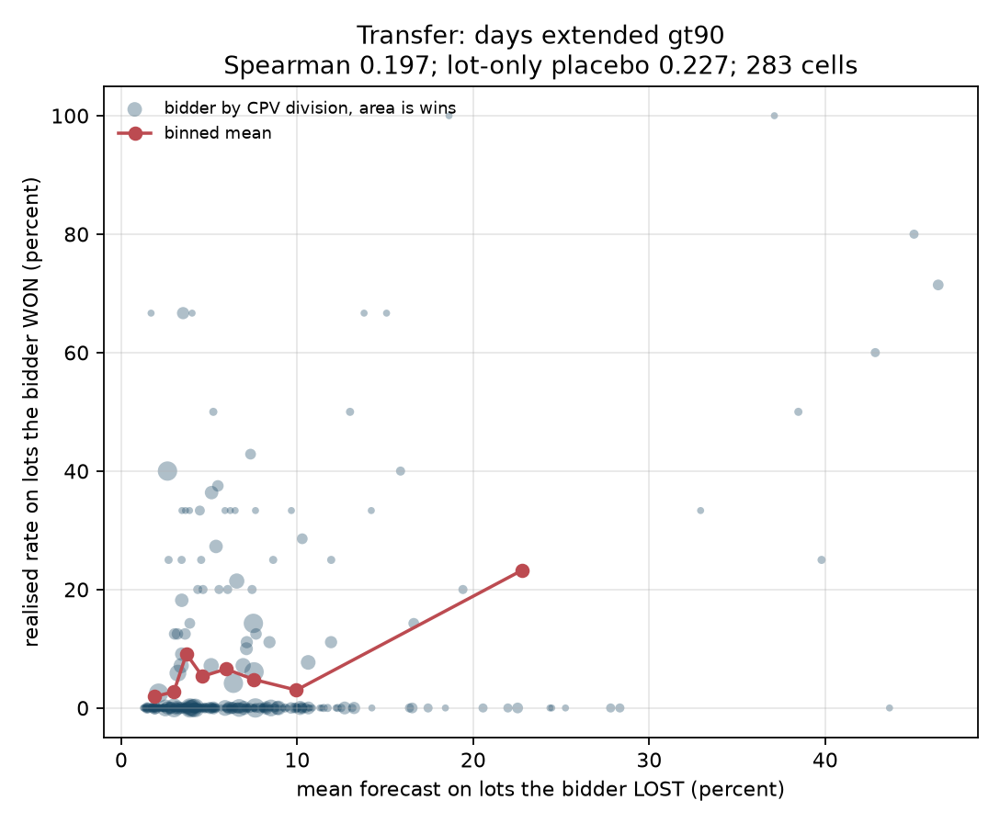
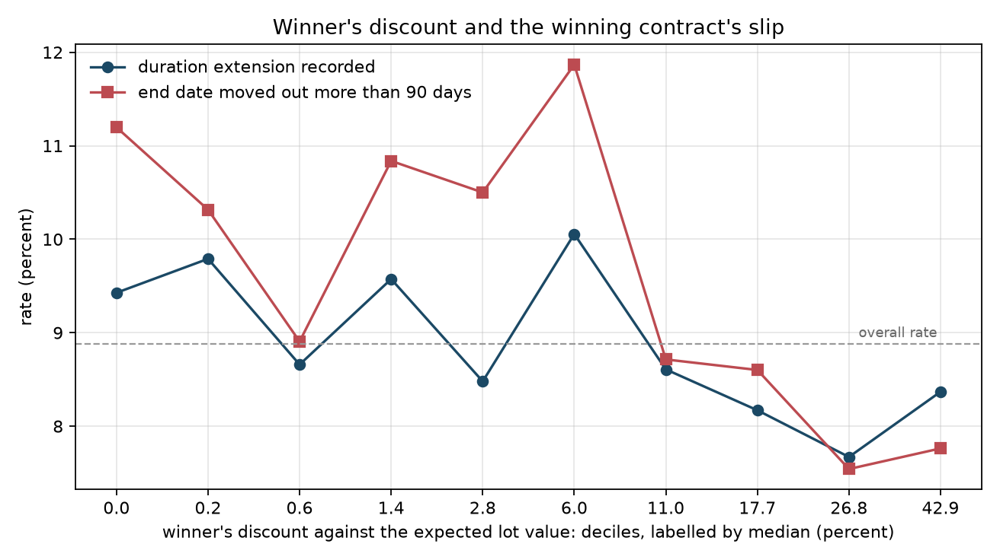

# Forecasting contract slip per competing bidder, Ukraine (Prozorro)

**The price does and the identity does not, which is the interesting part: what a bidder bid relative to its rivals on the same lot ranks the outcome, and outcomes do cluster by bidder, but a bidder's own past record does not rank its future one, so the clustering is not something a forecaster can use. The evidence, sharpest test first: with the lot held fixed, a bidder's own prior extension rate ranks its realised outcome at AUC 0.505 against a same-lot null of 0.500 (p = 0.640); the winner's raw price rank among the bids on that same lot, with no model between the price and the statistic, reaches AUC 0.514 (p = 0.208); a model given only the lot and the bidder's price reaches AUC 0.568 against 0.500 (p = 0.001); a bidder's mean forecast on the lots it lost ranks its realised rate on the lots it won at Spearman 0.233 against a within-division shuffled null of 0.138 (one-sided p = 0.030), against 0.249 for a lot-only placebo that knows nothing about the bidder and which it does not beat; outcomes nonetheless cluster by bidder beyond the buyer and the year (intraclass correlation 0.212 against a null of 0.190, one-sided p = 0.0099); and adding the winner's identity and record to the award-time model moves test AUC by -0.012.**

Prozorro is the only large procurement system that publishes every bidder's identity and price, so it is the only public place where the question can be asked at all. This report builds the panel, forecasts the winning contract's slip from award-time information, and then scores every losing bidder by transfer: what a bidder's forecast on the lots it lost says about the lots it won.

### The three tests, and why there are three

A losing bid never becomes a contract, so no forecast attached to one can ever be resolved. Everything below is an attempt to get at the same question without that resolution, and the three tests fail in different ways, which is why all three are reported.

| Test | What it compares | What could fake a positive result |
|---|---|---|
| Within-lot | the bidders on one lot, against each other, then the winner's own outcome | nothing about the lot: the buyer, the sector, the size and the year are identical for every bidder on it |
| Transfer | a bidder's mean forecast on lots it lost, against its realised rate on lots it won | the kinds of lot a bidder competes for, which is why the null shuffles within CPV division and a lot-only placebo is reported |
| Identity persistence | a bidder's rate in 2019-2020 against its rate in 2021-2022, won lots only | the sector a bidder works in, which is what the null holds fixed |

## What was built

A one-in-5 systematic sample of whole days from the Prozorro tender feed, every completed above-threshold tender it contains that was created in 2019 to 2022, each of those tenders' full documents (which is where the bids live), and the live contract-registry record for every contract they produced. From those, four released tables, a lot-level analysis table, a forward-chained model ladder, and the experiments below.

- Feed walked: 3,604,000 rows over 366 whole days, 3,604 listing requests.
- Completed above-threshold tenders found, all creation years: 121,036.
- Of those, created 2019-01-01 to 2022-12-31: 80,182.
- Queued for fetching: all of them. There is no second-stage subsample, so the only sampling step in the whole design is the one-in-5 day selection.
- Tender documents parsed: 13,675; bid rows: 40,461; lot rows: 15,707.
- Lots in the analysis set (at least two live priced bids, an identified winner, and a contract): 14,380 across 12,903 tenders, 7,076 distinct winning bidders, 15,222 distinct bidders overall, 5,345 buyers.

## The data and how the sample was drawn

The listing endpoint `/api/2.5/tenders` is ordered by `dateModified`, not by tender date, and each tender sits in it once at its current `dateModified`. Because `dateModified` only increases, a forward walk from a seed date visits every tender whose current `dateModified` is at or after that seed, and a tender created on or after the seed must have been modified on or after its creation. A walk from 2019-01-01 to the present would therefore be a complete census of everything created from 2019-01-01 onwards.

Walking every one of those rows to the present would have taken hours: feed volume rises from about 110,000 rows a month in 2019 to over 400,000 by late 2020. Instead the frame is a **systematic sample of whole days**: every 5th day of `dateModified` from 2019-01-01 to 2024-01-01, walked from midnight to midnight. Because whole days are taken and each selected day is walked completely, every tender in the range has inclusion probability exactly 0.20 whatever the volume of the day it happens to sit in. Sampling a fixed number of rows per day would instead have over-represented quiet days, and a step of 5 is coprime with 7 so the selected days rotate through the days of the week.

Covered `dateModified` span: 2019-01-01T00:00:10.310757+02:00 to 2024-01-01T10:10:30.344427+02:00; 3,604 listing requests over 366 whole days.

The only truncation the design can still cause is a tender whose feed position fell after the walk's end date. Measured on the fetched sample, the lag from the tenderID creation date to the tender's final `dateModified` has median 38 days, p99 111 days and a maximum of 1239 days; 8 of 13,675 tenders (0.059 percent) exceed a year and 8 exceed the 366 days of slack the walk allows after the last tender creation date in the window. That is the exact size of the hole. This is also why a tender's feed position is safe to use at all: a tender's `dateModified` freezes when its contract is published and does not move when the contract registry is later amended, so the walk does not select on the outcome being forecast.

What the feed is mostly made of (top procedure-and-status combinations):

| procedure and status | feed rows |
|---|---|
| reporting|complete | 2,992,260 |
| belowThreshold|complete | 142,264 |
| aboveThresholdUA|unsuccessful | 79,764 |
| belowThreshold|unsuccessful | 71,132 |
| aboveThresholdUA|complete | 67,843 |
| aboveThreshold|complete | 46,066 |
| aboveThreshold|unsuccessful | 29,901 |
| negotiation.quick|complete | 26,738 |
| reporting|active | 26,454 |
| negotiation|complete | 25,639 |
| belowThreshold|cancelled | 15,852 |
| aboveThresholdUA|cancelled | 14,294 |

Within that frame the sample is the completed tenders of the three above-threshold procedure types (`aboveThreshold`, `aboveThresholdUA`, `aboveThresholdEU`) whose tenderID creation date falls in 2019-01-01 to 2022-12-31, and every one of them was fetched, so there is no second sampling step to describe. The fetch order is shuffled across months, so even an interrupted fetch spans the whole window.

Tenders by creation year, and what survives into the analysis set:

| tender creation year | found in the 1-in-5 day sample | lots in the analysis set |
|---|---|---|
| 2019 | 20,859 | 4,131 |
| 2020 | 20,571 | 3,882 |
| 2021 | 25,955 | 4,834 |
| 2022 | 12,797 | 1,533 |

Above-threshold volume falls 50.7 percent from 2021 to 2022. That is the war, not a sampling artefact: the same one-in-5 day rule applies to every year. It is the main reason the 2022 test window is thin, and the reason a 2021-only test window is reported alongside it.

| procedure | lots in analysis set |
|---|---|
| aboveThresholdUA | 12,446 |
| aboveThresholdEU | 1,442 |
| aboveThreshold | 492 |

Lots whose tender opened on or after 2022-02-24, the full-scale invasion: 1,030 of 14,380. Every table that pools years is also reported on a 2021-only test window, which is entirely pre-invasion.

## Field evidence: what was checked in the data rather than assumed

Three things about the API changed the design, and all three were observed directly on 2026-09-16 rather than taken from documentation.

1. **`contractChangeRationaleTypes` is a vocabulary, not a record.** Every registry contract returns the same nine-entry dictionary (`durationExtension`, `fiscalYearExtension`, `itemPriceVariation`, `priceReduction`, `qualityImprovement`, `taxRate`, `thirdParty`, `volumeCuts`, `priceClarification`) whether or not any change was made: in an 89-contract probe all nine appeared on all 89. Applied changes live in `changes[]`, each entry carrying its own `rationaleTypes`, `date`, `dateSigned` and `status`. Every extension label here is built from `changes[]`.
2. **Registry `status: terminated` is the ordinary completed state.** In the same probe 78 of 89 contracts were `terminated`, 6 `active` and 5 `cancelled`. Treating `terminated` as a failure, as an English reading suggests, would have labelled almost the whole sample as failed. The abnormal state is `cancelled`, and that is what the `cancelled` label uses.
3. **`bids` and `awards` cannot be requested through `opt_fields`.** The listing endpoint honours `status`, `procurementMethodType`, `dateModified`, `tenderID`, `dateCreated`, `procuringEntity`, `awardPeriod`, `tenderPeriod` and `contracts`, and silently drops `bids`, `awards`, `lots`, `value`, `items`, `title` and `mainProcurementCategory`. Bidder identities therefore require one full tender fetch each, which is what sets the size of the sample.

Contract status in the analysis set, registry record against the tender's own copy:

| status | registry record | tender copy |
|---|---|---|
| terminated | 12,774 | 0 |
| active | 1,528 | 14,369 |
| no registry record found | 67 | 0 |
| pending | 11 | 11 |

That table is itself evidence that the tender copy is frozen at signing: the registry has moved most of these contracts to `terminated` while the tender copy still shows every one of them as it stood when the contract was published. It also shows why the `cancelled` label carries no information in this sample: there are 0 cancelled contracts among the lots scored. A tender only reaches status `complete` once it has a live contract, and where a lot has both a cancelled contract and a live replacement the live one is the one scored, so contract cancellation is essentially unobservable inside a completed-tender sample. It is reported rather than dropped, and the ladder refuses to score it.

The date encoded in the human `tenderID` matches the date part of `tenderPeriod.startDate` on 100.00 percent of the fetched tenders, which is why the sampling frame can be stratified on the tenderID without fetching every tender first.

Bid entry statuses across the whole fetched sample (40,461 entries): `active` 39,836, `deleted` 381, `unsuccessful` 231, `invalid` 13. Entries with status `deleted`, `draft` or `invalid.pre-qualification` never reached evaluation and are excluded from the bid counts, the price ranks and the dispersion statistics.

Consortium bids, meaning more than one tenderer on a single bid: 0. Prozorro records one legal entity per bid in this sample, so a bidder identity is unambiguous.

Disqualification is recorded as an award with status `unsuccessful` against a specific bid, not as a status on the bid itself: across the fetched sample there are 4,482 unsuccessful awards against 15,264 active ones. Prozorro strips the price from a bid that was withdrawn or rejected outright, and 2,211 bid entries in the sample carry no amount at all, so they cannot be ranked. Of the 4,482 unsuccessful awards, 100.0 percent point at a bid that does still carry a price and can therefore be placed in the price order. Experiment 3 is restricted to those.

The tender document's copy of a contract lags the live registry: it is written when the tender was last touched, and in the sample it agrees with the registry on the contract end date 78.8 percent of the 14,250 lots where both dates are present. The registry end date is later in 19.2 percent of them, by a median of 90 days. Conditioning on the registry's own `durationExtension` change, the two dates differ in 64.9 percent of extended contracts and 16.9 percent of unextended ones, and of the contracts whose end date did move, 27.3 percent carry a `durationExtension` change. So the end date moves considerably more often than an extension is registered against it. Some of that is a genuinely different event, an administrative edit to the period rather than an agreed extension, and some of it is the tender copy having been written after a change rather than at signing. Either way `days_extended` is the broader and noisier of the two signals, and `duration_extension`, which needs no date arithmetic at all, is the primary label for that reason.

## Fill rates

Field presence, over every parsed lot and over the analysis set. The analysis set is lots with at least two live priced bids, an identified winning bid and a contract.

| field | lots | share | lots, analysis set | share, analysis set |
|---|---|---|---|---|
| at least two live priced bids on the lot | 14,512 | 0.924 | 14,380 | 1.000 |
| an identified winning bid | 15,264 | 0.972 | 14,380 | 1.000 |
| lot has a contract in the tender document | 15,327 | 0.976 | 14,380 | 1.000 |
| contract found in the live registry | 14,488 | 0.922 | 14,313 | 0.995 |
| registry amountPaid present | 12,956 | 0.825 | 12,853 | 0.894 |
| registry amountPaid present and positive | 12,483 | 0.795 | 12,383 | 0.861 |
| registry period.endDate present | 14,387 | 0.916 | 14,275 | 0.993 |
| tender-copy contract period.endDate present | 15,201 | 0.968 | 14,317 | 0.996 |
| both period end dates present | 14,362 | 0.914 | 14,250 | 0.991 |
| registry changes[] non-empty | 8,022 | 0.511 | 7,979 | 0.555 |
| value_change_ratio computable | 14,348 | 0.913 | 14,173 | 0.986 |
| winner discount computable | 15,264 | 0.972 | 14,380 | 1.000 |
| bid dispersion computable | 14,512 | 0.924 | 14,380 | 1.000 |
| lots (denominator) | 15,707 | 1.000 | 14,380 | 1.000 |

## Labels

All labels are on the winning contract of a lot. A lot is one (tender, lot) pair; a single-lot tender contributes one row.

| Label | Definition | Source |
|---|---|---|
| `duration_extension` | at least one entry in `changes[]` whose `rationaleTypes` contains `durationExtension` | live contract registry |
| `days_extended_gt90` | registry `period.endDate` minus the tender copy's `contracts[].period.endDate`, above 90 days | registry and tender copy |
| `value_growth_gt10` | registry contract value over the value at signing, above 1.10, compared net to net where both `amountNet` are present and gross to gross otherwise | registry and tender copy |
| `any_change` | `changes[]` non-empty | live contract registry |
| `underexecuted` | registry `amountPaid` below 0.9 of the value at signing | live contract registry |
| `cancelled` | registry `status == "cancelled"` | live contract registry |

### Base rates by tender creation year

| year | lots | tenders | still running at the snapshot | duration extension recorded | end date moved out more than 90 days | contract value up more than 10 percent | any registered change | paid less than 90 percent of the signed value | contract cancelled |
|---|---|---|---|---|---|---|---|---|---|
| 2019 | 4,131 | 3,616 | 0.128 | 0.082 | 0.145 | 0.077 | 0.544 | 0.233 | 0.000 |
| 2020 | 3,882 | 3,519 | 0.101 | 0.086 | 0.075 | 0.067 | 0.568 | 0.273 | 0.000 |
| 2021 | 4,834 | 4,339 | 0.098 | 0.104 | 0.081 | 0.059 | 0.562 | 0.313 | 0.000 |
| 2022 | 1,533 | 1,429 | 0.085 | 0.066 | 0.065 | 0.034 | 0.554 | 0.379 | 0.000 |

Every label is read at one snapshot, so cohorts differ in how long they have had to accumulate changes. The fourth column measures what is left of that: the share of lots whose contract the registry still calls `active` runs from 8.5 percent to 12.8 percent, and it falls with the cohort year, so the test cohorts are if anything less censored than the training cohorts and the models are not being flattered by it. The oldest cohort carrying the most still-running contracts is not what exposure alone would predict, and no explanation for it is established here.

## Experiment 1: forecasting the winner's slip from award-time features

Forward-chained throughout. Training is every lot whose tender opened in 2019 or 2020; the test windows are later and disjoint. Every history feature is evaluated at the tender's own `tenderPeriod.startDate` and counts only events dated strictly before it, so a contract signed before the cutoff but extended after it contributes to the denominator and not the numerator. Brier skill is against the training-window base rate, which is a number a forecaster could have quoted in advance, never against the realised test rate.

Rungs, nested, so that each step answers one question: the training base rate; a shrunken CPV-division by region cell mean; gradient boosting on the lot alone with no identity of any kind in it; the same plus the buyer's as-of record; the same plus the winner's price position on that lot; the same plus the winner's as-of record.

Before any of the bidder questions, the plain one: how forecastable are these outcomes at all? Best rung on the primary test window, by skill against the training base rate: duration extension recorded AUC 0.742 with skill +0.124 on a 9.5 percent base rate; end date moved out more than 90 days AUC 0.745 with skill +0.105 on a 7.7 percent base rate; contract value up more than 10 percent AUC 0.688 with skill +0.005 on a 5.3 percent base rate; any registered change AUC 0.731 with skill +0.141 on a 56.0 percent base rate; paid less than 90 percent of the signed value AUC 0.770 with skill +0.218 on a 32.9 percent base rate. For comparison the US panel in this repository reaches AUC 0.84 to 0.86 on schedule slip, so Ukrainian above-threshold contracts are the harder forecasting problem, on outcomes that are not quite the same outcomes.

One detail worth stating rather than hiding: the gradient booster's own early-stopping validation split is a random 15 percent of the training window, not a temporal one. The test window is strictly later than the whole training window either way, so no test information enters the fit.

### test 2021-2022

| label | model | test lots | test base rate | train base rate | Brier | skill vs train base rate | AUC |
|---|---|---|---|---|---|---|---|
| duration extension recorded | base rate | 6,338 | 0.095 | 0.084 | 0.0860 | 0.000 | 0.500 |
| duration extension recorded | reference class | 6,338 | 0.095 | 0.084 | 0.0818 | 0.049 | 0.687 |
| duration extension recorded | GBM lot, no buyer history | 6,338 | 0.095 | 0.084 | 0.0774 | 0.100 | 0.714 |
| duration extension recorded | GBM lot, plus buyer history | 6,338 | 0.095 | 0.084 | 0.0759 | 0.117 | 0.726 |
| duration extension recorded | GBM plus the bidder's price | 6,338 | 0.095 | 0.084 | 0.0753 | 0.124 | 0.742 |
| duration extension recorded | GBM plus the bidder's price and history | 6,338 | 0.095 | 0.084 | 0.0761 | 0.114 | 0.730 |
| end date moved out more than 90 days | base rate | 6,317 | 0.077 | 0.111 | 0.0724 | 0.000 | 0.500 |
| end date moved out more than 90 days | reference class | 6,317 | 0.077 | 0.111 | 0.0727 | -0.004 | 0.607 |
| end date moved out more than 90 days | GBM lot, no buyer history | 6,317 | 0.077 | 0.111 | 0.0686 | 0.054 | 0.726 |
| end date moved out more than 90 days | GBM lot, plus buyer history | 6,317 | 0.077 | 0.111 | 0.0648 | 0.105 | 0.745 |
| end date moved out more than 90 days | GBM plus the bidder's price | 6,317 | 0.077 | 0.111 | 0.0651 | 0.102 | 0.743 |
| end date moved out more than 90 days | GBM plus the bidder's price and history | 6,317 | 0.077 | 0.111 | 0.0649 | 0.104 | 0.746 |
| contract value up more than 10 percent | base rate | 6,338 | 0.053 | 0.072 | 0.0503 | 0.000 | 0.500 |
| contract value up more than 10 percent | reference class | 6,338 | 0.053 | 0.072 | 0.0503 | -0.001 | 0.650 |
| contract value up more than 10 percent | GBM lot, no buyer history | 6,338 | 0.053 | 0.072 | 0.0515 | -0.024 | 0.681 |
| contract value up more than 10 percent | GBM lot, plus buyer history | 6,338 | 0.053 | 0.072 | 0.0516 | -0.026 | 0.684 |
| contract value up more than 10 percent | GBM plus the bidder's price | 6,338 | 0.053 | 0.072 | 0.0514 | -0.022 | 0.665 |
| contract value up more than 10 percent | GBM plus the bidder's price and history | 6,338 | 0.053 | 0.072 | 0.0501 | 0.005 | 0.688 |
| any registered change | base rate | 6,338 | 0.560 | 0.556 | 0.2464 | 0.000 | 0.500 |
| any registered change | reference class | 6,338 | 0.560 | 0.556 | 0.2243 | 0.090 | 0.693 |
| any registered change | GBM lot, no buyer history | 6,338 | 0.560 | 0.556 | 0.2118 | 0.141 | 0.731 |
| any registered change | GBM lot, plus buyer history | 6,338 | 0.560 | 0.556 | 0.2143 | 0.130 | 0.726 |
| any registered change | GBM plus the bidder's price | 6,338 | 0.560 | 0.556 | 0.2133 | 0.134 | 0.726 |
| any registered change | GBM plus the bidder's price and history | 6,338 | 0.560 | 0.556 | 0.2162 | 0.123 | 0.722 |
| paid less than 90 percent of the signed value | base rate | 5,503 | 0.329 | 0.253 | 0.2267 | 0.000 | 0.500 |
| paid less than 90 percent of the signed value | reference class | 5,503 | 0.329 | 0.253 | 0.2019 | 0.109 | 0.706 |
| paid less than 90 percent of the signed value | GBM lot, no buyer history | 5,503 | 0.329 | 0.253 | 0.1794 | 0.209 | 0.769 |
| paid less than 90 percent of the signed value | GBM lot, plus buyer history | 5,503 | 0.329 | 0.253 | 0.1782 | 0.214 | 0.767 |
| paid less than 90 percent of the signed value | GBM plus the bidder's price | 5,503 | 0.329 | 0.253 | 0.1772 | 0.218 | 0.770 |
| paid less than 90 percent of the signed value | GBM plus the bidder's price and history | 5,503 | 0.329 | 0.253 | 0.1775 | 0.217 | 0.768 |

### test 2021 only (pre-invasion)

| label | model | test lots | test base rate | train base rate | Brier | skill vs train base rate | AUC |
|---|---|---|---|---|---|---|---|
| duration extension recorded | base rate | 4,810 | 0.104 | 0.084 | 0.0935 | 0.000 | 0.500 |
| duration extension recorded | reference class | 4,810 | 0.104 | 0.084 | 0.0887 | 0.052 | 0.689 |
| duration extension recorded | GBM lot, no buyer history | 4,810 | 0.104 | 0.084 | 0.0825 | 0.118 | 0.734 |
| duration extension recorded | GBM lot, plus buyer history | 4,810 | 0.104 | 0.084 | 0.0807 | 0.137 | 0.741 |
| duration extension recorded | GBM plus the bidder's price | 4,810 | 0.104 | 0.084 | 0.0798 | 0.147 | 0.759 |
| duration extension recorded | GBM plus the bidder's price and history | 4,810 | 0.104 | 0.084 | 0.0809 | 0.135 | 0.743 |
| end date moved out more than 90 days | base rate | 4,789 | 0.081 | 0.111 | 0.0755 | 0.000 | 0.500 |
| end date moved out more than 90 days | reference class | 4,789 | 0.081 | 0.111 | 0.0754 | 0.002 | 0.610 |
| end date moved out more than 90 days | GBM lot, no buyer history | 4,789 | 0.081 | 0.111 | 0.0698 | 0.076 | 0.741 |
| end date moved out more than 90 days | GBM lot, plus buyer history | 4,789 | 0.081 | 0.111 | 0.0659 | 0.127 | 0.773 |
| end date moved out more than 90 days | GBM plus the bidder's price | 4,789 | 0.081 | 0.111 | 0.0660 | 0.127 | 0.767 |
| end date moved out more than 90 days | GBM plus the bidder's price and history | 4,789 | 0.081 | 0.111 | 0.0664 | 0.121 | 0.770 |
| contract value up more than 10 percent | base rate | 4,810 | 0.059 | 0.072 | 0.0554 | 0.000 | 0.500 |
| contract value up more than 10 percent | reference class | 4,810 | 0.059 | 0.072 | 0.0550 | 0.007 | 0.660 |
| contract value up more than 10 percent | GBM lot, no buyer history | 4,810 | 0.059 | 0.072 | 0.0562 | -0.015 | 0.691 |
| contract value up more than 10 percent | GBM lot, plus buyer history | 4,810 | 0.059 | 0.072 | 0.0562 | -0.014 | 0.693 |
| contract value up more than 10 percent | GBM plus the bidder's price | 4,810 | 0.059 | 0.072 | 0.0560 | -0.011 | 0.672 |
| contract value up more than 10 percent | GBM plus the bidder's price and history | 4,810 | 0.059 | 0.072 | 0.0549 | 0.009 | 0.695 |
| any registered change | base rate | 4,810 | 0.562 | 0.556 | 0.2462 | 0.000 | 0.500 |
| any registered change | reference class | 4,810 | 0.562 | 0.556 | 0.2230 | 0.094 | 0.697 |
| any registered change | GBM lot, no buyer history | 4,810 | 0.562 | 0.556 | 0.2089 | 0.151 | 0.738 |
| any registered change | GBM lot, plus buyer history | 4,810 | 0.562 | 0.556 | 0.2114 | 0.141 | 0.732 |
| any registered change | GBM plus the bidder's price | 4,810 | 0.562 | 0.556 | 0.2110 | 0.143 | 0.730 |
| any registered change | GBM plus the bidder's price and history | 4,810 | 0.562 | 0.556 | 0.2136 | 0.133 | 0.727 |
| paid less than 90 percent of the signed value | base rate | 4,190 | 0.313 | 0.253 | 0.2189 | 0.000 | 0.500 |
| paid less than 90 percent of the signed value | reference class | 4,190 | 0.313 | 0.253 | 0.1953 | 0.108 | 0.708 |
| paid less than 90 percent of the signed value | GBM lot, no buyer history | 4,190 | 0.313 | 0.253 | 0.1690 | 0.228 | 0.783 |
| paid less than 90 percent of the signed value | GBM lot, plus buyer history | 4,190 | 0.313 | 0.253 | 0.1687 | 0.229 | 0.781 |
| paid less than 90 percent of the signed value | GBM plus the bidder's price | 4,190 | 0.313 | 0.253 | 0.1682 | 0.231 | 0.781 |
| paid less than 90 percent of the signed value | GBM plus the bidder's price and history | 4,190 | 0.313 | 0.253 | 0.1683 | 0.231 | 0.780 |

### test 2022 post-invasion

| label | model | test lots | test base rate | train base rate | Brier | skill vs train base rate | AUC |
|---|---|---|---|---|---|---|---|
| duration extension recorded | base rate | 1,027 | 0.068 | 0.084 | 0.0638 | 0.000 | 0.500 |
| duration extension recorded | reference class | 1,027 | 0.068 | 0.084 | 0.0614 | 0.036 | 0.698 |
| duration extension recorded | GBM lot, no buyer history | 1,027 | 0.068 | 0.084 | 0.0624 | 0.022 | 0.650 |
| duration extension recorded | GBM lot, plus buyer history | 1,027 | 0.068 | 0.084 | 0.0609 | 0.045 | 0.708 |
| duration extension recorded | GBM plus the bidder's price | 1,027 | 0.068 | 0.084 | 0.0610 | 0.043 | 0.706 |
| duration extension recorded | GBM plus the bidder's price and history | 1,027 | 0.068 | 0.084 | 0.0611 | 0.041 | 0.722 |
| end date moved out more than 90 days | base rate | 1,027 | 0.057 | 0.111 | 0.0570 | 0.000 | 0.500 |
| end date moved out more than 90 days | reference class | 1,027 | 0.057 | 0.111 | 0.0599 | -0.050 | 0.605 |
| end date moved out more than 90 days | GBM lot, no buyer history | 1,027 | 0.057 | 0.111 | 0.0581 | -0.018 | 0.639 |
| end date moved out more than 90 days | GBM lot, plus buyer history | 1,027 | 0.057 | 0.111 | 0.0542 | 0.050 | 0.632 |
| end date moved out more than 90 days | GBM plus the bidder's price | 1,027 | 0.057 | 0.111 | 0.0557 | 0.024 | 0.631 |
| end date moved out more than 90 days | GBM plus the bidder's price and history | 1,027 | 0.057 | 0.111 | 0.0537 | 0.059 | 0.634 |
| contract value up more than 10 percent | base rate | 1,027 | 0.032 | 0.072 | 0.0327 | 0.000 | 0.500 |
| contract value up more than 10 percent | reference class | 1,027 | 0.032 | 0.072 | 0.0341 | -0.043 | 0.648 |
| contract value up more than 10 percent | GBM lot, no buyer history | 1,027 | 0.032 | 0.072 | 0.0344 | -0.052 | 0.658 |
| contract value up more than 10 percent | GBM lot, plus buyer history | 1,027 | 0.032 | 0.072 | 0.0348 | -0.065 | 0.646 |
| contract value up more than 10 percent | GBM plus the bidder's price | 1,027 | 0.032 | 0.072 | 0.0336 | -0.029 | 0.662 |
| contract value up more than 10 percent | GBM plus the bidder's price and history | 1,027 | 0.032 | 0.072 | 0.0324 | 0.010 | 0.670 |
| any registered change | base rate | 1,027 | 0.517 | 0.556 | 0.2512 | 0.000 | 0.500 |
| any registered change | reference class | 1,027 | 0.517 | 0.556 | 0.2300 | 0.085 | 0.705 |
| any registered change | GBM lot, no buyer history | 1,027 | 0.517 | 0.556 | 0.2213 | 0.119 | 0.718 |
| any registered change | GBM lot, plus buyer history | 1,027 | 0.517 | 0.556 | 0.2242 | 0.108 | 0.717 |
| any registered change | GBM plus the bidder's price | 1,027 | 0.517 | 0.556 | 0.2209 | 0.121 | 0.724 |
| any registered change | GBM plus the bidder's price and history | 1,027 | 0.517 | 0.556 | 0.2247 | 0.106 | 0.711 |
| paid less than 90 percent of the signed value | base rate | 937 | 0.289 | 0.253 | 0.2069 | 0.000 | 0.500 |
| paid less than 90 percent of the signed value | reference class | 937 | 0.289 | 0.253 | 0.1905 | 0.079 | 0.679 |
| paid less than 90 percent of the signed value | GBM lot, no buyer history | 937 | 0.289 | 0.253 | 0.1884 | 0.090 | 0.712 |
| paid less than 90 percent of the signed value | GBM lot, plus buyer history | 937 | 0.289 | 0.253 | 0.1914 | 0.075 | 0.706 |
| paid less than 90 percent of the signed value | GBM plus the bidder's price | 937 | 0.289 | 0.253 | 0.1854 | 0.104 | 0.719 |
| paid less than 90 percent of the signed value | GBM plus the bidder's price and history | 937 | 0.289 | 0.253 | 0.1867 | 0.098 | 0.713 |

Reading the nested rungs on duration extension recorded, each step against the one above it: adding the buyer's own record moves AUC +0.013; adding the winner's price position moves AUC +0.016; adding the winner's own record moves AUC -0.012.

Reading the nested rungs on end date moved out more than 90 days, each step against the one above it: adding the buyer's own record moves AUC +0.020; adding the winner's price position moves AUC -0.002; adding the winner's own record moves AUC +0.003.

Labels refused by the ladder, because a label with almost no positives on one side of the split produces skill and AUC numbers that are noise dressed as results:

| split | label | reason |
|---|---|---|
| test 2021-2022 | cancelled | cancelled: 0 positives in train, 0 in test |
| test 2021 only (pre-invasion) | cancelled | cancelled: 0 positives in train, 0 in test |
| test 2022 post-invasion | cancelled | cancelled: 0 positives in train, 0 in test |

Calibration of the top rung on duration extension, test 2021-2022, in equal-count bins of the forecast:

| lots | mean forecast | observed rate |
|---|---|---|
| 634 | 0.0220 | 0.0237 |
| 634 | 0.0289 | 0.0284 |
| 634 | 0.0345 | 0.0426 |
| 633 | 0.0413 | 0.0632 |
| 634 | 0.0495 | 0.0615 |
| 634 | 0.0593 | 0.1057 |
| 633 | 0.0740 | 0.0664 |
| 634 | 0.0990 | 0.0820 |
| 634 | 0.1505 | 0.1372 |
| 634 | 0.3665 | 0.3375 |

Murphy decomposition of that Brier score: reliability 0.00042, resolution 0.00761, uncertainty 0.08583. Reliability is the calibration penalty and smaller is better; resolution is how far the forecasts move away from the base rate in the right direction and larger is better.



## Experiment 2: the competing-bidder test

A losing bid never produces a contract, so its forecast can never be resolved directly. Instead every bidder on every test lot is scored as if it had won: the lot block is held fixed and the bidder block is replaced by that bidder's own price on that lot and its own as-of record. Each bidder's mean forecast over the lots it LOST is then compared with the rate it actually realised on the lots it WON, in the same test window and the same CPV division, for cells with at least three wins.

One circularity has to be closed before any of this means anything. A bidder's as-of history on a lot it lost in late 2021 already contains the outcome of a lot it won in early 2021, and that same early win is on the realised side of the comparison. The headline rows therefore freeze every bidder-history feature at the first day of the test window, so nothing that happens inside the resolution window can reach the forecast; the price features still come from the lot's own auction, because that is what a forecaster registering at award time would have. The two rows labelled "history as of each tender" are the leaky version, reported so the size of the circularity is visible rather than argued about.

Four forecasts are transferred. The last is a placebo: the lot-only model knows nothing about the bidder, so if its mean over a bidder's lost lots also ranks that bidder's realised rate, the correlation is about which lots the bidder competes for and not about the bidder. The null shuffles bidder identity within CPV division; because that shuffle keeps the between-division association, the null is not centred on zero, and its mean is the correlation that composition alone produces. The headline test is the right-tail probability against that null.

### duration extension recorded

| forecast transferred | cells | bidders | lost lots | won lots | Spearman | null mean | null sd | excess | p one-sided |
|---|---|---|---|---|---|---|---|---|---|
| full model (price and identity) | 284 | 282 | 2,152 | 1,897 | 0.233 | 0.138 | 0.045 | 0.094 | 0.0297 |
| price only | 284 | 282 | 2,152 | 1,897 | 0.269 | 0.133 | 0.046 | 0.136 | 0.0099 |
| prior extension rate only | 284 | 282 | 2,152 | 1,897 | 0.121 | 0.062 | 0.045 | 0.059 | 0.1188 |
| lot only (placebo) | 284 | 282 | 2,152 | 1,897 | 0.249 | 0.128 | 0.043 | 0.122 | 0.0099 |
| full model, history as of each tender (overlaps the resolution window) | 284 | 282 | 2,152 | 1,897 | 0.231 | 0.132 | 0.044 | 0.099 | 0.0297 |
| prior extension rate, history as of each tender (overlaps) | 284 | 282 | 2,152 | 1,897 | 0.288 | 0.104 | 0.049 | 0.184 | 0.0099 |

Read the placebo row first. It excesses the null by +0.122 against +0.094 for the bidder-aware forecast, so whatever correlation there is here is produced by which lots a bidder competes for and not by the bidder. A significant p-value on the full model would mean nothing while a forecast that cannot see the bidder at all does at least as well.

What this test could have found: the null has a standard deviation of 0.045, so the smallest excess over the null it could have declared significant at one-sided 5 percent is about 0.074. An effect smaller than that would not show up here whether or not it exists, and the number of cells is what sets it.

Pooled across divisions, ignoring the CPV cell: Spearman 0.265 over 322 bidders with at least three wins in the test window.



### end date moved out more than 90 days

| forecast transferred | cells | bidders | lost lots | won lots | Spearman | null mean | null sd | excess | p one-sided |
|---|---|---|---|---|---|---|---|---|---|
| full model (price and identity) | 283 | 281 | 2,149 | 1,890 | 0.197 | 0.135 | 0.041 | 0.062 | 0.0594 |
| price only | 283 | 281 | 2,149 | 1,890 | 0.236 | 0.129 | 0.044 | 0.107 | 0.0099 |
| prior extension rate only | 283 | 281 | 2,149 | 1,890 | -0.115 | 0.010 | 0.049 | -0.125 | 1.0000 |
| lot only (placebo) | 283 | 281 | 2,149 | 1,890 | 0.227 | 0.132 | 0.042 | 0.095 | 0.0297 |
| full model, history as of each tender (overlaps the resolution window) | 283 | 281 | 2,149 | 1,890 | 0.205 | 0.136 | 0.041 | 0.069 | 0.0495 |
| prior extension rate, history as of each tender (overlaps) | 283 | 281 | 2,149 | 1,890 | -0.018 | 0.051 | 0.048 | -0.069 | 0.9208 |

Read the placebo row first. It excesses the null by +0.095 against +0.062 for the bidder-aware forecast, so whatever correlation there is here is produced by which lots a bidder competes for and not by the bidder. A significant p-value on the full model would mean nothing while a forecast that cannot see the bidder at all does at least as well.

What this test could have found: the null has a standard deviation of 0.041, so the smallest excess over the null it could have declared significant at one-sided 5 percent is about 0.067. An effect smaller than that would not show up here whether or not it exists, and the number of cells is what sets it.

Pooled across divisions, ignoring the CPV cell: Spearman 0.249 over 320 bidders with at least three wins in the test window.



### The within-lot test

The transfer test above still compares a bidder across different lots. This one does not: it holds the lot fixed. Everything that makes a lot slip-prone - the buyer, the sector, the size, the year, the number of bidders - is identical for every bidder on that lot, so ranking the bidders against each other removes all of it by construction. For each test lot the winner's percentile rank among that lot's bidders is taken under each forecast, and the table reports the AUC of that percentile against the winner's own realised outcome. The null replaces the winner with a uniformly random bidder from the same lot, which is why it centres on 0.5 even though the winner's percentile is not uniform (winners are chosen largely on price).

| label | sample | forecast | test lots | mean percentile when it slipped | mean percentile when it did not | AUC | null mean | null sd | p two-sided |
|---|---|---|---|---|---|---|---|---|---|
| duration_extension | all test lots | raw price rank on the lot, no model | 6,338 | 0.160 | 0.140 | 0.514 | 0.499 | 0.011 | 0.208 |
| duration_extension | all test lots | full model (price and identity) | 6,338 | 0.395 | 0.329 | 0.538 | 0.500 | 0.011 | 0.002 |
| duration_extension | all test lots | price only | 6,338 | 0.407 | 0.290 | 0.568 | 0.500 | 0.011 | 0.001 |
| duration_extension | all test lots | prior extension rate only | 6,338 | 0.455 | 0.451 | 0.505 | 0.500 | 0.011 | 0.640 |
| duration_extension | all test lots | lot only (degenerate control) | 6,338 | 0.500 | 0.500 | 0.500 | 0.500 | 0.000 | 1.000 |
| duration_extension | pre-invasion test lots only | raw price rank on the lot, no model | 5,311 | 0.159 | 0.135 | 0.517 | 0.500 | 0.012 | 0.158 |
| duration_extension | pre-invasion test lots only | full model (price and identity) | 5,311 | 0.392 | 0.329 | 0.537 | 0.500 | 0.012 | 0.002 |
| duration_extension | pre-invasion test lots only | price only | 5,311 | 0.409 | 0.295 | 0.566 | 0.500 | 0.012 | 0.001 |
| duration_extension | pre-invasion test lots only | prior extension rate only | 5,311 | 0.453 | 0.451 | 0.504 | 0.500 | 0.013 | 0.757 |
| duration_extension | pre-invasion test lots only | lot only (degenerate control) | 5,311 | 0.500 | 0.500 | 0.500 | 0.500 | 0.000 | 1.000 |
| days_extended_gt90 | all test lots | raw price rank on the lot, no model | 6,317 | 0.149 | 0.141 | 0.502 | 0.500 | 0.012 | 0.837 |
| days_extended_gt90 | all test lots | full model (price and identity) | 6,317 | 0.476 | 0.458 | 0.511 | 0.500 | 0.012 | 0.364 |
| days_extended_gt90 | all test lots | price only | 6,317 | 0.427 | 0.426 | 0.497 | 0.499 | 0.013 | 0.830 |
| days_extended_gt90 | all test lots | prior extension rate only | 6,317 | 0.466 | 0.450 | 0.511 | 0.499 | 0.013 | 0.391 |
| days_extended_gt90 | all test lots | lot only (degenerate control) | 6,317 | 0.500 | 0.500 | 0.500 | 0.500 | 0.000 | 1.000 |
| days_extended_gt90 | pre-invasion test lots only | raw price rank on the lot, no model | 5,290 | 0.133 | 0.138 | 0.497 | 0.499 | 0.014 | 0.818 |
| days_extended_gt90 | pre-invasion test lots only | full model (price and identity) | 5,290 | 0.483 | 0.455 | 0.517 | 0.500 | 0.013 | 0.204 |
| days_extended_gt90 | pre-invasion test lots only | price only | 5,290 | 0.420 | 0.425 | 0.495 | 0.499 | 0.013 | 0.684 |
| days_extended_gt90 | pre-invasion test lots only | prior extension rate only | 5,290 | 0.467 | 0.450 | 0.513 | 0.499 | 0.014 | 0.358 |
| days_extended_gt90 | pre-invasion test lots only | lot only (degenerate control) | 5,290 | 0.500 | 0.500 | 0.500 | 0.500 | 0.000 | 1.000 |

The first row needs no model at all: it is the winner's own price rank among the bids on its lot, at AUC 0.514 (p = 0.208). Above 0.5 means the more expensive the winner was relative to its rivals, the more likely the extension. It points the same way as the discount deciles further down, where the extension rate falls as the discount deepens (Spearman -0.70 across deciles), but on its own it does not clear its null, so the rank alone is not the statistic to lean on. What does clear it is the model that sees the size of the discount and not only its rank (AUC 0.568, p = 0.001), which says the relationship between price and slip is not simply monotone in the price order within a lot.

Dropping every lot whose tender opened on or after the full-scale invasion moves no AUC in that table by more than 0.003. The answer does not depend on the war.

### Whose identity carries the signal

Each of these is used on its own as the whole forecast, scored on the same test rows, so the comparison is like for like. The US panel in this repository found that the contracting office mattered more than the contractor; this is the same question asked where the bidders are visible. Rank discrimination only, because a raw rate used as a probability is not calibrated and the Brier score would be measuring the calibration rather than the ranking.

Pooled against stratified, on duration extension. A stratified column never compares two lots from different strata, so a predictor that ranks well only because it tracks which buyer, sector or year a lot belongs to loses that advantage there. Only strata containing both outcomes can contribute, which is what the `used` columns count; a stratified AUC resting on fewer than 20 strata is left blank rather than printed.

| predictor | AUC pooled | AUC within buyer | buyers used | AUC within CPV division and year | cells used |
|---|---|---|---|---|---|
| buyer's as-of extension rate | 0.641 | 0.472 | 183 | 0.619 | 57 |
| winner's as-of extension rate | 0.519 | 0.393 | 183 | 0.538 | 57 |
| winner's as-of win rate | 0.494 | 0.517 | 183 | 0.487 | 57 |
| winner's price as a share of the expected value | 0.550 | 0.576 | 183 | 0.533 | 57 |
| log lot value | 0.724 | 0.601 | 183 | 0.693 | 57 |

Three readings follow. First the sanity check: the buyer's own rate goes from 0.641 pooled to 0.472 within buyer, because it is nearly constant inside a buyer and has nothing left to rank with once the buyer is fixed. It keeps 0.619 within CPV division and year, so it is not a sector effect either. Second, the winner's price goes from 0.550 pooled to 0.576 within buyer, so the price signal is not a buyer effect wearing a price costume.

Third, and this is the one to be careful with: the winner's own record reads 0.519 pooled, 0.393 within buyer and 0.538 within CPV division and year. Those sit on both sides of chance and span 0.145. A signal that changes sign depending on what is held fixed is not a signal; the honest reading is that the bidder's own record is close to uninformative and that the direction of the residue is not stable enough to name.

| predictor | duration extension recorded | end date moved out more than 90 days | contract value up more than 10 percent | any registered change | paid less than 90 percent of the signed value |
|---|---|---|---|---|---|
| buyer's as-of extension rate | 0.641 | 0.561 | 0.392 | 0.551 | 0.562 |
| log lot value | 0.724 | 0.742 | 0.487 | 0.618 | 0.601 |
| winner's as-of extension rate | 0.519 | 0.522 | 0.504 | 0.482 | 0.484 |
| winner's as-of win rate | 0.494 | 0.501 | 0.499 | 0.472 | 0.481 |
| winner's price as a share of the expected value | 0.550 | 0.534 | 0.535 | 0.490 | 0.486 |

On duration extension the buyer's own record reaches AUC 0.641 and the winner's reaches 0.519. Both are visible in this dataset and only one of them carries the signal. That is the same answer the US panel in this repository gave from the other direction: there the contracting office mattered and the contractor added almost nothing, but US data never shows the losing offers, so it could not rule out that the bidder's identity mattered and was simply unobserved. Here it is observed, and it does not.

A thin record is the obvious alternative explanation for a null bidder result, so the same comparison restricted to the lots where the record is already substantial, on duration extension. These are pooled AUCs: the experienced-winner subset leaves too few buyers holding both outcomes for a within-buyer version to mean anything, which is itself a finding about how concentrated experienced bidders are:

| subset | buyer's as-of extension rate | winner's as-of extension rate | lots |
|---|---|---|---|
| all test lots | 0.641 | 0.519 | 6,338 |
| buyer has 10 or more prior lots | 0.788 | 0.431 | 1,072 |
| winner has 10 or more prior wins | 0.829 | 0.256 | 718 |

Restricting to winners with at least ten prior wins, where the bidder's own rate is estimated from a real sample rather than two or three contracts, it inverts, from 0.519 to 0.256. An experienced bidder's past extension rate ranks its next contract in the wrong direction in this sample. Thin histories are therefore not what is holding the bidder result down, but the inversion itself is not explained here: experienced bidders concentrate at a handful of high-volume buyers whose own rate reaches 0.829 on the same lots, and that concentration is enough to produce an inversion without any bidder-level mechanism at all. It is reported as an observation, not as a finding about bidders.

The same question without any model in it. The intraclass correlation asks how much of the variance in an outcome sits between groups rather than within them, using nothing but the outcome and the grouping. Groups with fewer than three lots are dropped, because a group of one contributes no within-group variance and would inflate the statistic. The null shuffles the outcome across the retained rows, which destroys real clustering while keeping the group sizes and the base rate.

| label | grouping | lots | groups | mean group size | ICC | null mean | null sd | p one-sided |
|---|---|---|---|---|---|---|---|---|
| duration extension recorded | the buyer | 9,351 | 1,375 | 6.8007 | 0.2605 | 0.0002 | 0.0067 | 0.0099 |
| duration extension recorded | the winning bidder | 7,379 | 1,153 | 6.3998 | 0.2368 | -0.0017 | 0.0088 | 0.0099 |
| duration extension recorded | the CPV division | 14,311 | 45 | 318.0222 | 0.0806 | 0.0002 | 0.0008 | 0.0099 |
| duration extension recorded | the buyer's region | 14,287 | 54 | 264.5741 | 0.0037 | 0.0001 | 0.0008 | 0.0099 |
| end date moved out more than 90 days | the buyer | 9,290 | 1,372 | 6.7711 | 0.2429 | 0.0012 | 0.0071 | 0.0099 |
| end date moved out more than 90 days | the winning bidder | 7,319 | 1,140 | 6.4202 | 0.1674 | 0.0002 | 0.0077 | 0.0099 |
| end date moved out more than 90 days | the CPV division | 14,248 | 45 | 316.6222 | 0.0313 | -0.0000 | 0.0007 | 0.0099 |
| end date moved out more than 90 days | the buyer's region | 14,224 | 54 | 263.4074 | 0.0159 | -0.0000 | 0.0008 | 0.0099 |
| any registered change | the buyer | 9,351 | 1,375 | 6.8007 | 0.2521 | 0.0008 | 0.0062 | 0.0099 |
| any registered change | the winning bidder | 7,379 | 1,153 | 6.3998 | 0.3135 | 0.0004 | 0.0058 | 0.0099 |
| any registered change | the CPV division | 14,311 | 45 | 318.0222 | 0.1517 | -0.0000 | 0.0007 | 0.0099 |
| any registered change | the buyer's region | 14,287 | 54 | 264.5741 | 0.0188 | -0.0000 | 0.0008 | 0.0099 |
| paid less than 90 percent of the signed value | the buyer | 8,061 | 1,216 | 6.6291 | 0.2331 | 0.0001 | 0.0065 | 0.0099 |
| paid less than 90 percent of the signed value | the winning bidder | 6,166 | 990 | 6.2283 | 0.3083 | -0.0006 | 0.0083 | 0.0099 |
| paid less than 90 percent of the signed value | the CPV division | 12,376 | 43 | 287.8140 | 0.1623 | -0.0001 | 0.0008 | 0.0099 |
| paid less than 90 percent of the signed value | the buyer's region | 12,358 | 53 | 233.1698 | 0.0167 | -0.0000 | 0.0008 | 0.0099 |

On duration extension the buyer explains 0.260 of the variance and the winning bidder 0.237. No model is involved in those two numbers.

The raw figures above cannot separate the two, because a bidder usually wins repeatedly from the same handful of buyers, so clustering by bidder partly restates clustering by buyer. This next table holds one of them fixed. The null permutes the grouping label among lots that share the same block value, which keeps every group's size exactly and keeps each block's mix of groups, and destroys only the pairing between a particular group and a particular outcome. An excess over that null is clustering the block cannot account for.

| label | sample | clustering by | holding fixed | lots | groups | blocks | ICC | null mean | null sd | excess | p one-sided |
|---|---|---|---|---|---|---|---|---|---|---|---|
| duration extension recorded | all lots | the winning bidder | the buyer | 7,379 | 1,153 | 3,390 | 0.2368 | 0.1812 | 0.0081 | 0.0556 | 0.0099 |
| duration extension recorded | all lots | the buyer | the winning bidder | 9,351 | 1,375 | 4,968 | 0.2605 | 0.1824 | 0.0058 | 0.0781 | 0.0099 |
| duration extension recorded | all lots | the winning bidder | the CPV division | 7,379 | 1,153 | 42 | 0.2368 | 0.0977 | 0.0101 | 0.1391 | 0.0099 |
| duration extension recorded | all lots | the buyer | the CPV division | 9,351 | 1,375 | 46 | 0.2605 | 0.0303 | 0.0080 | 0.2302 | 0.0099 |
| duration extension recorded | all lots | the winning bidder | the buyer within the year | 7,379 | 1,153 | 4,513 | 0.2368 | 0.2083 | 0.0059 | 0.0285 | 0.0099 |
| duration extension recorded | one lot per bidder and tender | the winning bidder | the buyer | 6,315 | 1,007 | 3,321 | 0.2124 | 0.1714 | 0.0086 | 0.0410 | 0.0099 |
| duration extension recorded | one lot per bidder and tender | the winning bidder | the buyer within the year | 6,315 | 1,007 | 4,404 | 0.2124 | 0.1895 | 0.0062 | 0.0229 | 0.0099 |
| duration extension recorded | one lot per bidder and tender | the buyer | the winning bidder | 8,326 | 1,299 | 4,910 | 0.2438 | 0.1723 | 0.0060 | 0.0715 | 0.0099 |
| duration extension recorded | pre-invasion lots only | the winning bidder | the buyer within the year | 6,765 | 1,073 | 4,058 | 0.2462 | 0.2144 | 0.0064 | 0.0318 | 0.0099 |
| duration extension recorded | pre-invasion lots only | the buyer | the winning bidder | 8,640 | 1,292 | 4,612 | 0.2669 | 0.1896 | 0.0068 | 0.0773 | 0.0099 |
| end date moved out more than 90 days | all lots | the winning bidder | the buyer | 7,319 | 1,140 | 3,382 | 0.1674 | 0.1210 | 0.0078 | 0.0464 | 0.0099 |
| end date moved out more than 90 days | all lots | the buyer | the winning bidder | 9,290 | 1,372 | 4,946 | 0.2429 | 0.1349 | 0.0059 | 0.1080 | 0.0099 |
| end date moved out more than 90 days | all lots | the winning bidder | the CPV division | 7,319 | 1,140 | 42 | 0.1674 | 0.0366 | 0.0085 | 0.1308 | 0.0099 |
| end date moved out more than 90 days | all lots | the buyer | the CPV division | 9,290 | 1,372 | 46 | 0.2429 | 0.0094 | 0.0062 | 0.2335 | 0.0099 |
| end date moved out more than 90 days | all lots | the winning bidder | the buyer within the year | 7,319 | 1,140 | 4,492 | 0.1674 | 0.1403 | 0.0076 | 0.0272 | 0.0099 |
| end date moved out more than 90 days | one lot per bidder and tender | the winning bidder | the buyer | 6,266 | 995 | 3,313 | 0.1406 | 0.1051 | 0.0081 | 0.0355 | 0.0099 |
| end date moved out more than 90 days | one lot per bidder and tender | the winning bidder | the buyer within the year | 6,266 | 995 | 4,384 | 0.1406 | 0.1214 | 0.0070 | 0.0192 | 0.0099 |
| end date moved out more than 90 days | one lot per bidder and tender | the buyer | the winning bidder | 8,275 | 1,297 | 4,888 | 0.2239 | 0.1289 | 0.0073 | 0.0950 | 0.0099 |
| end date moved out more than 90 days | pre-invasion lots only | the winning bidder | the buyer within the year | 6,704 | 1,059 | 4,038 | 0.1725 | 0.1428 | 0.0070 | 0.0297 | 0.0099 |
| end date moved out more than 90 days | pre-invasion lots only | the buyer | the winning bidder | 8,577 | 1,288 | 4,589 | 0.2485 | 0.1358 | 0.0064 | 0.1127 | 0.0099 |
| any registered change | all lots | the winning bidder | the buyer | 7,379 | 1,153 | 3,390 | 0.3135 | 0.2098 | 0.0054 | 0.1037 | 0.0099 |
| any registered change | all lots | the buyer | the winning bidder | 9,351 | 1,375 | 4,968 | 0.2521 | 0.1890 | 0.0049 | 0.0631 | 0.0099 |
| any registered change | all lots | the winning bidder | the CPV division | 7,379 | 1,153 | 42 | 0.3135 | 0.1429 | 0.0065 | 0.1706 | 0.0099 |
| any registered change | all lots | the buyer | the CPV division | 9,351 | 1,375 | 46 | 0.2521 | 0.0429 | 0.0055 | 0.2092 | 0.0099 |
| any registered change | all lots | the winning bidder | the buyer within the year | 7,379 | 1,153 | 4,513 | 0.3135 | 0.2517 | 0.0053 | 0.0619 | 0.0099 |
| any registered change | one lot per bidder and tender | the winning bidder | the buyer | 6,315 | 1,007 | 3,321 | 0.2677 | 0.1767 | 0.0068 | 0.0910 | 0.0099 |
| any registered change | one lot per bidder and tender | the winning bidder | the buyer within the year | 6,315 | 1,007 | 4,404 | 0.2677 | 0.2163 | 0.0057 | 0.0514 | 0.0099 |
| any registered change | one lot per bidder and tender | the buyer | the winning bidder | 8,326 | 1,299 | 4,910 | 0.2207 | 0.1639 | 0.0053 | 0.0568 | 0.0099 |
| any registered change | pre-invasion lots only | the winning bidder | the buyer within the year | 6,765 | 1,073 | 4,058 | 0.3087 | 0.2474 | 0.0052 | 0.0613 | 0.0099 |
| any registered change | pre-invasion lots only | the buyer | the winning bidder | 8,640 | 1,292 | 4,612 | 0.2582 | 0.1960 | 0.0053 | 0.0622 | 0.0099 |
| paid less than 90 percent of the signed value | all lots | the winning bidder | the buyer | 6,166 | 990 | 2,865 | 0.3083 | 0.1956 | 0.0068 | 0.1127 | 0.0099 |
| paid less than 90 percent of the signed value | all lots | the buyer | the winning bidder | 8,061 | 1,216 | 4,399 | 0.2331 | 0.1661 | 0.0052 | 0.0670 | 0.0099 |
| paid less than 90 percent of the signed value | all lots | the winning bidder | the CPV division | 6,166 | 990 | 41 | 0.3083 | 0.1435 | 0.0061 | 0.1648 | 0.0099 |
| paid less than 90 percent of the signed value | all lots | the buyer | the CPV division | 8,061 | 1,216 | 46 | 0.2331 | 0.0525 | 0.0076 | 0.1805 | 0.0099 |
| paid less than 90 percent of the signed value | all lots | the winning bidder | the buyer within the year | 6,166 | 990 | 3,795 | 0.3083 | 0.2464 | 0.0056 | 0.0619 | 0.0099 |
| paid less than 90 percent of the signed value | one lot per bidder and tender | the winning bidder | the buyer | 5,226 | 854 | 2,797 | 0.2853 | 0.1838 | 0.0077 | 0.1014 | 0.0099 |
| paid less than 90 percent of the signed value | one lot per bidder and tender | the winning bidder | the buyer within the year | 5,226 | 854 | 3,687 | 0.2853 | 0.2247 | 0.0056 | 0.0605 | 0.0099 |
| paid less than 90 percent of the signed value | one lot per bidder and tender | the buyer | the winning bidder | 7,174 | 1,154 | 4,347 | 0.2104 | 0.1511 | 0.0057 | 0.0593 | 0.0099 |
| paid less than 90 percent of the signed value | pre-invasion lots only | the winning bidder | the buyer within the year | 5,609 | 912 | 3,380 | 0.3174 | 0.2537 | 0.0058 | 0.0637 | 0.0099 |
| paid less than 90 percent of the signed value | pre-invasion lots only | the buyer | the winning bidder | 7,402 | 1,134 | 4,066 | 0.2396 | 0.1702 | 0.0056 | 0.0694 | 0.0099 |

On the strictest variant, one lot per bidder per tender with the buyer held fixed within the year, the bidder's clustering survives: ICC 0.212 against a null of 0.190, an excess of 0.023 (one-sided p = 0.0099). Read that next to the head-to-head table above, where a bidder's own past rate barely ranks its future one. Outcomes do cluster by bidder; the clustering is not stable enough over time to forecast with.

## Does a bidder's own record persist at all?

The transfer test above has nothing to transfer unless a bidder's record is stable over time in the first place. This check uses only lots the bidder WON, on both sides: its rate over lots whose tender opened in 2019 or 2020 against its rate over lots whose tender opened in 2021 or 2022, for bidders with at least the stated number of wins in each window. Nothing counterfactual is involved. The null shuffles the later rate among bidders that share a modal CPV division, so a correlation produced purely by the sector a bidder works in sits inside the null rather than in the result.

| label | wins each side | bidders | earlier lots | later lots | Spearman | null mean | null sd | excess | p one-sided |
|---|---|---|---|---|---|---|---|---|---|
| duration extension recorded | 2 | 327 | 1,816 | 1,677 | 0.263 | 0.104 | 0.050 | 0.159 | 0.0099 |
| duration extension recorded | 3 | 166 | 1,330 | 1,188 | 0.227 | 0.120 | 0.062 | 0.107 | 0.0594 |
| duration extension recorded | 5 | 58 | 775 | 677 | 0.301 | 0.098 | 0.111 | 0.203 | 0.0198 |
| end date moved out more than 90 days | 2 | 326 | 1,807 | 1,672 | 0.249 | 0.057 | 0.049 | 0.192 | 0.0099 |
| end date moved out more than 90 days | 3 | 166 | 1,323 | 1,185 | 0.148 | 0.083 | 0.069 | 0.065 | 0.1881 |
| end date moved out more than 90 days | 5 | 58 | 771 | 675 | 0.049 | 0.083 | 0.115 | -0.034 | 0.6238 |
| contract value up more than 10 percent | 2 | 326 | 1,804 | 1,675 | 0.102 | 0.060 | 0.054 | 0.042 | 0.2475 |
| contract value up more than 10 percent | 3 | 166 | 1,322 | 1,188 | 0.036 | 0.028 | 0.075 | 0.008 | 0.4950 |
| contract value up more than 10 percent | 5 | 58 | 772 | 677 | 0.028 | 0.026 | 0.130 | 0.002 | 0.4851 |
| any registered change | 2 | 327 | 1,816 | 1,677 | 0.445 | 0.317 | 0.037 | 0.127 | 0.0099 |
| any registered change | 3 | 166 | 1,330 | 1,188 | 0.547 | 0.391 | 0.043 | 0.157 | 0.0099 |
| any registered change | 5 | 58 | 775 | 677 | 0.630 | 0.391 | 0.089 | 0.239 | 0.0297 |
| paid less than 90 percent of the signed value | 2 | 275 | 1,510 | 1,367 | 0.518 | 0.323 | 0.042 | 0.195 | 0.0099 |
| paid less than 90 percent of the signed value | 3 | 137 | 1,080 | 959 | 0.625 | 0.439 | 0.038 | 0.186 | 0.0099 |
| paid less than 90 percent of the signed value | 5 | 50 | 626 | 566 | 0.606 | 0.430 | 0.081 | 0.177 | 0.0297 |
| contract cancelled | 2 | 327 | 1,816 | 1,677 |  |  |  |  |  |
| contract cancelled | 3 | 166 | 1,330 | 1,188 |  |  |  |  |  |
| contract cancelled | 5 | 58 | 775 | 677 |  |  |  |  |  |

## Experiment 3: the lowest bidder disqualified

Treated lots are those where the cheapest live bid was disqualified (an award with status `unsuccessful` against that bid) and a dearer bid won. Control lots are those where the cheapest bid won and nothing at the bottom was disqualified; a lot where a bid at the minimum price won despite a disqualification at the minimum belongs to neither group. The control group is reweighted onto the treated group's CPV-division by year cell mix before the difference is taken, and the interval is a 1,000-draw bootstrap over lots.

| label | treated lots | control lots | treated, matched | control, matched | treated rate, raw | control rate, raw | treated rate, matched | control rate, standardised | difference | 95% low | 95% high |
|---|---|---|---|---|---|---|---|---|---|---|---|
| duration extension recorded | 3,056 | 11,230 | 3,054 | 11,114 | 0.108 | 0.083 | 0.108 | 0.087 | 0.021 | 0.008 | 0.033 |
| end date moved out more than 90 days | 3,041 | 11,182 | 3,039 | 11,066 | 0.101 | 0.095 | 0.101 | 0.097 | 0.004 | -0.008 | 0.015 |
| contract value up more than 10 percent | 3,027 | 11,119 | 3,025 | 11,004 | 0.064 | 0.063 | 0.064 | 0.059 | 0.005 | -0.005 | 0.016 |
| any registered change | 3,056 | 11,230 | 3,054 | 11,114 | 0.573 | 0.553 | 0.573 | 0.557 | 0.016 | -0.004 | 0.036 |
| paid less than 90 percent of the signed value | 2,600 | 9,759 | 2,598 | 9,655 | 0.275 | 0.289 | 0.274 | 0.290 | -0.016 | -0.035 | 0.003 |

Differences whose interval excludes zero: duration extension recorded +2.1 points (+0.8 to +3.3).

### Winner's discount and the outcome

Deciles of the winner's discount against the expected lot value, with the realised rate of each label.

| decile | lots | discount min | discount median | discount max | duration extension recorded | end date moved out more than 90 days | contract value up more than 10 percent | any registered change | paid less than 90 percent of the signed value |
|---|---|---|---|---|---|---|---|---|---|
| 0 | 1,438 | 0.000 | 0.000 | 0.001 | 0.094 | 0.112 | 0.072 | 0.545 | 0.294 |
| 1 | 1,438 | 0.001 | 0.002 | 0.004 | 0.098 | 0.103 | 0.077 | 0.529 | 0.241 |
| 2 | 1,438 | 0.004 | 0.006 | 0.010 | 0.087 | 0.089 | 0.078 | 0.529 | 0.241 |
| 3 | 1,438 | 0.010 | 0.014 | 0.019 | 0.096 | 0.108 | 0.067 | 0.547 | 0.258 |
| 4 | 1,438 | 0.019 | 0.028 | 0.042 | 0.085 | 0.105 | 0.069 | 0.565 | 0.274 |
| 5 | 1,438 | 0.042 | 0.060 | 0.083 | 0.101 | 0.119 | 0.061 | 0.559 | 0.293 |
| 6 | 1,438 | 0.083 | 0.110 | 0.141 | 0.086 | 0.087 | 0.047 | 0.591 | 0.315 |
| 7 | 1,438 | 0.141 | 0.177 | 0.218 | 0.082 | 0.086 | 0.053 | 0.576 | 0.305 |
| 8 | 1,438 | 0.218 | 0.268 | 0.333 | 0.077 | 0.075 | 0.056 | 0.597 | 0.347 |
| 9 | 1,438 | 0.333 | 0.429 | 1.000 | 0.084 | 0.078 | 0.054 | 0.536 | 0.300 |

The relationship runs the opposite way to the winner's-curse intuition: the extension rate falls from 9.4 percent in the decile that won at essentially the expected value to 8.4 percent in the deepest-discount decile (Spearman across deciles -0.70). A bidder that cut its price hard is not the one whose contract gets extended in this sample.



## Experiment 4: bid dispersion within the lot

Bins of the coefficient of variation of the live priced bids on the lot, with the winner's realised outcome rates.

| decile | lots | dispersion min | dispersion median | dispersion max | duration extension recorded | end date moved out more than 90 days | contract value up more than 10 percent | any registered change | paid less than 90 percent of the signed value |
|---|---|---|---|---|---|---|---|---|---|
| 0 | 2,397 | 0.000 | 0.000 | 0.001 | 0.095 | 0.102 | 0.070 | 0.560 | 0.304 |
| 1 | 2,397 | 0.001 | 0.002 | 0.004 | 0.091 | 0.101 | 0.071 | 0.543 | 0.250 |
| 2 | 2,396 | 0.004 | 0.007 | 0.015 | 0.078 | 0.099 | 0.072 | 0.562 | 0.266 |
| 3 | 2,397 | 0.015 | 0.029 | 0.049 | 0.096 | 0.106 | 0.057 | 0.563 | 0.304 |
| 4 | 2,396 | 0.049 | 0.077 | 0.115 | 0.091 | 0.087 | 0.055 | 0.583 | 0.295 |
| 5 | 2,397 | 0.115 | 0.186 | 1.410 | 0.082 | 0.082 | 0.056 | 0.534 | 0.302 |

For comparison, the same rates by the number of live priced bids on the lot:

| live priced bids | lots | duration extension recorded | end date moved out more than 90 days | contract value up more than 10 percent | any registered change | paid less than 90 percent of the signed value |
|---|---|---|---|---|---|---|
| 2 | 9,359 | 0.083 | 0.099 | 0.064 | 0.549 | 0.283 |
| 3 | 2,810 | 0.096 | 0.095 | 0.072 | 0.590 | 0.301 |
| 4 | 1,157 | 0.114 | 0.108 | 0.055 | 0.553 | 0.288 |
| 5 | 544 | 0.092 | 0.076 | 0.045 | 0.557 | 0.276 |
| 6 | 240 | 0.071 | 0.046 | 0.029 | 0.492 | 0.269 |
| 7 | 116 | 0.112 | 0.088 | 0.052 | 0.586 | 0.229 |
| 8 | 154 | 0.104 | 0.039 | 0.052 | 0.597 | 0.333 |

## Caveats

- Wartime. Tenders opening on or after 2022-02-24 run under martial-law procurement rules, and one of the observed `durationExtension` rationales is explicitly the martial-law resolution (Cabinet of Ministers 12.10.2022 No. 1178). Every headline number is also reported on a 2021-only test window, which is entirely pre-invasion.
- Inflation. Values are nominal hryvnia. Consumer inflation in Ukraine ran above 20 percent in 2022, so `value_growth_gt10` in 2022 is not the same event as in 2019, and no deflator has been applied here.
- Reporting compliance. A change is only in the data if the buyer registered it. An extension agreed and not registered is invisible, and nothing in this dataset measures how often that happens. The extension labels are therefore a lower bound.
- The tender copy of a contract is not a snapshot taken at signing. It is the state as of the last write to the tender document, which is why the agreement rates above are reported. `days_extended` inherits that uncertainty; `duration_extension` does not.
- Bid amounts are post-auction. The `lotValues[].date` sits inside the auction period, so the stored price is the one the bidder ended at, not the sealed bid it opened with. That is the price available at award time, which is what the forecast needs, but it is not the bidder's initial offer.
- Transfer scoring is not counterfactual scoring. A bidder's forecast on a lot it lost is never resolved on that lot. The test asks whether the forecast ranks the bidder's realised record elsewhere, which is a weaker claim and is the only honest one available.
- Right censoring. Every label is read at a single snapshot, so a contract still running at that moment may yet acquire a change that this panel will never see. The share still running is reported by cohort in the base-rate table so the size of that is visible rather than assumed.
- One country, one period. Nothing here says the result carries to systems where the winner is not chosen mostly on price.
- Contract cancellation is not measurable in this sample. The sample is completed tenders, and a tender only reaches status `complete` once it has a live contract, so the `cancelled` label is near-empty by construction and the ladder refuses to score it. A study of contract failure would have to start from a different tender status.
- Prices are stripped from withdrawn and rejected bids, so the price order on a lot is the order among the bids that survived. The share of unsuccessful awards that still point at a priced bid is reported above, and it is high, but this is a property of the publication rules rather than of the procurement.
- A null result is not proof of absence. The transfer test's minimum detectable excess is stated with the test, and the within-lot test's null standard deviation is in its table. An effect smaller than those would not have shown up here.
- Only outcomes the registry records are measured. If the identity of a bidder shows up in delivered quality, in disputes, or in anything that never becomes a registered contract change, none of these tests would see it.
- A bidder that has never won has no record, so the identity features are missing or shrunk to the global rate for exactly the bidders a procurement officer would most want information about.

## What could not be verified

- Whether the tender document's copy of a contract is ever rewritten after signing. It clearly lags (contract status differs from the registry), but nothing observed proves it is frozen, so `days_extended` is reported with its agreement rate rather than treated as exact.
- Whether `amountPaid` is a settled figure or a running total. It is populated on most terminated contracts, but the API returns no field saying the payment record is final, so `underexecuted` may include contracts still being paid.
- Whether a `durationExtension` change always moves `period.endDate`. The cross-tab above measures how often the two move together in this sample; it does not establish a rule.
- Whether disqualification of the cheapest bid is recorded consistently across buyers. The signal used is an award with status `unsuccessful`, which is what the data shows; no external source was consulted on buyer practice.
- The Ukrainian legal vocabulary behind each rationale type beyond the English `title_en` and `description_en` that the API itself returns.
- Whether a bid is ever revised after the auction closes. The stored price carries a date inside the auction period, which is consistent with it being the final auction price, but nothing observed rules out a later edit.
- Whether the same legal entity ever appears under more than one identifier. Bidders are keyed on the published identifier as it stands; no entity resolution was attempted, so a firm that changed its registration would look like two bidders.
- Why the buyer's record carries signal and the bidder's does not. The measurement is solid; the mechanism is not established here, and buyer capacity, buyer sector mix and buyer-specific reporting habits would all produce the same pattern.

## Reproduction

From the repository root, in order. The first two steps make several hundred thousand HTTP requests and take hours; everything after them runs from the cache.

```
make -C prozorro census   # systematic one-in-5 day sample of the tender feed
make -C prozorro sample   # select the tenders to fetch, fixed seed
make -C prozorro fetch    # tender documents and contract registry records
make -C prozorro all      # parse, labels, experiments, release tables, this report
make -C prozorro test     # pytest
```

`prozorro/run_pipeline.sh` runs everything downstream of the fetch in one go. Cached JSON lives under `data/raw/prozorro/` (gitignored), so nothing after `fetch` touches the network.

Released tables, with `column_dictionary.json` beside them:

| file | rows | columns | MB |
|---|---|---|---|
| tenders.csv | 13,675 | 31 | 6.9 |
| bids.csv | 40,461 | 20 | 11.0 |
| contracts.csv | 16,226 | 49 | 10.6 |
| lots.csv | 15,707 | 35 | 6.7 |

These carry legal-entity names and the published identifier, both of which Prozorro publishes itself, and nothing else about any person: no contact name, no email, no telephone, no street address. One thing to know about the identifiers: 10,543 bidders carry an 8 digit company EDRPOU; 4,652 bidders carry a 10 digit individual taxpayer number; 27 bidders carry another identifier length. A Ukrainian sole trader bids under a personal name and a ten-digit individual taxpayer number rather than an eight-digit company EDRPOU, and both are kept here as published.

