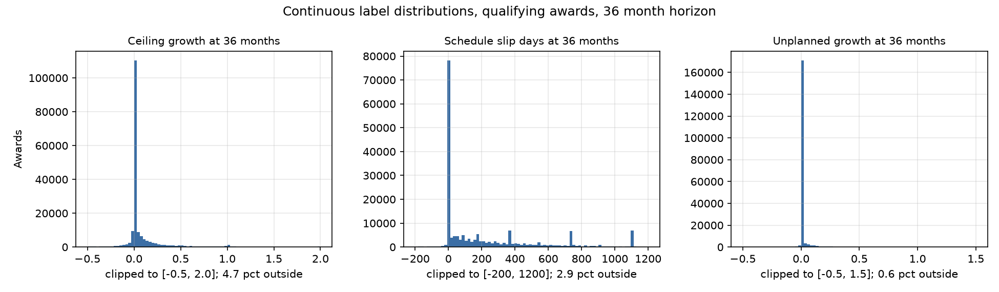
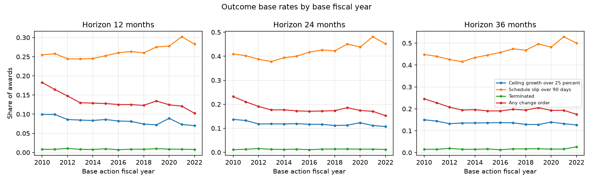
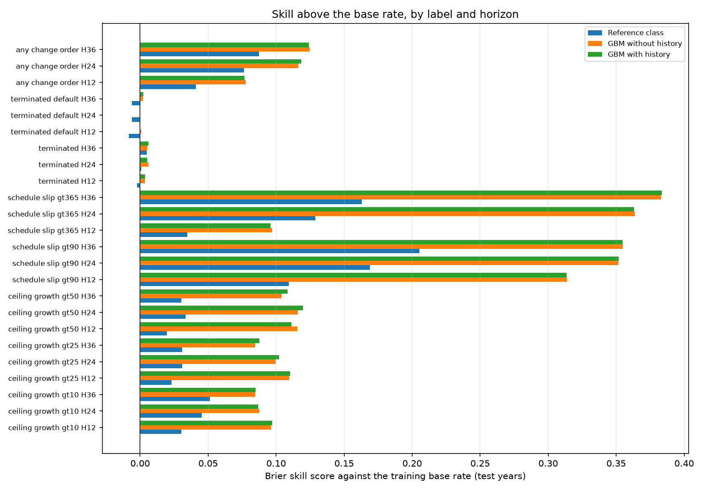
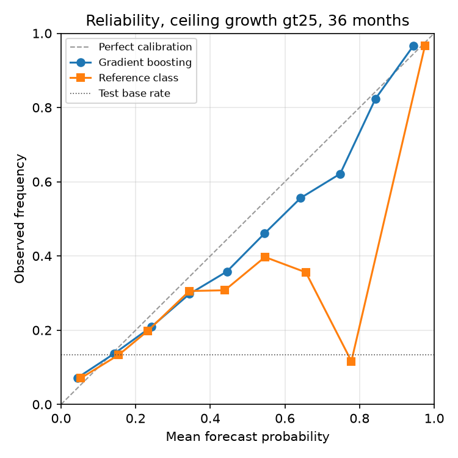
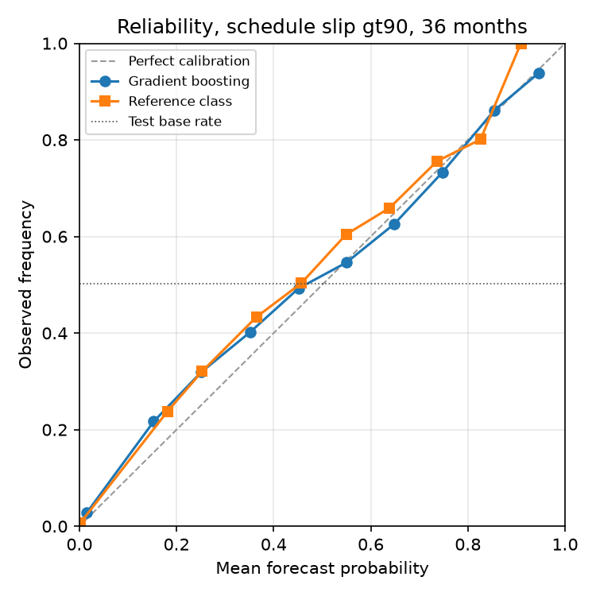
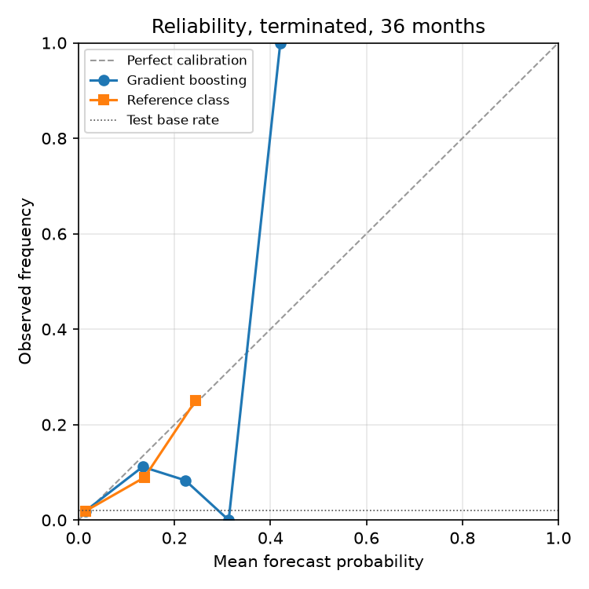
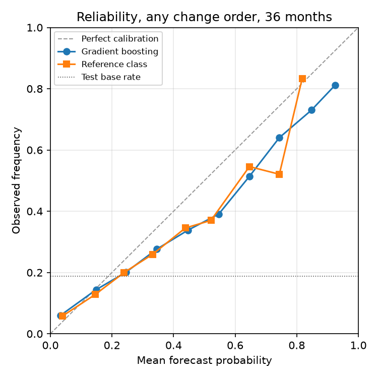

# Forecasting the outcome of a federal definitive contract at award

A leakage-controlled backtest on USAspending contract actions, FY2010 through FY2022 base awards, resolved at 12, 24 and 36 months.

Built 2026-09-16. Every number below is produced by a script in `usaspending/src/` and reproduced by `make -C usaspending all` from the repository root.

## What was built

A forecast of what happens to a United States federal definitive contract after it is awarded, made only from information carried on the award action itself plus the prior public record of the contractor and the contracting office, and scored against the later official record of modifications to that same contract.

The ladder has four rungs, run separately for every label and horizon:

0. the unconditional base rate over the training years;
1. a reference class, meaning shrunk cell means over (awarding agency, NAICS 2-digit, contract pricing code, log value quintile);
2. gradient boosting on the award-time features plus as-of contractor and office history;
3. the same gradient boosting with the history block removed.

Split by base action fiscal year: train FY2010 to FY2017, validate FY2018 to FY2019, test FY2020 to FY2022. Nothing is selected on the test years.

## The data

Source: the USAspending Custom Award Data Download API, `POST https://api.usaspending.gov/api/v2/bulk_download/awards/`, with `prime_award_types: ["D"]` (definitive contract), `date_type: "action_date"`, and the all-agencies form `{"type": "awarding", "tier": "toptier", "name": "All"}`. One job per federal fiscal year, October 1 to September 30, FY2010 through FY2026. An explicit `columns` list restricts the download to the 44 columns used here. Rows are contract actions, one row per modification.

| Fiscal year | Type D actions | Distinct awards | Parquet MB |
|---|---|---|---|
| 2010 | 253,528 | 106,922 | 16.1 |
| 2011 | 254,015 | 101,002 | 15.8 |
| 2012 | 237,691 | 98,426 | 15.1 |
| 2013 | 227,576 | 93,786 | 14.4 |
| 2014 | 208,891 | 89,216 | 13.3 |
| 2015 | 197,215 | 86,354 | 12.7 |
| 2016 | 193,779 | 86,851 | 13.7 |
| 2017 | 196,646 | 86,588 | 14.6 |
| 2018 | 191,570 | 83,702 | 15.6 |
| 2019 | 182,650 | 87,526 | 15.0 |
| 2020 | 190,686 | 86,736 | 15.6 |
| 2021 | 178,034 | 79,814 | 14.5 |
| 2022 | 179,542 | 77,262 | 14.3 |
| 2023 | 162,165 | 73,880 | 13.1 |
| 2024 | 162,574 | 73,977 | 13.2 |
| 2025 | 163,731 | 71,061 | 13.1 |
| 2026 | 106,930 | 47,861 | 8.7 |

Source: `usaspending/src/bulk_fetch.py`, run from the repository root as `.venv/bin/python -m usaspending.src.bulk_fetch --fy-start 2010 --fy-end 2026`. Written to `fetch_manifest.json`.

FY2026 is short because it is the year in progress: the extract runs to 2026-09-13, not to 30 September 2026. It is fetched anyway because outcomes of awards based as late as FY2022 are resolved out of it. FY2018 was fetched in four contiguous quarter-length windows rather than one, after the single-year job failed server side; the API keys a job on the request body, so an identical retry returns the same failed job and the body has to change. The windows were checked to tile the fiscal year exactly, and a test covers that for every split count from 1 to 12 across FY2010 to FY2026.

### The columns actually delivered

`src/columns.py` requests 44 named download columns. The parquet schema of every fiscal year was read back and diffed against that list, so a column the API silently dropped would show up here rather than as a column of nulls later.

| Check | Value |
|---|---|
| Fiscal years of parquet checked | 17 |
| Columns requested | 44 |
| Columns present in every year | 44 |
| Columns absent from at least one year | none |

Source: `usaspending/src/schema_check.py`, run from the repository root as `.venv/bin/python -m usaspending.src.schema_check`.

### Cross-check against the monthly full archive

The same fiscal year was also taken from the independent bulk path, `FY2010_All_Contracts_Full_20260906.zip`, streamed without extraction and filtered locally.

| Check | Value |
|---|---|
| Archive rows, all contract types | 3,543,905 |
| Archive rows with award_type_code D | 253,528 |
| Distinct type D awards in the archive | 106,922 |
| Columns of the 44 requested that are absent from the archive | 0 |

The API extract for the same year holds 253,528 type D actions, identical to the archive count. The two paths are independent: the API applies the type filter server side, the archive path downloads every contract action for the year and filters locally.

## Field behaviour, observed

No field semantics are asserted from the data dictionary alone. Each claim below is a statement about the dictionary followed by a count computed on the transactions. Twenty heavily modified awards are printed action by action in `field_evidence_samples.md` next to this file.

**Dictionary**: `base_and_all_options_value` is "the mutually agreed upon total contract value including all options" on the award, and `potential_total_value_of_award` is "the total amount that could be obligated on a contract, if the base and all options are exercised". On the base action the two should therefore agree.

| Base rows | Both fields present | Share equal within 1 percent or 1 dollar |
|---|---|---|
| 559,007 | 410,561 | 0.5325 |

**Dictionary**: on modifications, `base_and_all_options_value` holds "the CHANGE, positive or negative". If that is right, the base level plus the running sum of the modification values should track `potential_total_value_of_award` at each action, and the modification field read as a level should not.

| Modification rows tested | Share where base plus running delta matches potential | Share where the field read as a level matches potential |
|---|---|---|
| 1,460,177 | 0.7250 | 0.0024 |

Reading: the delta reading reconstructs the running ceiling far more often than the level reading.

**Dictionary**: `current_total_value_of_award` is "the total amount obligated to date on a contract, including the base and exercised options", so it should track the running sum of `federal_action_obligation` and sit at or below the ceiling.

| Rows tested | Share matching the running obligation | Share at or below potential total value |
|---|---|---|
| 2,006,356 | 0.4972 | 0.9951 |

**Dictionary**: `period_of_performance_current_end_date` is the scheduled completion date, revised by modifications that shorten or extend the period of performance.

| Awards with more than one action | Share whose current end date takes more than one value | Share whose current end date never changes |
|---|---|---|
| 414,445 | 0.7637 | 0.2363 |

**Consequence to check**: if `potential_total_value_of_award` is a running ceiling rather than a per-action amount, consecutive actions on the same award should rarely show it falling.

| Consecutive action pairs | Share non-decreasing | Share unchanged |
|---|---|---|
| 1,525,942 | 0.9039 | 0.8135 |

### The field the obvious label definition would use is a trap

`potential_total_value_of_award` reads like a running ceiling, and the dictionary describes it as "the total amount that could be obligated on a contract, if the base and all options are exercised". Measured over every definitive-contract action loaded, it is populated on 0.610 of them, and among awards with more than one populated action it takes a single value throughout the award 0.585 of the time. A field that is near constant within an award cannot be read at a horizon without importing the award's future.

| Field | Share of actions populated | Awards with more than one populated action | Share constant within the award |
|---|---|---|---|
| potential_total_value_of_award | 0.610 | 257,438 | 0.5846 |
| current_total_value_of_award | 0.610 | 257,437 | 0.5276 |
| total_dollars_obligated | 0.610 | 257,438 | 0.5033 |
| base_and_all_options_value | 1.000 | 414,445 | 0.0344 |
| base_and_exercised_options_value | 1.000 | 414,444 | 0.0360 |
| federal_action_obligation | 1.000 | 414,445 | 0.0228 |
| period_of_performance_current_end_date | 1.000 | 414,445 | 0.2363 |
| period_of_performance_potential_end_date | 1.000 | 414,444 | 0.3078 |
| period_of_performance_start_date | 1.000 | 414,444 | 0.3376 |

The fields that take one value throughout an award more than half the time are `potential_total_value_of_award`, `current_total_value_of_award`, `total_dollars_obligated`. Those are award-level summaries joined onto every action. The rest vary action to action and are safe to read at a horizon. So the ceiling at a horizon is reconstructed as the base action's `base_and_all_options_value` plus the sum of that same field over every later action dated at or before the horizon, and `period_of_performance_current_end_date` is used as it stands.

The availability of that field also changes across the split, which on its own rules it out as a label. Averaged over the training years FY2010 to FY2017 it is populated on 0.281 of actions; over the test years FY2020 to FY2022 it is populated on 1.000. A label that is present part of the time in training and always in test is not the same label on both sides. `base_and_all_options_value`, used instead, is populated on every action in every year.

| Action fiscal year | potential_total_value_of_award populated | base_and_all_options_value populated |
|---|---|---|
| 2010 | 0.261 | 1.000 |
| 2011 | 0.239 | 1.000 |
| 2012 | 0.240 | 1.000 |
| 2013 | 0.221 | 1.000 |
| 2014 | 0.233 | 1.000 |
| 2015 | 0.254 | 1.000 |
| 2016 | 0.280 | 1.000 |
| 2017 | 0.518 | 1.000 |
| 2018 | 1.000 | 1.000 |
| 2019 | 1.000 | 1.000 |
| 2020 | 1.000 | 1.000 |
| 2021 | 1.000 | 1.000 |
| 2022 | 1.000 | 1.000 |
| 2023 | 1.000 | 1.000 |
| 2024 | 1.000 | 1.000 |
| 2025 | 1.000 | 1.000 |
| 2026 | 1.000 | 1.000 |

Where the field is populated on every action, its behaviour can be tested directly. For awards based in FY2019 or later with at least three actions (97,496 awards), each action's value is compared with three things: the reconstruction as of that action, the award's own final value, and the base level.

| Actions | n | Equals the reconstruction | Equals the award's final value | Equals the base level |
|---|---|---|---|---|
| Final action of the award | 97,496 | 0.9846 | 1.0000 | 0.3974 |
| All earlier actions | 661,250 | 0.7667 | 0.5025 | 0.4460 |
| Earlier actions, awards whose ceiling changed | 525,900 | 0.7086 | 0.3774 | 0.3058 |

Two things follow. On the award's last action the reconstruction agrees with the field 0.985 of the time, so the reconstruction is arriving at the right number. On earlier actions of awards that did change, it agrees only 0.709 of the time, while the field already equals the award's eventual final value on 0.377 of them. Reading the field at a horizon would therefore import the award's future on a large minority of awards.

The consequence is visible in the label itself. Under the reconstruction the share of awards past 25 percent ceiling growth rises with the horizon, as it must. Under the award-level reading it barely moves, because the same end state is being read at every horizon.

| horizon_months | n_qualifying | n_reconstructed_label | n_award_level_label | rate_reconstructed | rate_award_level | n_both_available | rate_reconstructed_on_common_rows | rate_award_level_on_common_rows |
|---|---|---|---|---|---|---|---|---|
| 12 | 192377 | 192377 | 149812 | 0.0839 | 0.1178 | 149812 | 0.0807 | 0.1178 |
| 24 | 192377 | 192377 | 149812 | 0.1196 | 0.1178 | 149812 | 0.1167 | 0.1178 |
| 36 | 192377 | 192377 | 149812 | 0.1360 | 0.1178 | 149812 | 0.1340 | 0.1178 |

### Reason for modification codes actually present

The dictionary domain for contracts, pulled from `GET /api/v2/references/data_dictionary/` this session, is A additional work, B supplemental agreement within scope, C funding only, D change order, E terminate for default, F terminate for convenience, G exercise an option, H definitize letter contract, J novation, K close out, L definitize change order, M other administrative, N legal contract cancellation, P and R re-representation, S change PIID, T transfer, V entity identifier or name change, W address change, X terminate for cause, Y add subcontract plan. Counts over every type D action loaded:

| action_type_code | Actions | Share |
|---|---|---|
| M | 677,389 | 0.2061 |
| B | 661,111 | 0.2011 |
| C | 639,784 | 0.1946 |
| (null) | 562,979 | 0.1713 |
| G | 331,003 | 0.1007 |
| D | 243,198 | 0.0740 |
| K | 73,397 | 0.0223 |
| A | 35,346 | 0.0108 |
| L | 20,906 | 0.0064 |
| F | 16,348 | 0.0050 |
| V | 6,924 | 0.0021 |
| J | 6,255 | 0.0019 |
| W | 4,690 | 0.0014 |
| H | 2,318 | 0.0007 |
| N | 1,346 | 0.0004 |
| S | 1,317 | 0.0004 |
| E | 1,062 | 0.0003 |
| X | 497 | 0.0002 |
| T | 465 | 0.0001 |
| R | 376 | 0.0001 |
| P | 299 | 0.0001 |
| Y | 213 | 0.0001 |

### Fill rates on the base action

| Field | Share not null on base rows |
|---|---|
| number_of_offers_received | 1.0000 |
| recipient_uei | 1.0000 |
| awarding_office_code | 1.0000 |
| product_or_service_code | 1.0000 |
| extent_competed_code | 1.0000 |
| type_of_contract_pricing_code | 1.0000 |
| fed_biz_opps_code | 1.0000 |
| performance_based_service_acquisition_code | 1.0000 |
| multi_year_contract_code | 1.0000 |
| contracting_officers_determination_of_business_size_code | 1.0000 |
| period_of_performance_potential_end_date | 1.0000 |
| naics_code | 1.0000 |
| type_of_set_aside_code | 1.0000 |
| cost_or_pricing_data_code | 0.9714 |
| recipient_duns | 0.6734 |
| solicitation_identifier | 0.5446 |

`solicitation_identifier` and `number_of_offers_received` get their own section below, because the memo flagged both as unmeasured and a public scoreboard depends on them.

### Is a field carried per action, or restated across the award?

The test that matters for a backtest is not whether a field is populated but whether the value sitting on an old action is the value that was true then. Take awards with at least three actions, and among them the awards whose value actually moved. On every action except the last, compare the field with the value the award ends up with. A field carried per action should rarely match it. A field restated across the award's whole history will match it almost always.

| Field | Non-final actions of | n | Already equals the award's final value | Still equals the base action's value |
|---|---|---|---|---|
| `potential_total_value_of_award` | all awards | 661,250 | 0.503 | 0.446 |
| `potential_total_value_of_award` | awards whose ceiling moved | 525,900 | 0.377 | 0.306 |
| `period_of_performance_current_end_date` | all awards | 661,250 | 0.246 | 0.392 |
| `period_of_performance_current_end_date` | awards whose end date moved | 600,913 | 0.170 | 0.331 |

The two fields behave differently, and that difference is the whole design. On awards whose ceiling moved, 0.377 of earlier actions already carry the award's eventual final ceiling: the ceiling field is substantially restated. On awards whose end date moved, only 0.170 of earlier actions already carry the final end date. So the schedule field is read as it stands and the ceiling is reconstructed from per-action deltas.

Restatement rate of the ceiling field by the fiscal year of the action, on awards whose ceiling moved:

| Action fiscal year | Non-final actions | Already equals the award's final value |
|---|---|---|
| 2019 | 23,192 | 0.480 |
| 2020 | 52,910 | 0.390 |
| 2021 | 69,760 | 0.333 |
| 2022 | 86,178 | 0.319 |
| 2023 | 85,681 | 0.328 |
| 2024 | 87,545 | 0.344 |
| 2025 | 81,877 | 0.414 |
| 2026 | 38,757 | 0.614 |

The rise in the last two action years is an artefact of the snapshot rather than a change in reporting, and is labelled as an inference because it was not tested separately: an action dated close to the data end has the award's last observed action close behind it, so the two coincide more often simply because less time has passed for the ceiling to move again. The training and test years of this backtest sit in the flat middle of the table.

Source: `usaspending/src/field_evidence.py`, run from the repository root as `.venv/bin/python -m usaspending.src.field_evidence`.

### What the reconstruction cannot fix

Summing per-action deltas inherits whatever the deltas say. One award in the twenty printed in `field_evidence_samples.md` carries a single modification with a delta of 1.7 billion dollars on a contract that ends at 3.4 million, reversed by later actions; the reconstruction lands on the right final number to the cent, but a horizon that falls between the error and its reversal sits on top of it. That is a real limit and the question is how big it is.

| Horizon | Median growth | p99 | p99.9 | Max | Share above 1x | Share above 10x | Share above 100x |
|---|---|---|---|---|---|---|---|
| 12 months | 0.0000 | 2.403 | 13.8 | 1,171 | 0.03088 | 0.00162 | 0.00012 |
| 24 months | 0.0000 | 3.577 | 21.8 | 1,198 | 0.04445 | 0.00285 | 0.00024 |
| 36 months | 0.0000 | 4.199 | 28.5 | 1,198 | 0.04961 | 0.00363 | 0.00034 |

| Pathology | Awards | Share of panel |
|---|---|---|
| Awards with a negative reconstructed ceiling at some horizon, which is physically impossible and therefore certainly a data error | 24 | 0.000125 |
| Awards whose ceiling more than doubled by 24 months and then fell by more than half by 36 months, the signature of a delta that was later reversed | 9 | 0.000047 |

So it is rare. It barely touches the binary labels, whose thresholds are 10, 25 and 50 percent: an award needs a gross error to cross them spuriously, and fewer than four awards in ten thousand exceed even ten times growth at 36 months. It matters much more for the continuous label, whose mean is not robust to a tail like this, which is why the quantile ladder winsorises at the training-period 1st and 99th percentile and reports the cut points. The binary results below should be read as unaffected; any mean of raw ceiling growth should not.

Source: `usaspending/src/report.py, reconstruction_sanity`, run from the repository root as `.venv/bin/python -m usaspending.src.report`.

### Fill rates the public scoreboard depends on

`solicitation_identifier` is the key that would link an award back to the notice that produced it, which is what a forecast published before award would have to be registered against. Over 559,007 base actions it is present on 0.545 of them. The second column applies a shape test: at least one letter, at least one digit, and at least eight characters. That rule is an inference about what a SAM.gov solicitation number looks like, not an official specification, and it is reported separately for that reason. It removes very little, so the values that are present are mostly well formed; the most common failures are literal placeholders such as `NONE` and `0`.

| Base fiscal year | Base actions | Share not null | Share matching the solicitation-number shape |
|---|---|---|---|
| 2010 | 53,953 | 0.433 | 0.417 |
| 2011 | 44,379 | 0.461 | 0.443 |
| 2012 | 43,251 | 0.498 | 0.484 |
| 2013 | 39,352 | 0.468 | 0.466 |
| 2014 | 36,617 | 0.461 | 0.458 |
| 2015 | 34,232 | 0.563 | 0.560 |
| 2016 | 34,427 | 0.637 | 0.632 |
| 2017 | 32,524 | 0.666 | 0.659 |
| 2018 | 30,846 | 0.694 | 0.688 |
| 2019 | 35,743 | 0.552 | 0.548 |
| 2020 | 34,690 | 0.550 | 0.544 |
| 2021 | 28,061 | 0.579 | 0.573 |
| 2022 | 26,443 | 0.574 | 0.570 |
| 2023 | 25,679 | 0.594 | 0.589 |
| 2024 | 25,319 | 0.594 | 0.590 |
| 2025 | 21,915 | 0.538 | 0.535 |
| 2026 | 11,576 | 0.622 | 0.618 |

Most common non-null values that fail the shape test: `NONE` (280), `PY361` (103), `PY350` (65), `PYRFP5` (51), `PY360` (47), `PY351` (41), `PY364` (41), `0` (36).

`number_of_offers_received` is the competition-intensity field. It is not missing in this extract, which is itself the finding: it is present on every base action in every year. What varies is whether it carries information.

| Base fiscal year | Base actions | Share not null | Median where present | Share equal to one |
|---|---|---|---|---|
| 2010 | 53,953 | 1.000 | 1.0 | 0.513 |
| 2011 | 44,379 | 1.000 | 1.0 | 0.536 |
| 2012 | 43,251 | 1.000 | 1.0 | 0.519 |
| 2013 | 39,352 | 1.000 | 1.0 | 0.505 |
| 2014 | 36,617 | 1.000 | 1.0 | 0.521 |
| 2015 | 34,232 | 1.000 | 1.0 | 0.502 |
| 2016 | 34,427 | 1.000 | 1.0 | 0.511 |
| 2017 | 32,524 | 1.000 | 1.0 | 0.519 |
| 2018 | 30,846 | 1.000 | 1.0 | 0.503 |
| 2019 | 35,743 | 1.000 | 3.0 | 0.390 |
| 2020 | 34,690 | 1.000 | 3.0 | 0.417 |
| 2021 | 28,061 | 1.000 | 2.0 | 0.487 |
| 2022 | 26,443 | 1.000 | 2.0 | 0.497 |
| 2023 | 25,679 | 1.000 | 1.0 | 0.540 |
| 2024 | 25,319 | 1.000 | 1.0 | 0.509 |
| 2025 | 21,915 | 1.000 | 2.0 | 0.488 |
| 2026 | 11,576 | 1.000 | 2.0 | 0.453 |

By extent-competed code, where the reason becomes clear. On awards coded as not competed the field is present but mechanically equal to one, so it adds nothing beyond the competition code itself. It only separates awards within the competed codes.

| extent_competed_code | Base actions | Share of base actions | Share not null | Median where present | Share equal to one |
|---|---|---|---|---|---|
| `D` | 137,321 | 0.246 | 1.000 | 5.0 | 0.155 |
| `A` | 135,625 | 0.243 | 1.000 | 3.0 | 0.289 |
| `F` | 93,906 | 0.168 | 1.000 | 3.0 | 0.273 |
| `C` | 79,155 | 0.142 | 1.000 | 1.0 | 1.000 |
| `B` | 74,815 | 0.134 | 1.000 | 1.0 | 0.993 |
| `G` | 38,164 | 0.068 | 1.000 | 1.0 | 1.000 |
| `E` | 21 | 0.000 | 1.000 | 1.0 | 0.905 |

Source: `usaspending/src/field_evidence.py`, run from the repository root as `.venv/bin/python -m usaspending.src.field_evidence`.

## Data funnel

Data end, the latest action_date in the extract: **2026-09-13**. Transactions loaded: **3,287,223**, across fiscal years [2010, 2011, 2012, 2013, 2014, 2015, 2016, 2017, 2018, 2019, 2020, 2021, 2022, 2023, 2024, 2025, 2026]. A missing fiscal year would not merely shrink the sample: outcomes are read from the modification record of later years, so a hole would silently delete real modifications and make every label whose horizon crosses it wrong. The loader therefore refuses to run on an extract with a gap.

The funnel runs in two stages, and the order matters. The first stage asks whether an award is a well identified base award at all. What survives it is the **history source**: the set of prior awards a contractor's or an office's track record is counted over. The second stage asks whether an award is in scope for the forecast, and it runs only after labels, features and history have been built. Doing it that way means "this contractor's tenth federal contract" counts contracts, not contracts that happened to clear the simplified acquisition threshold; and it keeps the single-base-row check, which inspects actions dated after the base date, from reaching back and changing an earlier award's prior-award count.

| Quantity | Awards |
|---|---|
| Base awards in the history source | 474,512 |
| Of those, booked to an aggregate placeholder recipient | 25,040 |

The history source is much larger than the modelling panel because it is not restricted by award size. The placeholder-recipient count above is over that wider set; the section on contractor identity below reports the smaller count within the panel itself.

| Base row diagnostic | Awards |
|---|---|
| awards type D total | 631,431 |
| awards without modification number zero | 72,424 |
| awards with modification zero that is not the first action | 6 |
| awards with more than one base action | 3,334 |

| Filter | Awards remaining | Dropped |
|---|---|---|
| start: one base row per type-D award | 631,431 |  |
| award has an action with an explicit modification_number of zero | 559,007 | -72,424 |
| that modification-zero action is the award's first action | 559,001 | -6 |
| base action_date in FY2010-FY2022 | 474,512 | -84,489 |
| exactly one action carries a modification_number of zero | 471,439 | -3,073 |
| base federal_action_obligation >= 250,000 | 192,380 | -279,059 |
| base period_of_performance_current_end_date is not null | 192,380 | none |
| base_and_all_options_value > 0 and not null | 192,377 | -3 |

Source: `usaspending/src/panel.py`, run from the repository root as `.venv/bin/python -m usaspending.src.panel`.

### Right censoring

An award qualifies for horizon H only when its base action date plus H months falls at or before the data end, so no label is read off a period the extract does not cover. The data end is **2026-09-13**, which is later than the base action date of the last award in the population plus 36 months, so every award in the panel qualifies at every horizon and the model comparison is not made on different populations at different horizons. The table is reported anyway because the rule binds as soon as the panel is extended to more recent base years.

| base_fy | awards_in_panel | earliest_base_action | latest_base_action | qualifying_H12 | share_qualifying_H12 | qualifying_H24 | share_qualifying_H24 | qualifying_H36 | share_qualifying_H36 |
|---|---|---|---|---|---|---|---|---|---|
| 2010 | 19065 | 2009-10-01 | 2010-09-30 | 19065 | 1.0000 | 19065 | 1.0000 | 19065 | 1.0000 |
| 2011 | 16338 | 2010-10-01 | 2011-09-30 | 16338 | 1.0000 | 16338 | 1.0000 | 16338 | 1.0000 |
| 2012 | 16998 | 2011-10-01 | 2012-09-30 | 16998 | 1.0000 | 16998 | 1.0000 | 16998 | 1.0000 |
| 2013 | 14436 | 2012-10-01 | 2013-09-30 | 14436 | 1.0000 | 14436 | 1.0000 | 14436 | 1.0000 |
| 2014 | 14335 | 2013-10-01 | 2014-09-30 | 14335 | 1.0000 | 14335 | 1.0000 | 14335 | 1.0000 |
| 2015 | 13779 | 2014-10-01 | 2015-09-30 | 13779 | 1.0000 | 13779 | 1.0000 | 13779 | 1.0000 |
| 2016 | 14418 | 2015-10-01 | 2016-09-30 | 14418 | 1.0000 | 14418 | 1.0000 | 14418 | 1.0000 |
| 2017 | 13864 | 2016-10-01 | 2017-09-30 | 13864 | 1.0000 | 13864 | 1.0000 | 13864 | 1.0000 |
| 2018 | 14610 | 2017-10-01 | 2018-09-30 | 14610 | 1.0000 | 14610 | 1.0000 | 14610 | 1.0000 |
| 2019 | 14617 | 2018-10-01 | 2019-09-30 | 14617 | 1.0000 | 14617 | 1.0000 | 14617 | 1.0000 |
| 2020 | 14634 | 2019-10-01 | 2020-09-30 | 14634 | 1.0000 | 14634 | 1.0000 | 14634 | 1.0000 |
| 2021 | 12527 | 2020-10-01 | 2021-09-30 | 12527 | 1.0000 | 12527 | 1.0000 | 12527 | 1.0000 |
| 2022 | 12756 | 2021-10-01 | 2022-09-30 | 12756 | 1.0000 | 12756 | 1.0000 | 12756 | 1.0000 |
| ALL | 192377 |  |  | 192377 | 1.0000 | 192377 | 1.0000 | 192377 | 1.0000 |

Source: `usaspending/src/report.py`, run from the repository root as `.venv/bin/python -m usaspending.src.report`.

### Who counts as one contractor

The contractor history features are keyed on `recipient_uei`, which assumes a UEI is one firm. Some are not. USAspending books some actions against placeholder entities that stand for a bucket of firms, and on this panel the largest of them is the single most frequent recipient UEI of all, ahead of any real contractor:

| Recipient UEI | Recipient name | Base awards in the panel | Held out of contractor pooling |
|---|---|---|---|
| `LN9PU5M2YZN5` | MISCELLANEOUS FOREIGN AWARDEES | 2,731 | yes |
| `NN2NGPDNCK23` | FOREIGN AWARDEES (UNDISCLOSED) | 922 | yes |
| `KA5HQCLKUVW1` | DOMESTIC AWARDEES (UNDISCLOSED) | 671 | yes |
| `WWFNFCV65M13` | BUNDESAMT F¿R BAUWESEN UND RAUMORDNUNG (largest real contractor, for scale) | 673 | no |

Left alone, the first of those becomes a fictitious contractor with a track record of thousands of awards, and its prior mean outcome pools unrelated companies. Awards booked to such a recipient are therefore held out of the contractor pooling entirely, as both source and subject, and receive a null contractor history rather than a pooled one. A null is the honest answer and the gradient booster treats it as missing natively, whereas a zero would assert the contractor is new when the truth is that the record does not say who the contractor is. The awards stay in the panel, and carry a `recipient_is_aggregate` flag so the model can use the fact itself. Their awarding office is a real office, so office history is unaffected.

The rule is a match on the recipient name against `UNDISCLOSED|MISCELLANEOUS FOREIGN AWARDEES|MULTIPLE RECIPIENTS|REDACTED`. It is an inference from the name, not an official flag, and it is stated here so it can be argued with. The word "aggregate" is deliberately not in the pattern: it matches real construction firms such as HIGH DESERT AGGREGATE & PAVING.

The opposite failure is more common and harder to fix: one firm carrying several UEIs, which splits its track record. Of 39,500 distinct recipient names in the panel, 921 (0.023) appear under more than one UEI, covering 24,162 awards (0.128 of the panel). Matching on name instead would create the opposite error, since distinct legal entities share names, so the UEI is kept and the consequence is reported rather than papered over: contractor history is understated for these firms.

| Recipient name | Base awards | Distinct UEIs | Share under the largest single UEI |
|---|---|---|---|
| RAYTHEON COMPANY | 1,147 | 54 | 0.194 |
| LOCKHEED MARTIN CORPORATION | 1,002 | 45 | 0.109 |
| NORTHROP GRUMMAN SYSTEMS CORPORATION | 775 | 56 | 0.124 |
| THE BOEING COMPANY | 487 | 39 | 0.207 |
| L3HARRIS TECHNOLOGIES, INC. | 382 | 19 | 0.285 |
| LEIDOS, INC. | 365 | 20 | 0.526 |
| L3 TECHNOLOGIES, INC. | 351 | 27 | 0.319 |
| BAE SYSTEMS INFORMATION AND ELECTRONIC SYSTEMS INTEGRATION INC. | 308 | 14 | 0.308 |

Source: `usaspending/src/panel.py, is_aggregate_recipient; report.py, aggregate_recipient_table and uei_fragmentation_table`, run from the repository root as `.venv/bin/python -m usaspending.src.report`.

## Label definitions

For an award with base action date `t0` and horizon `H` months, the state at `H` is taken from the latest action with `action_date <= t0 + H months`, ordering actions by action date, then by the numeric suffix of the modification number, then by transaction number, then by the modification number itself. That last key is not decoration. Without it, 2,595 actions in the extract, 0.079 percent, tie on the first three and which one counts as the latest at a horizon would be settled by the order the per-year files happened to be concatenated in. With it there are no ties at all, measured on the full extract.

| Label | Definition |
|---|---|
| ceiling_growth_H | the reconstructed ceiling at H divided by base_and_all_options_value on the base action, minus one, where the reconstructed ceiling is the base action's base_and_all_options_value plus the sum of that same field over every later action dated at or before t0 + H. This is NOT potential_total_value_of_award read at H; the section on field behaviour above measures why that field cannot be used |
| ceiling_growth_gt10_H, gt25_H, gt50_H | ceiling_growth_H strictly above 0.10, 0.25, 0.50, after rounding the ratio to ten decimal places so an award at exactly the threshold is not counted |
| schedule_slip_days_H | period_of_performance_current_end_date at H minus the same field on the base action, in days |
| schedule_slip_gt90_H, gt365_H | schedule_slip_days_H above 90, above 365 |
| terminated_H | any action by H with action_type_code in E, F or X |
| terminated_default_H | any action by H with action_type_code E only |
| change_order_count_H | count of actions by H with action_type_code A or D |
| unplanned_growth_H | sum of base_and_all_options_value on A and D actions by H, divided by the base ceiling |
| any_change_order_H | change_order_count_H above zero |

An award qualifies for horizon H only when `t0 + H months` is at or before the data end, so no label is read off a period the data does not cover. Awards whose base ceiling is missing or not positive are dropped, since ceiling growth is undefined for them.

## Label distributions

### Base rates by base fiscal year, horizon 12 months

| base_fy | qualifying_awards | any_change_order | ceiling_growth_gt10 | ceiling_growth_gt25 | ceiling_growth_gt50 | schedule_slip_gt365 | schedule_slip_gt90 | terminated | terminated_default |
|---|---|---|---|---|---|---|---|---|---|
| 2010 | 19065 | 0.1830 | 0.1617 | 0.0995 | 0.0687 | 0.0593 | 0.2549 | 0.0083 | 0.0011 |
| 2011 | 16338 | 0.1643 | 0.1537 | 0.0992 | 0.0663 | 0.0500 | 0.2579 | 0.0082 | 0.0007 |
| 2012 | 16998 | 0.1475 | 0.1354 | 0.0860 | 0.0595 | 0.0302 | 0.2447 | 0.0106 | 0.0008 |
| 2013 | 14436 | 0.1299 | 0.1299 | 0.0846 | 0.0578 | 0.0322 | 0.2441 | 0.0082 | 0.0005 |
| 2014 | 14335 | 0.1288 | 0.1295 | 0.0836 | 0.0562 | 0.0730 | 0.2453 | 0.0080 | 0.0006 |
| 2015 | 13779 | 0.1277 | 0.1359 | 0.0861 | 0.0560 | 0.0523 | 0.2527 | 0.0096 | 0.0012 |
| 2016 | 14418 | 0.1252 | 0.1298 | 0.0822 | 0.0540 | 0.0321 | 0.2603 | 0.0071 | 0.0004 |
| 2017 | 13864 | 0.1249 | 0.1289 | 0.0811 | 0.0539 | 0.0351 | 0.2636 | 0.0085 | 0.0006 |
| 2018 | 14610 | 0.1230 | 0.1226 | 0.0743 | 0.0478 | 0.0845 | 0.2600 | 0.0084 | 0.0002 |
| 2019 | 14617 | 0.1344 | 0.1194 | 0.0721 | 0.0487 | 0.0582 | 0.2755 | 0.0100 | 0.0007 |
| 2020 | 14634 | 0.1246 | 0.1353 | 0.0892 | 0.0613 | 0.0326 | 0.2779 | 0.0087 | 0.0003 |
| 2021 | 12527 | 0.1209 | 0.1170 | 0.0731 | 0.0502 | 0.0367 | 0.3021 | 0.0084 | 0.0003 |
| 2022 | 12756 | 0.1024 | 0.1125 | 0.0701 | 0.0452 | 0.1010 | 0.2830 | 0.0079 | 0.0002 |

Source: `usaspending/src/models.py, base_rates_table`, run from the repository root as `.venv/bin/python -m usaspending.src.models`. Written in full to `base_rates.csv`.

### Base rates by base fiscal year, horizon 24 months

| base_fy | qualifying_awards | any_change_order | ceiling_growth_gt10 | ceiling_growth_gt25 | ceiling_growth_gt50 | schedule_slip_gt365 | schedule_slip_gt90 | terminated | terminated_default |
|---|---|---|---|---|---|---|---|---|---|
| 2010 | 19065 | 0.2322 | 0.2220 | 0.1373 | 0.0909 | 0.1663 | 0.4098 | 0.0112 | 0.0019 |
| 2011 | 16338 | 0.2105 | 0.2044 | 0.1326 | 0.0894 | 0.1566 | 0.4024 | 0.0129 | 0.0017 |
| 2012 | 16998 | 0.1912 | 0.1853 | 0.1182 | 0.0805 | 0.1474 | 0.3876 | 0.0158 | 0.0018 |
| 2013 | 14436 | 0.1767 | 0.1836 | 0.1185 | 0.0791 | 0.1478 | 0.3779 | 0.0128 | 0.0010 |
| 2014 | 14335 | 0.1772 | 0.1828 | 0.1182 | 0.0781 | 0.1753 | 0.3938 | 0.0121 | 0.0011 |
| 2015 | 13779 | 0.1727 | 0.1878 | 0.1195 | 0.0761 | 0.1679 | 0.4002 | 0.0134 | 0.0012 |
| 2016 | 14418 | 0.1712 | 0.1848 | 0.1169 | 0.0747 | 0.1620 | 0.4170 | 0.0110 | 0.0008 |
| 2017 | 13864 | 0.1720 | 0.1829 | 0.1165 | 0.0752 | 0.1794 | 0.4263 | 0.0136 | 0.0012 |
| 2018 | 14610 | 0.1736 | 0.1811 | 0.1120 | 0.0725 | 0.1949 | 0.4227 | 0.0137 | 0.0005 |
| 2019 | 14617 | 0.1860 | 0.1803 | 0.1130 | 0.0736 | 0.1917 | 0.4508 | 0.0142 | 0.0012 |
| 2020 | 14634 | 0.1746 | 0.1891 | 0.1234 | 0.0823 | 0.1790 | 0.4384 | 0.0134 | 0.0006 |
| 2021 | 12527 | 0.1708 | 0.1862 | 0.1117 | 0.0733 | 0.2199 | 0.4812 | 0.0134 | 0.0006 |
| 2022 | 12756 | 0.1529 | 0.1772 | 0.1076 | 0.0677 | 0.2248 | 0.4519 | 0.0121 | 0.0009 |

Source: `usaspending/src/models.py, base_rates_table`, run from the repository root as `.venv/bin/python -m usaspending.src.models`. Written in full to `base_rates.csv`.

### Base rates by base fiscal year, horizon 36 months

| base_fy | qualifying_awards | any_change_order | ceiling_growth_gt10 | ceiling_growth_gt25 | ceiling_growth_gt50 | schedule_slip_gt365 | schedule_slip_gt90 | terminated | terminated_default |
|---|---|---|---|---|---|---|---|---|---|
| 2010 | 19065 | 0.2460 | 0.2410 | 0.1501 | 0.0985 | 0.2188 | 0.4483 | 0.0151 | 0.0028 |
| 2011 | 16338 | 0.2274 | 0.2234 | 0.1440 | 0.0974 | 0.2145 | 0.4399 | 0.0152 | 0.0023 |
| 2012 | 16998 | 0.2078 | 0.2064 | 0.1324 | 0.0888 | 0.2018 | 0.4253 | 0.0193 | 0.0027 |
| 2013 | 14436 | 0.1944 | 0.2084 | 0.1352 | 0.0885 | 0.2059 | 0.4153 | 0.0155 | 0.0015 |
| 2014 | 14335 | 0.1962 | 0.2077 | 0.1355 | 0.0880 | 0.2291 | 0.4343 | 0.0151 | 0.0015 |
| 2015 | 13779 | 0.1906 | 0.2160 | 0.1363 | 0.0851 | 0.2333 | 0.4456 | 0.0168 | 0.0015 |
| 2016 | 14418 | 0.1904 | 0.2135 | 0.1369 | 0.0866 | 0.2379 | 0.4578 | 0.0132 | 0.0012 |
| 2017 | 13864 | 0.1978 | 0.2121 | 0.1363 | 0.0881 | 0.2588 | 0.4742 | 0.0171 | 0.0015 |
| 2018 | 14610 | 0.1944 | 0.2074 | 0.1287 | 0.0830 | 0.2580 | 0.4677 | 0.0171 | 0.0009 |
| 2019 | 14617 | 0.2051 | 0.2054 | 0.1283 | 0.0824 | 0.2670 | 0.4965 | 0.0178 | 0.0013 |
| 2020 | 14634 | 0.1928 | 0.2160 | 0.1394 | 0.0927 | 0.2591 | 0.4817 | 0.0162 | 0.0011 |
| 2021 | 12527 | 0.1932 | 0.2175 | 0.1321 | 0.0862 | 0.3004 | 0.5293 | 0.0164 | 0.0009 |
| 2022 | 12756 | 0.1751 | 0.2045 | 0.1266 | 0.0777 | 0.2886 | 0.5001 | 0.0263 | 0.0010 |

Source: `usaspending/src/models.py, base_rates_table`, run from the repository root as `.venv/bin/python -m usaspending.src.models`. Written in full to `base_rates.csv`.

### Pooled base rates over all base years

| label | H12 | H24 | H36 |
|---|---|---|---|
| any_change_order | 0.1357 | 0.1837 | 0.2026 |
| ceiling_growth_gt10 | 0.1329 | 0.1893 | 0.2145 |
| ceiling_growth_gt25 | 0.0839 | 0.1196 | 0.1360 |
| ceiling_growth_gt50 | 0.0564 | 0.0786 | 0.0884 |
| schedule_slip_gt365 | 0.0517 | 0.1763 | 0.2417 |
| schedule_slip_gt90 | 0.2622 | 0.4184 | 0.4608 |
| terminated | 0.0086 | 0.0130 | 0.0169 |
| terminated_default | 0.0006 | 0.0011 | 0.0016 |

### Continuous labels

| label | horizon_months | n | mean | sd | p10 | p25 | median | p75 | p90 | p99 | share_zero |
|---|---|---|---|---|---|---|---|---|---|---|---|
| ceiling_growth | 12 | 192377 | 0.1648 | 4.6129 | 0.0000 | 0.0000 | 0.0000 | 0.0062 | 0.1828 | 2.4025 | 0.6498 |
| schedule_slip_days | 12 | 192377 | 67.6425 | 339.1373 | 0.0000 | 0.0000 | 0.0000 | 96.0000 | 365.0000 | 684.2400 | 0.5606 |
| unplanned_growth | 12 | 192377 | 0.0341 | 3.1426 | 0.0000 | 0.0000 | 0.0000 | 0.0000 | 0.0000 | 0.4102 | 0.9054 |
| ceiling_growth | 24 | 192377 | 0.2603 | 6.0031 | -0.0007 | 0.0000 | 0.0000 | 0.0443 | 0.3406 | 3.5771 | 0.5400 |
| schedule_slip_days | 24 | 192377 | 155.1402 | 375.1177 | 0.0000 | 0.0000 | 24.0000 | 274.0000 | 548.0000 | 950.0000 | 0.4226 |
| unplanned_growth | 24 | 192377 | 0.0559 | 3.3925 | 0.0000 | 0.0000 | 0.0000 | 0.0000 | 0.0082 | 0.6937 | 0.8671 |
| ceiling_growth | 36 | 192377 | 0.3310 | 7.8730 | -0.0071 | 0.0000 | 0.0000 | 0.0654 | 0.4221 | 4.1994 | 0.4993 |
| schedule_slip_days | 36 | 192377 | 220.2657 | 447.7376 | 0.0000 | 0.0000 | 57.0000 | 365.0000 | 731.0000 | 1219.0000 | 0.3888 |
| unplanned_growth | 36 | 192377 | 0.0737 | 4.1808 | 0.0000 | 0.0000 | 0.0000 | 0.0000 | 0.0171 | 0.8470 | 0.8519 |





## Model results

All figures are on the test years, base action fiscal year FY2020 to FY2022. The Brier skill score uses the training-period base rate as the reference forecast, so zero means no skill above knowing the historical frequency and nothing else.

| Label | H | n test | Train base rate | Test base rate | Brier base rate | Brier ref class | Brier GBM | Brier GBM no hist | BSS ref class | BSS GBM | BSS GBM no hist | AUC ref class | AUC GBM | AUC GBM no hist |
|---|---|---|---|---|---|---|---|---|---|---|---|---|---|---|
| ceiling_growth_gt10 | 12 | 39,917 | 0.1392 | 0.1223 | 0.1076 | 0.1044 | 0.0972 | 0.0973 | 0.0302 | 0.0970 | 0.0962 | 0.667 | 0.730 | 0.727 |
| ceiling_growth_gt10 | 24 | 39,917 | 0.1930 | 0.1844 | 0.1505 | 0.1436 | 0.1374 | 0.1373 | 0.0453 | 0.0866 | 0.0877 | 0.665 | 0.708 | 0.708 |
| ceiling_growth_gt10 | 36 | 39,917 | 0.2169 | 0.2128 | 0.1675 | 0.1589 | 0.1533 | 0.1533 | 0.0511 | 0.0849 | 0.0847 | 0.665 | 0.705 | 0.703 |
| ceiling_growth_gt25 | 12 | 39,917 | 0.0884 | 0.0780 | 0.0721 | 0.0704 | 0.0641 | 0.0641 | 0.0231 | 0.1104 | 0.1097 | 0.667 | 0.742 | 0.742 |
| ceiling_growth_gt25 | 24 | 39,917 | 0.1229 | 0.1147 | 0.1016 | 0.0984 | 0.0912 | 0.0915 | 0.0310 | 0.1021 | 0.0995 | 0.665 | 0.719 | 0.719 |
| ceiling_growth_gt25 | 36 | 39,917 | 0.1388 | 0.1330 | 0.1154 | 0.1118 | 0.1053 | 0.1056 | 0.0308 | 0.0876 | 0.0845 | 0.663 | 0.710 | 0.708 |
| ceiling_growth_gt50 | 12 | 39,917 | 0.0596 | 0.0527 | 0.0500 | 0.0490 | 0.0444 | 0.0442 | 0.0195 | 0.1111 | 0.1157 | 0.678 | 0.750 | 0.753 |
| ceiling_growth_gt50 | 24 | 39,917 | 0.0811 | 0.0748 | 0.0693 | 0.0670 | 0.0610 | 0.0612 | 0.0334 | 0.1198 | 0.1161 | 0.686 | 0.744 | 0.743 |
| ceiling_growth_gt50 | 36 | 39,917 | 0.0906 | 0.0859 | 0.0785 | 0.0762 | 0.0700 | 0.0704 | 0.0301 | 0.1083 | 0.1040 | 0.680 | 0.737 | 0.734 |
| schedule_slip_gt90 | 12 | 39,917 | 0.2529 | 0.2871 | 0.2059 | 0.1833 | 0.1413 | 0.1413 | 0.1094 | 0.3137 | 0.3137 | 0.701 | 0.844 | 0.844 |
| schedule_slip_gt90 | 24 | 39,917 | 0.4018 | 0.4561 | 0.2510 | 0.2086 | 0.1627 | 0.1628 | 0.1690 | 0.3518 | 0.3517 | 0.717 | 0.839 | 0.839 |
| schedule_slip_gt90 | 36 | 39,917 | 0.4422 | 0.5025 | 0.2536 | 0.2015 | 0.1637 | 0.1636 | 0.2054 | 0.3547 | 0.3549 | 0.741 | 0.838 | 0.838 |
| schedule_slip_gt365 | 12 | 39,917 | 0.0458 | 0.0557 | 0.0527 | 0.0509 | 0.0477 | 0.0476 | 0.0347 | 0.0959 | 0.0973 | 0.721 | 0.832 | 0.835 |
| schedule_slip_gt365 | 24 | 39,917 | 0.1624 | 0.2065 | 0.1658 | 0.1444 | 0.1056 | 0.1055 | 0.1289 | 0.3631 | 0.3636 | 0.740 | 0.860 | 0.860 |
| schedule_slip_gt365 | 36 | 39,917 | 0.2239 | 0.2815 | 0.2056 | 0.1721 | 0.1267 | 0.1269 | 0.1628 | 0.3836 | 0.3829 | 0.749 | 0.856 | 0.856 |
| terminated | 12 | 39,917 | 0.0086 | 0.0084 | 0.0083 | 0.0083 | 0.0083 | 0.0083 | -0.0023 | 0.0035 | 0.0037 | 0.617 | 0.649 | 0.650 |
| terminated | 24 | 39,917 | 0.0129 | 0.0130 | 0.0128 | 0.0128 | 0.0127 | 0.0127 | 0.0008 | 0.0050 | 0.0062 | 0.609 | 0.642 | 0.645 |
| terminated | 36 | 39,917 | 0.0159 | 0.0195 | 0.0191 | 0.0190 | 0.0190 | 0.0190 | 0.0048 | 0.0060 | 0.0053 | 0.612 | 0.636 | 0.635 |
| terminated_default | 12 | 39,917 | 0.0007 | 0.0003 | 0.0003 | 0.0003 | 0.0003 | 0.0003 | -0.0083 | 0.0003 | 0.0009 | 0.589 | 0.640 | 0.643 |
| terminated_default | 24 | 39,917 | 0.0014 | 0.0007 | 0.0007 | 0.0007 | 0.0007 | 0.0007 | -0.0062 | 0.0002 | 0.0001 | 0.535 | 0.615 | 0.614 |
| terminated_default | 36 | 39,917 | 0.0019 | 0.0010 | 0.0010 | 0.0010 | 0.0010 | 0.0010 | -0.0062 | 0.0025 | 0.0019 | 0.552 | 0.786 | 0.772 |
| any_change_order | 12 | 39,917 | 0.1436 | 0.1163 | 0.1036 | 0.0993 | 0.0956 | 0.0955 | 0.0411 | 0.0766 | 0.0776 | 0.716 | 0.747 | 0.751 |
| any_change_order | 24 | 39,917 | 0.1902 | 0.1665 | 0.1393 | 0.1287 | 0.1228 | 0.1231 | 0.0765 | 0.1184 | 0.1163 | 0.725 | 0.755 | 0.755 |
| any_change_order | 36 | 39,917 | 0.2083 | 0.1873 | 0.1526 | 0.1393 | 0.1337 | 0.1336 | 0.0873 | 0.1240 | 0.1248 | 0.723 | 0.754 | 0.756 |

Source: `usaspending/src/models.py`, run from the repository root as `.venv/bin/python -m usaspending.src.models`. Full detail in `model_results.json`.



### What the table says

Of the 24 label-and-horizon cells, gradient boosting beats the training base rate in 24, and beats the reference class in 24. The reference class on its own beats the base rate in 20. Gradient boosting AUC runs from 0.615 to 0.860 with a median of 0.743.

The contractor and office history block is the part worth stating plainly: it improves the Brier skill score in 13 of the 24 cells, and the median difference between the model with history and the model without it is 0.00009 of skill score. Whatever the history features contribute is small next to what the award-time fields already carry, and on a public scoreboard the simpler model would be the honest default.

Best and worst cells by gradient boosting skill:

| Label | H | BSS GBM | AUC GBM |
|---|---|---|---|
| schedule_slip_gt365 | 36 | 0.3836 | 0.856 |
| schedule_slip_gt365 | 24 | 0.3631 | 0.860 |
| schedule_slip_gt90 | 36 | 0.3547 | 0.838 |
| schedule_slip_gt90 | 24 | 0.3518 | 0.839 |
| schedule_slip_gt90 | 12 | 0.3137 | 0.844 |
| terminated | 24 | 0.0050 | 0.642 |
| terminated | 12 | 0.0035 | 0.649 |
| terminated_default | 36 | 0.0025 | 0.786 |
| terminated_default | 12 | 0.0003 | 0.640 |
| terminated_default | 24 | 0.0002 | 0.615 |

## Calibration

One table per label at the 36 month horizon. `model_results.json` carries the same table for all three horizons, and for the reference class as well as the gradient boosting model.

### ceiling growth gt10, horizon 36 months, gradient boosting

| bin | n | mean_forecast | observed_rate |
|---|---|---|---|
| [0.0,0.1) | 10055 | 0.0298 | 0.0592 |
| [0.1,0.2) | 9666 | 0.1532 | 0.1777 |
| [0.2,0.3) | 9207 | 0.2468 | 0.2380 |
| [0.3,0.4) | 5516 | 0.3456 | 0.2915 |
| [0.4,0.5) | 2951 | 0.4446 | 0.3633 |
| [0.5,0.6) | 1372 | 0.5453 | 0.4257 |
| [0.6,0.7) | 569 | 0.6453 | 0.5378 |
| [0.7,0.8) | 358 | 0.7465 | 0.6564 |
| [0.8,0.9) | 173 | 0.8338 | 0.7803 |
| [0.9,1.0] | 50 | 0.9559 | 0.9800 |

Expected calibration error, gradient boosting: 0.0356; reference class: 0.0278.

### ceiling growth gt25, horizon 36 months, gradient boosting

| bin | n | mean_forecast | observed_rate |
|---|---|---|---|
| [0.0,0.1) | 21010 | 0.0437 | 0.0716 |
| [0.1,0.2) | 11239 | 0.1420 | 0.1365 |
| [0.2,0.3) | 4016 | 0.2423 | 0.2092 |
| [0.3,0.4) | 1692 | 0.3446 | 0.2979 |
| [0.4,0.5) | 899 | 0.4447 | 0.3582 |
| [0.5,0.6) | 484 | 0.5455 | 0.4607 |
| [0.6,0.7) | 275 | 0.6423 | 0.5564 |
| [0.7,0.8) | 140 | 0.7481 | 0.6214 |
| [0.8,0.9) | 102 | 0.8426 | 0.8235 |
| [0.9,1.0] | 60 | 0.9445 | 0.9667 |

Expected calibration error, gradient boosting: 0.0256; reference class: 0.0262.



### ceiling growth gt50, horizon 36 months, gradient boosting

| bin | n | mean_forecast | observed_rate |
|---|---|---|---|
| [0.0,0.1) | 30844 | 0.0365 | 0.0502 |
| [0.1,0.2) | 5467 | 0.1391 | 0.1341 |
| [0.2,0.3) | 1797 | 0.2424 | 0.2204 |
| [0.3,0.4) | 777 | 0.3439 | 0.2831 |
| [0.4,0.5) | 422 | 0.4432 | 0.3578 |
| [0.5,0.6) | 272 | 0.5429 | 0.4669 |
| [0.6,0.7) | 117 | 0.6451 | 0.6496 |
| [0.7,0.8) | 128 | 0.7471 | 0.6797 |
| [0.8,0.9) | 62 | 0.8327 | 0.9677 |
| [0.9,1.0] | 31 | 0.9480 | 0.9677 |

Expected calibration error, gradient boosting: 0.0153; reference class: 0.0167.

### schedule slip gt90, horizon 36 months, gradient boosting

| bin | n | mean_forecast | observed_rate |
|---|---|---|---|
| [0.0,0.1) | 6651 | 0.0157 | 0.0287 |
| [0.1,0.2) | 2488 | 0.1531 | 0.2170 |
| [0.2,0.3) | 2932 | 0.2510 | 0.3192 |
| [0.3,0.4) | 3617 | 0.3516 | 0.4020 |
| [0.4,0.5) | 4151 | 0.4514 | 0.4927 |
| [0.5,0.6) | 4510 | 0.5497 | 0.5459 |
| [0.6,0.7) | 4141 | 0.6485 | 0.6259 |
| [0.7,0.8) | 3148 | 0.7476 | 0.7328 |
| [0.8,0.9) | 3068 | 0.8540 | 0.8608 |
| [0.9,1.0] | 5211 | 0.9456 | 0.9384 |

Expected calibration error, gradient boosting: 0.0254; reference class: 0.0369.



### schedule slip gt365, horizon 36 months, gradient boosting

| bin | n | mean_forecast | observed_rate |
|---|---|---|---|
| [0.0,0.1) | 14205 | 0.0376 | 0.0527 |
| [0.1,0.2) | 8934 | 0.1461 | 0.1802 |
| [0.2,0.3) | 5304 | 0.2446 | 0.2632 |
| [0.3,0.4) | 2774 | 0.3437 | 0.3497 |
| [0.4,0.5) | 1500 | 0.4466 | 0.4620 |
| [0.5,0.6) | 1029 | 0.5478 | 0.5899 |
| [0.6,0.7) | 852 | 0.6505 | 0.6714 |
| [0.7,0.8) | 1226 | 0.7548 | 0.7961 |
| [0.8,0.9) | 2406 | 0.8562 | 0.8770 |
| [0.9,1.0] | 1687 | 0.9266 | 0.9212 |

Expected calibration error, gradient boosting: 0.0207; reference class: 0.0325.

### terminated, horizon 36 months, gradient boosting

| bin | n | mean_forecast | observed_rate |
|---|---|---|---|
| [0.0,0.1) | 39636 | 0.0142 | 0.0188 |
| [0.1,0.2) | 242 | 0.1337 | 0.1116 |
| [0.2,0.3) | 36 | 0.2225 | 0.0833 |
| [0.3,0.4) | 1 | 0.3130 | 0.0000 |
| [0.4,0.5) | 2 | 0.4206 | 1.0000 |
| [0.5,0.6) | 0 | n/a | n/a |
| [0.6,0.7) | 0 | n/a | n/a |
| [0.7,0.8) | 0 | n/a | n/a |
| [0.8,0.9) | 0 | n/a | n/a |
| [0.9,1.0] | 0 | n/a | n/a |

Expected calibration error, gradient boosting: 0.0049; reference class: 0.0043.



### terminated default, horizon 36 months, gradient boosting

| bin | n | mean_forecast | observed_rate |
|---|---|---|---|
| [0.0,0.1) | 39917 | 0.0017 | 0.0010 |
| [0.1,0.2) | 0 | n/a | n/a |
| [0.2,0.3) | 0 | n/a | n/a |
| [0.3,0.4) | 0 | n/a | n/a |
| [0.4,0.5) | 0 | n/a | n/a |
| [0.5,0.6) | 0 | n/a | n/a |
| [0.6,0.7) | 0 | n/a | n/a |
| [0.7,0.8) | 0 | n/a | n/a |
| [0.8,0.9) | 0 | n/a | n/a |
| [0.9,1.0] | 0 | n/a | n/a |

Expected calibration error, gradient boosting: 0.0007; reference class: 0.0009.

### any change order, horizon 36 months, gradient boosting

| bin | n | mean_forecast | observed_rate |
|---|---|---|---|
| [0.0,0.1) | 14316 | 0.0333 | 0.0603 |
| [0.1,0.2) | 8642 | 0.1489 | 0.1441 |
| [0.2,0.3) | 6396 | 0.2459 | 0.2012 |
| [0.3,0.4) | 3946 | 0.3459 | 0.2765 |
| [0.4,0.5) | 2417 | 0.4463 | 0.3380 |
| [0.5,0.6) | 1760 | 0.5468 | 0.3909 |
| [0.6,0.7) | 1138 | 0.6458 | 0.5132 |
| [0.7,0.8) | 692 | 0.7434 | 0.6402 |
| [0.8,0.9) | 467 | 0.8478 | 0.7302 |
| [0.9,1.0] | 143 | 0.9241 | 0.8112 |

Expected calibration error, gradient boosting: 0.0455; reference class: 0.0430.



## Test rows whose contractor never appears in training

The history features are keyed on the contractor, so a contractor with no training-period award is the case where the model has the least to go on. The slice below restricts the test years to awards whose recipient UEI does not appear on any training-year base award.

Awards booked to an aggregate placeholder recipient are excluded from both sides of that split, because such an award has no identifiable contractor and is therefore neither a contractor seen in training nor one unseen in training. Leaving them in would mark a test award as "seen" because the bucket code appears in both periods rather than because any contractor does. The exclusion is measured rather than assumed to matter: of 39,917 test-year awards, 181 carry an aggregate recipient, and excluding them changes 0 rows' classification, leaving the slice at 14,108 either way. All three placeholder recipients appear in the training years, so none of them was ever in the unseen slice to begin with.

| Label | H | n unseen | Share of test | Observed rate | BSS ref class | BSS GBM | AUC GBM |
|---|---|---|---|---|---|---|---|
| ceiling_growth_gt10 | 12 | 14,108 | 0.353 | 0.1426 | -0.0164 | 0.0422 | 0.652 |
| ceiling_growth_gt10 | 24 | 14,108 | 0.353 | 0.2058 | -0.0009 | 0.0315 | 0.638 |
| ceiling_growth_gt10 | 36 | 14,108 | 0.353 | 0.2334 | 0.0049 | 0.0300 | 0.638 |
| ceiling_growth_gt25 | 12 | 14,108 | 0.353 | 0.0931 | -0.0106 | 0.0537 | 0.654 |
| ceiling_growth_gt25 | 24 | 14,108 | 0.353 | 0.1291 | -0.0024 | 0.0553 | 0.648 |
| ceiling_growth_gt25 | 36 | 14,108 | 0.353 | 0.1456 | -0.0020 | 0.0420 | 0.644 |
| ceiling_growth_gt50 | 12 | 14,108 | 0.353 | 0.0629 | -0.0068 | 0.0697 | 0.656 |
| ceiling_growth_gt50 | 24 | 14,108 | 0.353 | 0.0856 | 0.0033 | 0.0773 | 0.667 |
| ceiling_growth_gt50 | 36 | 14,108 | 0.353 | 0.0941 | -0.0001 | 0.0725 | 0.666 |
| schedule_slip_gt90 | 12 | 14,108 | 0.353 | 0.3238 | 0.1079 | 0.3042 | 0.827 |
| schedule_slip_gt90 | 24 | 14,108 | 0.353 | 0.4805 | 0.1516 | 0.3255 | 0.818 |
| schedule_slip_gt90 | 36 | 14,108 | 0.353 | 0.5162 | 0.1732 | 0.3180 | 0.815 |
| schedule_slip_gt365 | 12 | 14,108 | 0.353 | 0.0644 | 0.0447 | 0.1030 | 0.834 |
| schedule_slip_gt365 | 24 | 14,108 | 0.353 | 0.2203 | 0.1380 | 0.3695 | 0.853 |
| schedule_slip_gt365 | 36 | 14,108 | 0.353 | 0.2886 | 0.1604 | 0.3914 | 0.852 |
| terminated | 12 | 14,108 | 0.353 | 0.0102 | -0.0006 | 0.0023 | 0.643 |
| terminated | 24 | 14,108 | 0.353 | 0.0152 | -0.0026 | 0.0043 | 0.636 |
| terminated | 36 | 14,108 | 0.353 | 0.0225 | -0.0015 | 0.0009 | 0.604 |
| terminated_default | 12 | 14,108 | 0.353 | 0.0004 | -0.0050 | -0.0002 | 0.600 |
| terminated_default | 24 | 14,108 | 0.353 | 0.0011 | -0.0027 | 0.0003 | 0.589 |
| terminated_default | 36 | 14,108 | 0.353 | 0.0016 | -0.0036 | 0.0026 | 0.803 |
| any_change_order | 12 | 14,108 | 0.353 | 0.1274 | 0.0190 | 0.0469 | 0.714 |
| any_change_order | 24 | 14,108 | 0.353 | 0.1789 | 0.0496 | 0.0804 | 0.722 |
| any_change_order | 36 | 14,108 | 0.353 | 0.1979 | 0.0593 | 0.0813 | 0.719 |

Source: `usaspending/src/models.py, run_cell`, run from the repository root as `.venv/bin/python -m usaspending.src.models`.

## Feature importance

Permutation importance on the validation years for the gradient boosting model with history, measured as the increase in Brier score when one feature is shuffled. Higher means the model relied on it more.

Computed at horizon 36 months and deliberately not at 12, 24. It is single threaded and by a wide margin the most expensive step in the ladder, and this is the horizon the tables below print, so it is scoped rather than run everywhere. The omission is recorded per cell in `model_results.json` as `permutation_importance_computed`, so a missing horizon is visibly absent rather than silently zero.

### ceiling growth gt10, horizon 36 months

| Feature | Mean Brier increase | Standard deviation |
|---|---|---|
| awarding_office_code | 0.015580 | 0.000452 |
| option_heaviness | 0.009975 | 0.000079 |
| psc_full | 0.005018 | 0.000341 |
| naics6 | 0.004065 | 0.000089 |
| awarding_sub_agency_code | 0.003820 | 0.000136 |
| potential_extra_duration_days | 0.003208 | 0.000111 |
| type_of_contract_pricing_code | 0.001220 | 0.000019 |
| log_base_obligation | 0.001019 | 0.000068 |
| planned_duration_days | 0.000921 | 0.000084 |
| log_base_ceiling | 0.000674 | 0.000072 |
| psc1 | 0.000671 | 0.000052 |
| primary_place_of_performance_state_code | 0.000620 | 0.000074 |
| base_month | 0.000567 | 0.000200 |
| cost_or_pricing_data_code | 0.000239 | 0.000023 |
| solicitation_procedures_code | 0.000194 | 0.000049 |

Source: `usaspending/src/models.py, run_cell`, run from the repository root as `.venv/bin/python -m usaspending.src.models`.

### ceiling growth gt25, horizon 36 months

| Feature | Mean Brier increase | Standard deviation |
|---|---|---|
| option_heaviness | 0.014505 | 0.000339 |
| awarding_office_code | 0.008611 | 0.000137 |
| naics6 | 0.003598 | 0.000173 |
| potential_extra_duration_days | 0.003323 | 0.000204 |
| awarding_sub_agency_code | 0.002590 | 0.000049 |
| psc_full | 0.002186 | 0.000080 |
| type_of_contract_pricing_code | 0.001156 | 0.000038 |
| psc1 | 0.000956 | 0.000074 |
| planned_duration_days | 0.000881 | 0.000057 |
| log_base_ceiling | 0.000703 | 0.000075 |
| primary_place_of_performance_state_code | 0.000419 | 0.000140 |
| base_month | 0.000395 | 0.000140 |
| log_base_obligation | 0.000287 | 0.000085 |
| cost_or_pricing_data_code | 0.000273 | 0.000006 |
| office_prior_slip_rate_36 | 0.000141 | 0.000032 |

Source: `usaspending/src/models.py, run_cell`, run from the repository root as `.venv/bin/python -m usaspending.src.models`.

### ceiling growth gt50, horizon 36 months

| Feature | Mean Brier increase | Standard deviation |
|---|---|---|
| option_heaviness | 0.016695 | 0.000286 |
| awarding_office_code | 0.006321 | 0.000093 |
| naics6 | 0.004113 | 0.000142 |
| potential_extra_duration_days | 0.003925 | 0.000351 |
| psc_full | 0.002466 | 0.000186 |
| awarding_sub_agency_code | 0.001592 | 0.000100 |
| psc1 | 0.000981 | 0.000152 |
| type_of_contract_pricing_code | 0.000772 | 0.000030 |
| log_base_ceiling | 0.000635 | 0.000046 |
| planned_duration_days | 0.000367 | 0.000067 |
| cost_or_pricing_data_code | 0.000231 | 0.000021 |
| base_month | 0.000194 | 0.000060 |
| primary_place_of_performance_state_code | 0.000150 | 0.000078 |
| extent_competed_code | 0.000138 | 0.000016 |
| log_base_obligation | 0.000131 | 0.000033 |

Source: `usaspending/src/models.py, run_cell`, run from the repository root as `.venv/bin/python -m usaspending.src.models`.

### schedule slip gt90, horizon 36 months

| Feature | Mean Brier increase | Standard deviation |
|---|---|---|
| planned_duration_days | 0.032581 | 0.000530 |
| awarding_office_code | 0.025787 | 0.000554 |
| potential_extra_duration_days | 0.016733 | 0.000187 |
| awarding_sub_agency_code | 0.012431 | 0.000462 |
| log_base_ceiling | 0.011741 | 0.000398 |
| psc_full | 0.009876 | 0.000474 |
| naics6 | 0.007415 | 0.000358 |
| option_heaviness | 0.004045 | 0.000231 |
| type_of_contract_pricing_code | 0.001631 | 0.000172 |
| primary_place_of_performance_state_code | 0.001110 | 0.000116 |
| psc1 | 0.001068 | 0.000056 |
| type_of_set_aside_code | 0.000883 | 0.000054 |
| recipient_prior_slip_rate_36 | 0.000573 | 0.000092 |
| log_base_obligation | 0.000519 | 0.000074 |
| base_month | 0.000315 | 0.000153 |

Source: `usaspending/src/models.py, run_cell`, run from the repository root as `.venv/bin/python -m usaspending.src.models`.

### schedule slip gt365, horizon 36 months

| Feature | Mean Brier increase | Standard deviation |
|---|---|---|
| potential_extra_duration_days | 0.034763 | 0.000599 |
| planned_duration_days | 0.018327 | 0.000388 |
| awarding_office_code | 0.007904 | 0.000265 |
| log_base_ceiling | 0.007355 | 0.000190 |
| awarding_sub_agency_code | 0.005057 | 0.000097 |
| psc_full | 0.004465 | 0.000314 |
| option_heaviness | 0.004285 | 0.000124 |
| naics6 | 0.003728 | 0.000048 |
| primary_place_of_performance_state_code | 0.000722 | 0.000062 |
| recipient_prior_slip_rate_36 | 0.000523 | 0.000083 |
| psc1 | 0.000315 | 0.000038 |
| type_of_set_aside_code | 0.000284 | 0.000081 |
| solicitation_procedures_code | 0.000262 | 0.000042 |
| n_offers | 0.000160 | 0.000050 |
| type_of_contract_pricing_code | 0.000065 | 0.000013 |

Source: `usaspending/src/models.py, run_cell`, run from the repository root as `.venv/bin/python -m usaspending.src.models`.

### terminated, horizon 36 months

| Feature | Mean Brier increase | Standard deviation |
|---|---|---|
| awarding_office_code | 0.000266 | 0.000042 |
| n_offers | 0.000147 | 0.000027 |
| naics6 | 0.000097 | 0.000030 |
| psc_full | 0.000055 | 0.000016 |
| awarding_sub_agency_code | 0.000049 | 0.000030 |
| primary_place_of_performance_state_code | 0.000031 | 0.000012 |
| psc1 | 0.000022 | 0.000014 |
| potential_extra_duration_days | 0.000017 | 0.000003 |
| option_heaviness | 0.000015 | 0.000004 |
| awarding_agency_code | 0.000007 | 0.000004 |
| office_prior_slip_rate_36 | 0.000005 | 0.000002 |
| recipient_prior_award_count | 0.000003 | 0.000009 |
| office_prior_mean_ceiling_growth_36 | 0.000003 | 0.000001 |
| cost_or_pricing_data_code | 0.000001 | 0.000002 |
| type_of_set_aside_code | 0.000001 | 0.000010 |

Source: `usaspending/src/models.py, run_cell`, run from the repository root as `.venv/bin/python -m usaspending.src.models`.

### terminated default, horizon 36 months

| Feature | Mean Brier increase | Standard deviation |
|---|---|---|
| n_offers | 0.000002 | 0.000001 |
| psc_full | 0.000001 | 0.000001 |
| naics6 | 0.000001 | 0.000001 |
| primary_place_of_performance_state_code | 0.000001 | 0.000000 |
| awarding_office_code | 0.000001 | 0.000001 |
| recipient_prior_slip_rate_36 | 0.000001 | 0.000000 |
| recipient_prior_award_count | 0.000001 | 0.000000 |
| recipient_prior_mean_ceiling_growth_36 | 0.000001 | 0.000001 |
| type_of_set_aside_code | 0.000000 | 0.000000 |
| awarding_sub_agency_code | 0.000000 | 0.000000 |
| office_prior_slip_rate_36 | 0.000000 | 0.000000 |
| log_base_ceiling | 0.000000 | 0.000000 |
| psc1 | 0.000000 | 0.000000 |
| office_prior_award_count | 0.000000 | 0.000000 |
| office_prior_mean_ceiling_growth_36 | 0.000000 | 0.000000 |

Source: `usaspending/src/models.py, run_cell`, run from the repository root as `.venv/bin/python -m usaspending.src.models`.

### any change order, horizon 36 months

| Feature | Mean Brier increase | Standard deviation |
|---|---|---|
| awarding_office_code | 0.025093 | 0.000413 |
| naics6 | 0.009092 | 0.000103 |
| awarding_sub_agency_code | 0.006502 | 0.000212 |
| log_base_ceiling | 0.003570 | 0.000125 |
| psc_full | 0.003304 | 0.000098 |
| primary_place_of_performance_state_code | 0.001834 | 0.000061 |
| log_base_obligation | 0.001714 | 0.000151 |
| psc1 | 0.000380 | 0.000019 |
| planned_duration_days | 0.000348 | 0.000057 |
| office_prior_mean_ceiling_growth_36 | 0.000213 | 0.000108 |
| n_offers | 0.000210 | 0.000132 |
| fed_biz_opps_code | 0.000152 | 0.000041 |
| office_prior_award_count | 0.000139 | 0.000027 |
| recipient_prior_mean_ceiling_growth_36 | 0.000110 | 0.000046 |
| base_month | 0.000091 | 0.000094 |

Source: `usaspending/src/models.py, run_cell`, run from the repository root as `.venv/bin/python -m usaspending.src.models`.

## Continuous labels, quantile forecasts

Gradient boosting with the pinball loss at 0.10, 0.50 and 0.90, against a constant forecast at the training-period quantile. Outcomes are winsorised at the 1st and 99th percentile of the training distribution before fitting and scoring, and the cut points are reported so the effect is visible.

Fitted for 9 of the 9 label-and-horizon combinations the continuous labels allow: labels `ceiling_growth`, `schedule_slip_days`, `unplanned_growth` at horizons 12, 24, 36 months. Each combination costs three quantile regressors and this ladder is optional in the specification, so the scope is stated here rather than left to be inferred from the table. Wall time 897 s.

| Label | H | Quantile | Train constant | Pinball constant | Pinball GBM | Skill |
|---|---|---|---|---|---|---|
| ceiling_growth | 12 | 0.10 | 0.0000 | 0.02087 | 0.02079 | 0.0037 |
| ceiling_growth | 12 | 0.50 | 0.0000 | 0.05286 | 0.05294 | -0.0015 |
| ceiling_growth | 12 | 0.90 | 0.1994 | 0.07776 | 0.06106 | 0.2147 |
| ceiling_growth | 24 | 0.10 | -0.0012 | 0.03497 | 0.03394 | 0.0295 |
| ceiling_growth | 24 | 0.50 | 0.0000 | 0.08564 | 0.08573 | -0.0011 |
| ceiling_growth | 24 | 0.90 | 0.3593 | 0.11493 | 0.08979 | 0.2188 |
| ceiling_growth | 36 | 0.10 | -0.0073 | 0.04269 | 0.04077 | 0.0451 |
| ceiling_growth | 36 | 0.50 | 0.0000 | 0.10320 | 0.10258 | 0.0061 |
| ceiling_growth | 36 | 0.90 | 0.4382 | 0.13375 | 0.10402 | 0.2223 |
| schedule_slip_days | 12 | 0.10 | 0.0000 | 16.47225 | 14.83285 | 0.0995 |
| schedule_slip_days | 12 | 0.50 | 0.0000 | 47.27074 | 36.24934 | 0.2332 |
| schedule_slip_days | 12 | 0.90 | 336.0000 | 34.37476 | 22.33090 | 0.3504 |
| schedule_slip_days | 24 | 0.10 | 0.0000 | 27.61972 | 24.30430 | 0.1200 |
| schedule_slip_days | 24 | 0.50 | 13.0000 | 98.04782 | 62.84266 | 0.3591 |
| schedule_slip_days | 24 | 0.90 | 517.0000 | 59.88570 | 34.91608 | 0.4170 |
| schedule_slip_days | 36 | 0.10 | 0.0000 | 33.70400 | 31.15348 | 0.0757 |
| schedule_slip_days | 36 | 0.50 | 40.0000 | 132.36700 | 82.11143 | 0.3797 |
| schedule_slip_days | 36 | 0.90 | 730.0000 | 79.64720 | 46.14836 | 0.4206 |
| unplanned_growth | 12 | 0.10 | 0.0000 | 0.00083 | 0.00083 | -0.0001 |
| unplanned_growth | 12 | 0.50 | 0.0000 | 0.00403 | 0.00403 | -0.0000 |
| unplanned_growth | 12 | 0.90 | 0.0000 | 0.00724 | 0.00707 | 0.0229 |
| unplanned_growth | 24 | 0.10 | 0.0000 | 0.00181 | 0.00181 | 0.0011 |
| unplanned_growth | 24 | 0.50 | 0.0000 | 0.00821 | 0.00822 | -0.0012 |
| unplanned_growth | 24 | 0.90 | 0.0128 | 0.01477 | 0.01408 | 0.0468 |
| unplanned_growth | 36 | 0.10 | 0.0000 | 0.00244 | 0.00244 | 0.0006 |
| unplanned_growth | 36 | 0.50 | 0.0000 | 0.01083 | 0.01083 | 0.0002 |
| unplanned_growth | 36 | 0.90 | 0.0217 | 0.01931 | 0.01810 | 0.0628 |

Source: `usaspending/src/quantile_models.py`, run from the repository root as `.venv/bin/python -m usaspending.src.quantile_models`.

Median forecasts, mean absolute error:

| Label | H | MAE constant | MAE GBM | Winsor low | Winsor high |
|---|---|---|---|---|---|
| ceiling_growth | 12 | 0.1057 | 0.1059 | -0.764 | 2.598 |
| ceiling_growth | 24 | 0.1713 | 0.1715 | -0.946 | 3.846 |
| ceiling_growth | 36 | 0.2064 | 0.2052 | -0.973 | 4.403 |
| schedule_slip_days | 12 | 94.5415 | 72.4987 | -491.000 | 652.360 |
| schedule_slip_days | 24 | 196.0956 | 125.6853 | -550.000 | 915.000 |
| schedule_slip_days | 36 | 264.7340 | 164.2229 | -395.680 | 1187.000 |
| unplanned_growth | 12 | 0.0081 | 0.0081 | -0.003 | 0.433 |
| unplanned_growth | 24 | 0.0164 | 0.0164 | -0.021 | 0.700 |
| unplanned_growth | 36 | 0.0217 | 0.0217 | -0.032 | 0.846 |

## Where this departs from the specification, and why

Six things are done differently from the way the workstream was specified. Each is a measured decision, not a shortcut, and each is listed here so a reader does not have to diff the code against the brief.

- **The ceiling label is reconstructed, not read off `potential_total_value_of_award`.** The specification defines `ceiling_growth_H` as that field read at the horizon. It cannot be: it is populated on 0.610 of actions overall but on roughly a quarter of actions in the training years and on all of them from FY2018, so the label would not be the same label on both sides of the split; and where it is complete, a non-final action of an award whose ceiling moved already carries the award's eventual final value 0.377 of the time, which is a forward look. The ceiling at a horizon is instead the base action's `base_and_all_options_value` plus the sum of that field over later actions up to the horizon, which the dictionary prescribes and which converges on the field's own value on the award's final action. All of that is measured in the field-behaviour section above.
- **Awards without an explicit modification number of zero are dropped, not backfilled.** The specification says to use the modification-zero action, or the earliest action if zero is absent. Using the earliest action would treat a mid-life modification as an award, which would put a already-grown ceiling in the denominator of the growth label and would systematically understate growth for exactly the oldest contracts. So the 72,424 awards with no modification-zero action in the window are excluded instead, and so are the 3,334 awards that carry more than one. The cost is left truncation: a contract whose base action predates 1 October 2009 cannot enter the panel. The funnel above reports both counts.
- **Reference-class shrinkage is continuous rather than a threshold at n=30.** The specification says to shrink to the parent cell when n is below 30. The implementation shrinks every cell as `(n*mean + 30*parent) / (n + 30)`, which gives the parent half the weight at n=30, about 9 percent at n=300 and about 91 percent at n=3. A hard switch would make the forecast jump discontinuously as a cell crossed 30 observations. This is not a marginal choice: of the 2,885 finest cells, 2,539 (0.880) hold fewer than 30 observations and 1,135 hold exactly one, so most cells are in the regime where the rule bites. `reference_class_table.csv` reports n, the raw cell mean, the parent and the shrunk mean side by side, so the effect is visible per cell.
- **CRPS is not computed; the quantile ladder is reported instead.** The specification makes CRPS optional and offers quantile gradient boosting with pinball loss at 0.10, 0.50 and 0.90 as the alternative. That is what is reported. Outcomes are winsorised at the training-period 1st and 99th percentile before fitting and scoring, because ceiling growth has a tail in the thousands; the cut points are printed with the results.
- **History is computed before the in-scope filters, not after.** The specification asks for recipient and office history over awards with a base action date strictly before this award's. Computing that after the population filters would have made it "prior awards that also cleared the simplified acquisition threshold, had a valid end date and carried exactly one modification-zero action", which is not the same quantity and is not what a contracting officer means by a contractor's track record. Worse, the single-base-row filter inspects actions dated after the base date, so applying it first would let a later action change an earlier award's prior-award count. Labels, features and history are therefore built on the wider history source and the in-scope filters applied afterwards. The funnel above reports both stages and both counts.
- **The history block carries one feature more than specified.** The specification asks for prior award count, prior mean `ceiling_growth_36` and prior termination rate, for both recipient and office. A prior schedule-slip rate is included as well, on the same as-of rule. Prior mean ceiling growth is clipped to [-1, 10] before averaging, using bounds fixed a priori rather than estimated from the data, because a single award with a tiny base ceiling and a large later modification would otherwise dominate a contractor's history. The label itself is never clipped.

## Caveats

- Only the award that was made is scored. Losing bids are source selection information under FAR 3.104 and never become public, so nothing here forecasts a proposal that did not win. This is the carve-out the memo identified and it is not fixable with public United States data.
- Option exercises are planned growth. `ceiling_growth` counts every increase in the potential total value, including exercised options and within-scope supplemental agreements, so it is not an overrun measure. `unplanned_growth` and `change_order_count`, which count only action_type_code A and D, are the closer proxies for unplanned work; both are reported.
- FPDS data quality is uneven. The Government Accountability Office found 18 percent of reviewed records miscoded in 2010, and competition codes on orders have been inherited from the parent vehicle since October 2009. That last point does not bite here because orders under indefinite delivery vehicles are award type C and are excluded, but coding error in the reason-for-modification field goes straight into the labels.
- The award is a treatment, not only a label. Contract type, ceiling and duration are chosen by the contracting officer partly in anticipation of risk, so a feature that predicts an outcome may be a response to it. Nothing here is causal.
- Records are restated. The extract is a single snapshot taken from files stamped 2026-09-06; FPDS records can be corrected after the fact, so a true pre-registered forecast would have to freeze the first print at registration time rather than read history back from one snapshot.
- The base action is identified by an explicit modification number of zero. Awards whose first action in the window is a later modification are excluded, which removes contracts whose base action falls before FY2010 and also removes any award whose base row is missing from the feed.
- Contractor identity is only as stable as the unique entity identifier, and it is not very stable. Measured on this panel, RAYTHEON COMPANY appears under 54 distinct UEIs with its largest holding under a fifth of its awards, and 12.8 percent of panel awards sit under a recipient name that carries more than one UEI. Novations (action_type_code J) and the 2022 move from DUNS to UEI both break the key. Contractor history is therefore understated, worst for exactly the largest primes, and that is one candidate explanation for how little the history block adds.
- Some awards are booked to placeholder recipients that stand for a bucket of firms rather than a firm. Those are identified by a name rule, held out of the contractor pooling and given a null contractor history; the section on contractor identity gives the rule, the counts and the reasoning. The rule is an inference from the recipient name and may not catch every placeholder in use.
- Prior-award counts are taken over the history source, which is every well identified base award in FY2010 to FY2022 regardless of size, not over the modelling panel. A contractor's second contract counts as its second contract even when the first was below the simplified acquisition threshold. That is the intended reading, and it differs from counting only in-scope awards, so it is stated rather than assumed.
- Text fields in the feed carry mis-transcoded characters at source. One of the larger recipients in the panel is recorded as BUNDESAMT F¿R BAUWESEN UND RAUMORDNUNG, with an inverted question mark where an umlaut belongs. This is not introduced by the decoding here: measured over the panel, zero values in recipient_name or awarding_agency_name contain the Unicode replacement character. Name-based matching of any kind inherits the problem.
- CPARS past performance ratings, the richest outcome label in federal contracting, are closed by FAR 42.1503 and are not used.

## What could not be verified

- Whether a restated record differs materially from the first print. Testing that needs two snapshots of the same fiscal year taken months apart, and only the 2026-09-06 stamp was available this session.
- Whether the `solicitation_identifier` values that are present actually resolve to a retrievable solicitation. The fill rate is measured above; the join to SAM.gov or an archive of notices was not attempted.
- Whether the residual miscoding rate in the reason-for-modification field is still near the 18 percent the Government Accountability Office reported in 2010. That figure is quoted from the memo, not measured here.
- Whether terminations that never produce an E, F or X action exist in material numbers, for example a contract quietly allowed to lapse. The termination label only sees actions that were coded as terminations.
- Whether the three placeholder recipients identified here are the complete set. The rule matches on the recipient name, and a placeholder named in some other way would pass through as a contractor.
- Whether a recipient name carrying several UEIs is one firm with a fragmented identifier or several genuinely distinct legal entities sharing a name. Resolving that needs an entity-resolution source such as SAM.gov registration records, which was not attempted. The fragmentation is measured; its cause is not.

## Reproduction, disk and wall time

Wall time per step, each recorded by the step itself into `timings.json`:

| Step | Seconds | Finished |
|---|---|---|
| panel | 53 | 2026-09-15T23:51:08 |
| field evidence | 19 | 2026-09-16T00:01:02 |
| models | 5,030 | 2026-09-16T01:19:27 |
| quantile models | 897 | 2026-09-16T01:35:43 |
| **total of the recorded steps** | **5,999** |  |

The fetch is not in that total. It is dominated by waiting on the USAspending download service, which queues each fiscal-year job server side; `fetch_manifest.json` records every job. Re-running the fetch against parquet already on disk reuses it and takes seconds.

| Item | Value |
|---|---|
| Definitive-contract parquet extract | 238.9 MB |
| Award panel | 53.2 MB |
| Results directory, this report included | 1.2 MB |
| Total disk held by the workstream | 293.3 MB, against a 15 GB budget |
| Peak additional disk during a fetch | one zip at a time, each under 10 MB for the API path, deleted after conversion to parquet |
| Peak additional disk during the optional archive cross-check | 1.17 GB, one zip held at a time and deleted after streaming |
| Wall time for this report step | 0 s |

```
make -C usaspending all      # fetch, evidence, panel, models, quantiles, report
make -C usaspending test     # pytest
make -C usaspending crosscheck  # optional, re-runs the archive validation
```

Files written next to this report: `base_rates.csv`, `reference_class_table.csv`, `continuous_label_summary.csv`, `leak_comparison.csv`, `funnel.json`, `field_evidence.json`, `field_evidence_samples.md`, `column_mapping.json`, `model_results.json`, `quantile_results.json`, `fetch_manifest.json`, `category_cardinality.json`, `timings.json`, and the PNG charts.
