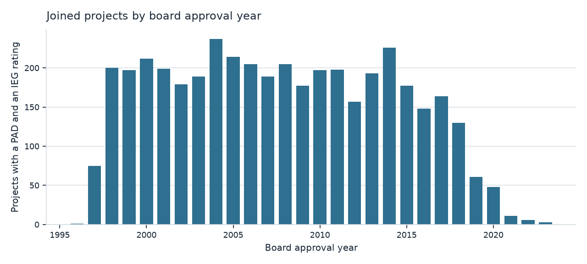
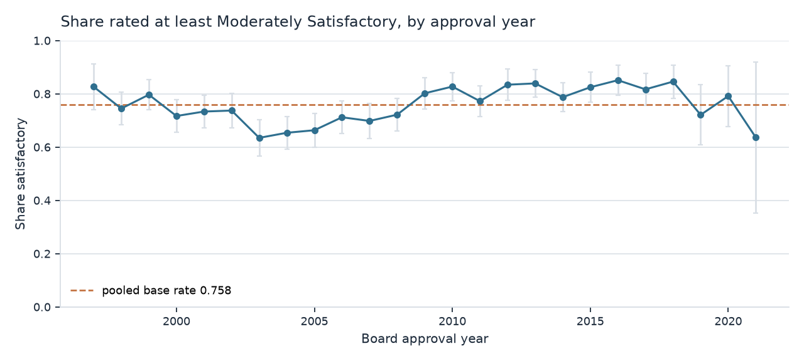
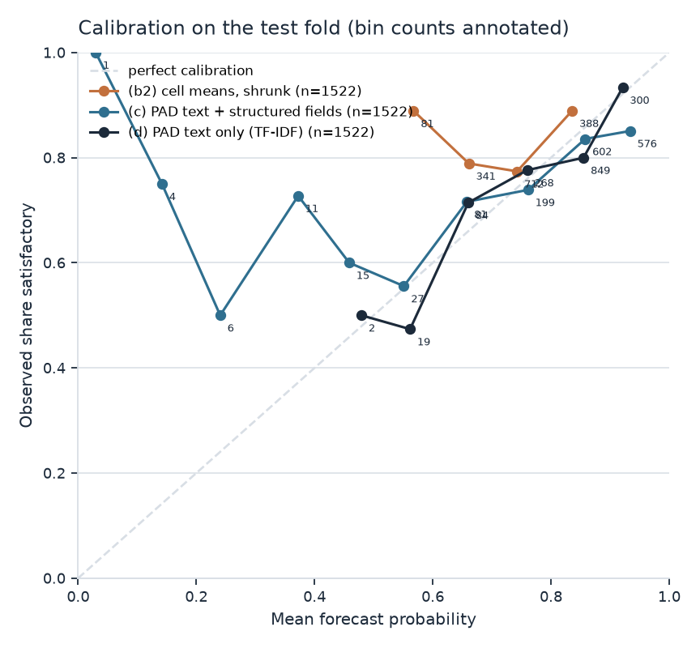
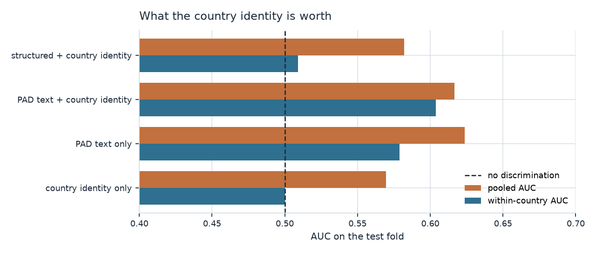
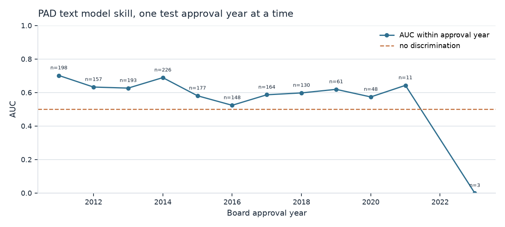
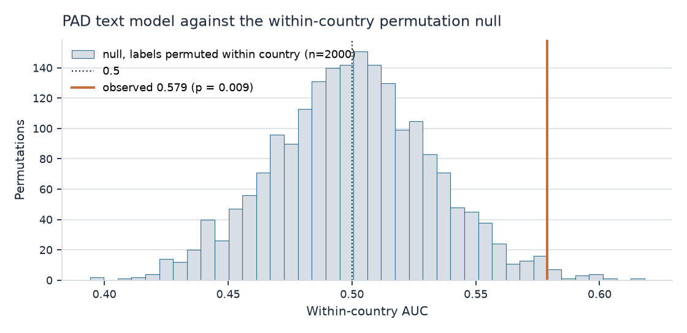
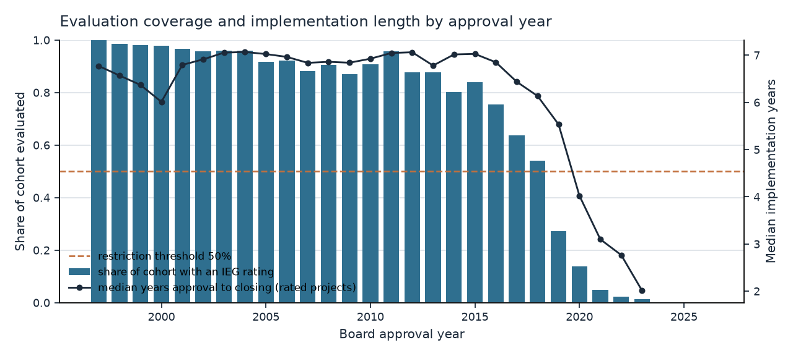
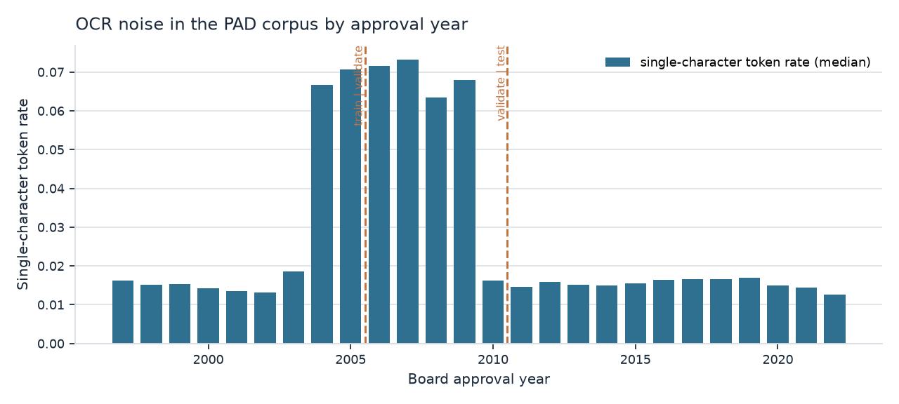
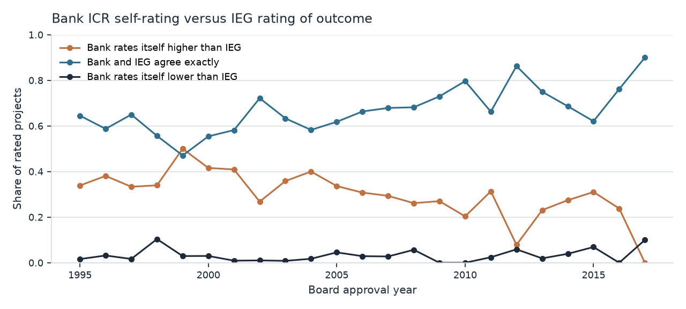

# World Bank Project Appraisal Documents to IEG outcome ratings

A leakage-controlled join from the proposal document a project was approved on
to the independent rating that evaluation gave it years later, plus a
forward-chained text baseline that tries to predict the rating from the
proposal.

Built 2026-09-15. Every number below is produced by a script in `worldbank/src`
and reproduced by `make all` from `worldbank/`. Test suite: `make test`.

## What was built

1. A complete pull of World Bank Documents and Reports metadata for three
   document types, a complete pull of the Projects API, and the IEG ratings
   bulk table.
2. A join on the P-number that keeps only the appraisal document that existed
   at or before board approval, so the input cannot contain knowledge of the
   outcome.
3. A release table, `results/pad_ieg_join.csv`, with 4,253 projects and
   178 columns.
4. A model ladder scored forward-chained on board approval year.
5. A second pass that attacks the ladder's one positive result: a country
   ablation, a per-year skill table, an exact within-country permutation null, a
   permuted-label refit of the whole pipeline, a second label cut, and a
   measurement of the evaluation lag that censors the recent cohorts.
6. The Bank-versus-IEG rating disagreement series, which is the quantity a
   public scoreboard would show first.

## The headline, stated plainly

On 1,522 test projects approved from 2011
onward, with models fitted only on projects approved earlier:

- **1 of the 6 rungs beats a constant forecast at the realised test base rate on Brier score.** The best is `(d) PAD text only (TF-IDF)`, at a Brier skill score of +0.0237 against that benchmark (Brier 0.1486 against 0.1594 for a constant at the training base rate) and +0.0666 against the reference-class baseline. That benchmark is the strict one: no forecaster could have known the realised test base rate in advance, so beating it is a real if small result rather than an artefact of the base rate drifting upward from 0.728 to 0.813. Every other rung is negative against it.
- **The PAD text does carry some ranking information about the outcome.** The
  text-only rung reaches a within-country AUC of
  0.579 against an exact
  permutation null of 0.500, one-sided
  p = 0.009.
- **That p-value does not survive the search that produced it.** Six rungs and a
  nine-point regularisation sweep were examined before this one was reported. A
  Bonferroni threshold across the rungs alone would be 0.008, and the largest of
  20 pure-noise pipeline refits reached
  0.565, close to the reported
  effect.
- **Most of the naive pooled skill is the country.** A model given nothing but
  the country identity reaches a pooled AUC of
  0.570
  and, necessarily, a within-country AUC of exactly 0.500.

The defensible claim is therefore: **the joined dataset is the contribution, and
the text baseline is a weak positive that has not been replicated.** The PAD text
carries real but small information about the outcome an evaluator will record
years later, on both the Brier and the ranking measure, and the effect is of the
same order as what the search that found it can produce by chance. It is a
reason to run one pre-registered replication on a later period, not a reason to
forecast anything with this model. The rest of this report is the evidence for
each of those four statements.

For a scoreboard, the operative number is not the AUC but the Brier skill score
against the zero-information benchmark, because that is what a published forecast
would be scored on. On this test fold that is
+0.0237: positive, and small.

## The data

### Source files

| name | bytes | sha256 | http_status |
| --- | --- | --- | --- |
| ieg_ratings_csv | 3305163 | d8216727f0507e736ec6f008dc083a41fc57aac2ea5fc7ce39ad3f73bd5e364c | 200 |
| govtech_xlsx | 3808135 | 0f7b558df47625bb4d32c3ee32fe539529ba105403d5fca9dfd66decbc5fef1b | 200 |

The IEG dataset page at financesone.worldbank.org is a JavaScript application,
but the bulk download URL is present in the server-rendered HTML, so no browser
was needed. The legacy Socrata host `finances.worldbank.org` now redirects every
`/resource/` and `/api/views/` path to the Finances One application, so the SODA
API described in older references no longer returns data. That was tested, not
assumed.

### Documents and Reports API coverage

| document type | rows fetched | API total |
| --- | --- | --- |
| Project Appraisal Document | 6991 | 6991 |
| Implementation Completion and Results Report | 8603 | 8603 |
| Implementation Completion Report Review | 7815 | 7815 |

Every document type was paginated to completion against the API's own reported
total. Records carry `projectid`, `docdt`, `txturl`, `pdfurl`, `guid` and `url`.

### Projects API

28,113 of 28,113 projects fetched. The default response carries only 15 fields
and no ratings at all; `fl=*` is required, and returns the nested `icr_ratings`,
`ieg_ratings`, `milestones` and `isr_ratings` blocks.

### IEG ratings dataset, exactly as observed

12,598 rows and 21 columns, "As of Date" 09/13/2026, CC BY 4.0.

| n | column | distinct values | null |
| --- | --- | --- | --- |
| 1 | As of Date | 1 | 0 |
| 2 | Project ID | 12597 | 0 |
| 3 | Project Name | 10929 | 0 |
| 4 | WB Region | 9 | 0 |
| 5 | Country / Economy | 187 | 0 |
| 6 | Country / Economy Lending Group | 4 | 97 |
| 7 | Country / Economy FCS Status | 2 | 0 |
| 8 | Country / Economy FCS Lending Group | 9 | 0 |
| 9 | Practice Group | 6 | 4560 |
| 10 | Global Practice | 18 | 4553 |
| 11 | Agreement Type | 8 | 0 |
| 12 | Lending Instrument Type | 2 | 0 |
| 13 | Approval FY | 67 | 0 |
| 14 | Final Closing FY | 50 | 4524 |
| 15 | Evaluation Type | 7 | 0 |
| 16 | Outcome | 7 | 0 |
| 17 | Quality at Entry | 7 | 0 |
| 18 | Quality of Supervision | 7 | 0 |
| 19 | Bank Performance | 7 | 0 |
| 20 | M&E Quality | 5 | 0 |
| 21 | Evaluation FY | 55 | 0 |

The dataset does **not** carry Risk to Development Outcome, Borrower
Performance, ICR Quality, or the Bank's own ICR self-rating. Those were
obtained elsewhere and are described below.

### The rating scale, exactly as observed

| column | value | n | six point | four point |
| --- | --- | --- | --- | --- |
| Outcome | Satisfactory | 5629 | 5 |  |
| Outcome | Moderately Satisfactory | 3143 | 4 |  |
| Outcome | Unsatisfactory | 1870 | 2 |  |
| Outcome | Moderately Unsatisfactory | 1214 | 3 |  |
| Outcome | Highly Satisfactory | 397 | 6 |  |
| Outcome | Highly Unsatisfactory | 194 | 1 |  |
| Outcome | Not Rated | 151 |  |  |

`Outcome`, `Quality at Entry`, `Quality of Supervision` and `Bank Performance`
all use this six-point ordinal scale plus an explicit `Not Rated` sentinel.
`M&E Quality` uses a different four-point scale (High, Substantial, Modest,
Negligible), which is why the code keeps the two scales strictly separate and
tests that a four-point value never lands on the six-point scale.

**Label definition.** `y_satisfactory = 1` when `Outcome` is one of
Moderately Satisfactory, Satisfactory or Highly Satisfactory; `0` when it is one
of Moderately Unsatisfactory, Unsatisfactory or Highly Unsatisfactory; and
undefined (row dropped) when `Not Rated`. That is the "at least Moderately
Satisfactory" cut, on the observed scale.

## The leakage filter

Additional-financing appraisal documents and restructuring papers are filed
under the same P-number as the original project and are dated after board
approval. A document written years into implementation can describe what has
already happened, so using it as an ex-ante input would leak the outcome.

Rule, in order. Among the PADs of a project, keep the one that
1. has `docdt` on or before the board approval date plus 30 days -- **this is
   the leakage test, and it is the only step that is about leakage**;
2. is in English, if any qualifying version is;
3. is the earliest of what remains;
4. has the lowest document id, purely so the result is deterministic.

Steps 2 to 4 choose among documents that have all already passed step 1. The
grace window exists because the document date and the board date are recorded
independently.

**Why step 2 is there.** WDS carries translations of the appraisal document
under the same P-number, and a translation is frequently dated *earlier* than
the English original, so an earliest-only rule selected it. Measured before this
step was added: 40 projects were represented by a French, Spanish, Arabic,
Russian or Portuguese document, and an English PAD existed and qualified for 39
of them. Those documents then entered an English-stopword TF-IDF model as their
own vocabulary. After the fix the corpus is
4,252 English and
1 other, the remainder being the one
project with no qualifying English version.

**Dates are compared as calendar dates.** WDS renders `docdt` as an instant at
midnight US Eastern (04:00Z or 05:00Z across all 6,991
records), while the board date is a bare date at 00:00. Differencing them without normalising lost a
partial day to truncation, which made `pad_lead_days` one day short on every
single row and shortened the documented 30-day grace window to 29 days and 20
hours. Both sides are now floored to midnight. (No PAD actually falls between 27
and 32 days after approval, so the grace-window half of that bug changed no
row's inclusion; it was wrong regardless.)

Of 6,991 PAD records, 12 carry no
`projectid` at all and 138 carry a
comma-separated multi-project `projectid`, which is exploded to one row per
project. That leaves 6,575 distinct P-numbers,
distributed like this:

| PADs per P-number | P-numbers |
| --- | --- |
| 1 | 6065 |
| 2 | 484 |
| 3 | 22 |
| 4 | 2 |
| 5 | 1 |
| 30 | 1 |

Documents excluded, by reason:

| reject_reason | n |
| --- | --- |
| docdt_after_approval_plus_grace | 72 |
| later_version_within_grace_window | 112 |
| no_board_approval_date | 33 |
| same_date_duplicate_or_translation | 413 |

The last two reasons are separated on purpose, because collapsing them
overstates what the filter does. `docdt_after_approval_plus_grace` is the
leakage case: an additional-financing or restructuring paper filed under the
original P-number. `same_date_duplicate_or_translation` and
`later_version_within_grace_window` are documents that PASSED the leakage test
and simply were not the one selected. Of the not-selected rows belonging to a
project that is in the release table, 78.7% carry the same
`docdt` as the document that was kept, so most of what the filter removes is a
same-day duplicate or a translation rather than a post-hoc document.

The single P-number carrying 30 PAD rows in the table above is P173789, and it
is not 30 versions of a project's history: it is one 2020 operation whose
appraisal document was disclosed in English, Spanish and Arabic across several
same-week dates.

### Which version of the appraisal document was kept

| PAD version type | n | share |
| --- | --- | --- |
| Buff cover | 2658 | 0.6250 |
| Final | 1424 | 0.3348 |
| Revised buff cover | 129 | 0.0303 |
| Revised | 16 | 0.0038 |
| Buff | 12 | 0.0028 |
| Gray cover | 9 | 0.0021 |
| (missing) | 3 | 0.0007 |
| corrigendum buff cover | 1 | 0.0002 |
| Buff Cover | 1 | 0.0002 |

**What is and is not known about these labels.** `versiontyp` is a WDS metadata
field and no World Bank dictionary defining its values was found or read this
session, so what "Buff cover" and "Final" mean editorially is NOT claimed here.
What is established is the only thing the leakage argument needs: every row in
this table has a `docdt` on or before board approval plus 30 days, because that
is the filter that admitted it. A reader who wants to restrict the corpus to one
version type can do so from `pad_versiontyp` in the release table; the counts
are given here for that purpose, not as evidence about editorial status.

## The funnel

| stage | n |
| --- | --- |
| IEG rating rows in the bulk CSV (as published) | 12598 |
| rows dropped as duplicate P-numbers | 1 |
| distinct projects with an IEG rating | 12597 |
| distinct projects with any PAD in WDS | 6575 |
| rated projects with any PAD | 4265 |
| rated projects with a board approval date | 12578 |
| rated projects with a PAD and a board approval date | 4265 |
| rated projects with a QUALIFYING PAD (leakage filter passed) | 4253 |
| rated projects with a qualifying PAD and a txturl | 4251 |

### Evaluation type in the joined sample

| evaluation type | n | share satisfactory |
| --- | --- | --- |
| ICRR | 3801 | 0.7637 |
| PPAR | 397 | 0.7078 |

LABELLED INFERENCE: that IEG selects projects for a Project Performance
Assessment Report rather than sampling at random is an inference from the
observed difference in satisfactory rates between the two evaluation types, not
something an IEG methodology document read this session states. What is
established is that the two types have different satisfactory rates in this
sample, which is in the table. They are pooled for the label, and the difference
is reported here so a reader can split them.

This table covers the 4,198 joined projects that carry a usable
outcome label, not all 4,253 rows of the release table; the difference is
the 55 projects rated "Not Rated".

## Joined sample by approval year





| approval_year | n | share_satisfactory |
| --- | --- | --- |
| 1996 | 1 | 1.0000 |
| 1997 | 75 | 0.8267 |
| 1998 | 200 | 0.7450 |
| 1999 | 197 | 0.7970 |
| 2000 | 212 | 0.7170 |
| 2001 | 199 | 0.7337 |
| 2002 | 179 | 0.7374 |
| 2003 | 189 | 0.6349 |
| 2004 | 237 | 0.6540 |
| 2005 | 214 | 0.6636 |
| 2006 | 205 | 0.7122 |
| 2007 | 189 | 0.6984 |
| 2008 | 205 | 0.7220 |
| 2009 | 177 | 0.8023 |
| 2010 | 197 | 0.8274 |
| 2011 | 198 | 0.7727 |
| 2012 | 157 | 0.8344 |
| 2013 | 193 | 0.8394 |
| 2014 | 226 | 0.7876 |
| 2015 | 177 | 0.8249 |
| 2016 | 148 | 0.8514 |
| 2017 | 164 | 0.8171 |
| 2018 | 130 | 0.8462 |
| 2019 | 61 | 0.7213 |
| 2020 | 48 | 0.7917 |
| 2021 | 11 | 0.6364 |
| 2022 | 6 | 1.0000 |
| 2023 | 3 | 0.6667 |

## PAD text corpus

| status | n |
| --- | --- |
| ok | 4213 |
| too_short | 24 |
| extract_failed | 13 |
| http_404 | 1 |

Total bytes downloaded: 1,301,526,327. Every document
has its sha256 and byte size recorded in `results/pad_text_manifest.csv` and in
the release table (`pad_text_sha256`, `pad_text_bytes`, `pad_text_status`).
**The truncation is a real limitation, and bigger than it looks.** The models
read the first 200,000 characters of each document. The mean usable document is
308,930 bytes and the median is
284,388, so
**80.5% of the corpus is truncated** and
the models never see the later pages of four documents in five. Appraisal
documents put the results framework, the risk matrix and the economic analysis
towards the end, so this is not a tail-trimming exercise. The cut was made to
keep the TF-IDF matrix tractable, it was not tuned, and the effect of raising it
was not measured. Any skill reported here is skill from the front of the
document only.
Downloads used four concurrent requests with exponential backoff. Some `txturl`
responses return HTTP 200 with a short sentinel body rather than document text
("The original PDF is Password Protected for Opening. Unable to extract text for
Index."); those are classified `extract_failed` and excluded from the corpus
rather than entering it as an 88-byte document.

## Models

### What goes into each rung

Rungs (c) and (e) use structured fields. They are named here because a claim
that the inputs predate the outcome is empty unless the inputs are listed.

- categorical: `ieg_region`, `ieg_country_lending_group`, `ieg_practice_group`, `ieg_agreement_type`, `ieg_lending_instrument_type`, `prodline_exact`, `envassesmentcategorycode`
- numeric: `log_commitment`, `approval_year`, `pad_lead_days`
- the country identity is NOT among them; see the country ablation below
- excluded as post-treatment: `ieg_country_fcs_status`

| field | countries_varying | countries_tested | mean_approval_fy_accuracy | mean_closing_fy_accuracy | closing_better_in | approval_better_in | verdict |
| --- | --- | --- | --- | --- | --- | --- | --- |
| Country / Economy FCS Status | 51 | 50 | 0.8785 | 0.9230 | 29.0000 | 0.0000 | tracks the closing period; NOT established as ex ante |
| Country / Economy Lending Group | 4 | 0 |  |  |  |  | constant within country in this snapshot |
| Country / Economy FCS Lending Group | 58 | 50 | 0.8785 | 0.9230 | 29.0000 | 0.0000 | tracks the closing period; NOT established as ex ante |
| Practice Group | 164 | 134 | 0.6921 | 0.6796 | 30.0000 | 54.0000 | tracks the approval period |
| Global Practice | 165 | 134 | 0.8173 | 0.8065 | 15.0000 | 46.0000 | tracks the approval period |
| Agreement Type | 147 | 126 | 0.8920 | 0.8875 | 18.0000 | 32.0000 | tracks the approval period |
| Lending Instrument Type | 146 | 127 | 0.8419 | 0.8218 | 27.0000 | 63.0000 | tracks the approval period |

**Why `ieg_country_fcs_status` was excluded.** Both source tables are 2026
snapshots, so whether a field carries an approval-time or a closing-time value
is a measurement, not an assumption. `src/feature_vintage.py` makes it: for each
country, it finds the best single threshold on Approval FY and the best single
threshold on Final Closing FY for reproducing the field, and compares them.
Fragile-state status varies within a country in 51 of
187 countries, and the closing-year threshold reproduces it better
(0.923 against 0.878 on average, better in
29 of 50 countries tested and worse in
0). Burkina Faso is the clean case: every non-FCS project closes 1995 to 2019
and every FCS project closes 2020 to 2025, while the two groups' approval years
overlap almost entirely. A status carried at closing is post-treatment and
cannot be an ex-ante input. **What is not claimed:** no World Bank dictionary
stating the field's as-of date was found, so the cause is unknown. The field is
excluded because its ex-ante status could not be established, not because a
mechanism was proven. What the exclusion changed is in the sensitivity table
below rather than asserted to be nothing.

Two fields are kept with a caveat. `ieg_country_lending_group` takes one value
per country in this snapshot (it varies within only 4 of 187 countries), so it
is a 2026 country attribute stamped on projects of every vintage; being
country-constant is exactly what the within-country statistic neutralises.
`ieg_practice_group` is the post-2014 Global Practice vocabulary applied to
projects of every vintage: the underlying sector is ex ante, the vocabulary is
not, and the vintage test puts it on the approval side.

### Folds

Splits are by board approval year, never random. Train and validation are fitted
together for the final model and scored once on the test fold.

- train: approval year <= 2005, n = 1,703
- validate: 2006 to 2010, n = 973
- test: 2011 onward, n = 1,522

The pre-registered cut points (2005 / 2010) gave a test fold above the required
800 rows, so they were not moved. (`moved_from_preregistered` in
`results/model_meta.json` records this, and reads
`False`.)

Train-plus-validation base rate 0.7276; test-fold base
rate 0.8127. Documents with usable text:
2,640 of 2,676 in train-plus-validation and
1,520 of 1,522 in test. Regularisation strength
was chosen on the validation fold only: {'text_structured': 10.0, 'text_only': 10.0, 'structured_only': 1.0}.

**The pre-registered cell baseline degenerates, and the report shows both.** The
specified reference class is country by approval decade by practice group. Under
forward chaining the test fold's decade is, by construction, nearly absent from
the training fold, so most test rows fall back to the global mean and the
"baseline" stops being a reference class at all. Measured here:
59.4% of test rows fall back with the
decade term, against 12.0% without it.
Model (b) is the pre-registered cell and model (b2) drops the decade term. The
BSS-versus-cell column is computed against (b2), the one that actually behaves
like a reference class.

| model | n | auc | brier | bss_vs_train_base_rate | bss_vs_test_base_rate | bss_vs_cell | within_country_auc_pairwt | within_country_auc_nwt | within_country_rows_excluded |
| --- | --- | --- | --- | --- | --- | --- | --- | --- | --- |
| (a) base rate (constant, train) | 1522 | 0.5000 | 0.1594 | 0.0000 | -0.0477 | -0.0016 | 0.5000 | 0.5000 | 0.3246 |
| (b) country x decade x practice cell means, shrunk (pre-registered; degenerates) | 1522 | 0.5275 | 0.1581 | 0.0082 | -0.0390 | 0.0066 | 0.5107 | 0.5067 | 0.3246 |
| (b2) country x practice cell means, shrunk (reference class) | 1522 | 0.5624 | 0.1592 | 0.0016 | -0.0459 | 0.0000 | 0.5169 | 0.5075 | 0.3246 |
| (c) PAD text + structured fields | 1522 | 0.6047 | 0.1537 | 0.0358 | -0.0102 | 0.0342 | 0.5480 | 0.5584 | 0.3246 |
| (d) PAD text only (TF-IDF) | 1522 | 0.6238 | 0.1486 | 0.0681 | 0.0237 | 0.0666 | 0.5788 | 0.5839 | 0.3246 |
| (e) structured fields only (ablation) | 1522 | 0.5548 | 0.1635 | -0.0252 | -0.0740 | -0.0269 | 0.4990 | 0.5211 | 0.3246 |

Reading the columns:

- `bss_vs_train_base_rate` is the Brier skill score against a constant at the
  **training** base rate, which is the only constant a forecaster could actually
  have registered before the test period began.
- `bss_vs_test_base_rate` is against a constant at the **realised test** base
  rate. No forecaster could know that number, but it is the correct
  zero-information benchmark, and it is the decisive column here: a model that
  beats the training constant only because the base rate drifted upward from
  0.728 to 0.813 scores positive
  on the first column and negative on this one. **`(d) PAD text only (TF-IDF)` is positive on this column; every other rung is negative.**
- `bss_vs_cell` is against the shrunk cell baseline, model (b2).
- `within_country_auc_pairwt` is the mean of per-country AUC weighted by
  **comparable pairs** (positives times negatives in the country), which is the
  weighting under which the pooled and within-country quantities are
  commensurable. `within_country_auc_nwt` is the same mean weighted by country
  row count instead; both are shown because they can differ when class balance
  varies across countries. The pair-weighted column is the one quoted in the
  text.
- Both within-country columns count only countries with at least 10 test
  projects and at least 2 of each class, and
  `within_country_rows_excluded` is the share of test rows that exclusion
  discards. That is a selection on realised labels, so it is reported on every
  row rather than buried.

### Calibration



| model | bin | n | mean_forecast | observed_rate | gap |
| --- | --- | --- | --- | --- | --- |
| (b2) cell means, shrunk | [0.0, 0.1) | 0 |  |  |  |
| (b2) cell means, shrunk | [0.1, 0.2) | 0 |  |  |  |
| (b2) cell means, shrunk | [0.2, 0.3) | 0 |  |  |  |
| (b2) cell means, shrunk | [0.3, 0.4) | 0 |  |  |  |
| (b2) cell means, shrunk | [0.4, 0.5) | 0 |  |  |  |
| (b2) cell means, shrunk | [0.5, 0.6) | 81 | 0.5675 | 0.8889 | 0.3214 |
| (b2) cell means, shrunk | [0.6, 0.7) | 341 | 0.6611 | 0.7889 | 0.1278 |
| (b2) cell means, shrunk | [0.7, 0.8) | 712 | 0.7427 | 0.7739 | 0.0312 |
| (b2) cell means, shrunk | [0.8, 0.9) | 388 | 0.8357 | 0.8892 | 0.0535 |
| (b2) cell means, shrunk | [0.9, 1.0] | 0 |  |  |  |
| (c) PAD text + structured fields | [0.0, 0.1) | 1 | 0.0297 | 1.0000 | 0.9703 |
| (c) PAD text + structured fields | [0.1, 0.2) | 4 | 0.1418 | 0.7500 | 0.6082 |
| (c) PAD text + structured fields | [0.2, 0.3) | 6 | 0.2404 | 0.5000 | 0.2596 |
| (c) PAD text + structured fields | [0.3, 0.4) | 11 | 0.3723 | 0.7273 | 0.3550 |
| (c) PAD text + structured fields | [0.4, 0.5) | 15 | 0.4586 | 0.6000 | 0.1414 |
| (c) PAD text + structured fields | [0.5, 0.6) | 27 | 0.5511 | 0.5556 | 0.0045 |
| (c) PAD text + structured fields | [0.6, 0.7) | 81 | 0.6577 | 0.7160 | 0.0583 |
| (c) PAD text + structured fields | [0.7, 0.8) | 199 | 0.7614 | 0.7387 | -0.0227 |
| (c) PAD text + structured fields | [0.8, 0.9) | 602 | 0.8578 | 0.8355 | -0.0223 |
| (c) PAD text + structured fields | [0.9, 1.0] | 576 | 0.9339 | 0.8507 | -0.0832 |
| (d) PAD text only (TF-IDF) | [0.0, 0.1) | 0 |  |  |  |
| (d) PAD text only (TF-IDF) | [0.1, 0.2) | 0 |  |  |  |
| (d) PAD text only (TF-IDF) | [0.2, 0.3) | 0 |  |  |  |
| (d) PAD text only (TF-IDF) | [0.3, 0.4) | 0 |  |  |  |
| (d) PAD text only (TF-IDF) | [0.4, 0.5) | 2 | 0.4792 | 0.5000 | 0.0208 |
| (d) PAD text only (TF-IDF) | [0.5, 0.6) | 19 | 0.5616 | 0.4737 | -0.0879 |
| (d) PAD text only (TF-IDF) | [0.6, 0.7) | 84 | 0.6601 | 0.7143 | 0.0542 |
| (d) PAD text only (TF-IDF) | [0.7, 0.8) | 268 | 0.7596 | 0.7761 | 0.0165 |
| (d) PAD text only (TF-IDF) | [0.8, 0.9) | 849 | 0.8550 | 0.7998 | -0.0552 |
| (d) PAD text only (TF-IDF) | [0.9, 1.0] | 300 | 0.9212 | 0.9333 | 0.0121 |

### Within-country AUC, largest countries in the test fold

| group | n | n_pos | n_neg | pairs | usable | auc |
| --- | --- | --- | --- | --- | --- | --- |
| People's Republic of China | 108 | 101 | 7 | 707 | True | 0.5799 |
| Republic of India | 78 | 66 | 12 | 792 | True | 0.4545 |
| Socialist Republic of Viet Nam | 44 | 39 | 5 | 195 | True | 0.5282 |
| People's Republic of Bangladesh | 40 | 37 | 3 | 111 | True | 0.7027 |
| Western and Central Africa | 34 | 32 | 2 | 64 | True | 0.5156 |
| Republic of Indonesia | 29 | 25 | 4 | 100 | True | 0.2900 |
| Federative Republic of Brazil | 26 | 22 | 4 | 88 | True | 0.5341 |
| Islamic Republic of Pakistan | 25 | 20 | 5 | 100 | True | 0.9100 |
| Eastern and Southern Africa | 25 | 20 | 5 | 100 | True | 0.2000 |
| Islamic  Republic of Afghanistan | 24 | 6 | 18 | 108 | True | 0.6944 |
| Federal Republic of Nigeria | 23 | 16 | 7 | 112 | True | 0.8036 |
| Federal Democratic Republic of Ethiopia | 22 | 19 | 3 | 57 | True | 0.4912 |
| Nepal | 22 | 16 | 6 | 96 | True | 0.6458 |
| Democratic Republic of the Congo | 22 | 16 | 6 | 96 | True | 0.6146 |
| Republic of Ghana | 21 | 17 | 4 | 68 | True | 0.7353 |
| Republic of Mali | 20 | 18 | 2 | 36 | True | 0.3889 |
| West Bank and Gaza | 20 | 17 | 3 | 51 | True | 0.4118 |
| Burkina Faso | 20 | 14 | 6 | 84 | True | 0.5476 |
| Republic of Kenya | 19 | 17 | 2 | 34 | True | 0.6765 |
| Republic of Mozambique | 19 | 17 | 2 | 34 | True | 0.5882 |

## Does the result survive

The ladder has exactly one positive finding: PAD text alone reaches a
within-country AUC above 0.5 on the test fold. Everything in this section exists
to attack that number. Five checks, all forward-chained on the same folds, all
reusing the regularisation strength chosen on the validation fold rather than
tuning again.

### What the country identity is worth



| model | n_features | pooled_auc | within_country_auc | brier |
| --- | --- | --- | --- | --- |
| country identity only | 150 | 0.5695 | 0.5000 | 0.1629 |
| PAD text only | 300000 | 0.6238 | 0.5788 | 0.1486 |
| PAD text + country identity | 300150 | 0.6166 | 0.6038 | 0.1556 |
| structured + country identity | 190 | 0.5820 | 0.5091 | 0.1681 |

Read the first row first. A model given nothing but the country identity is
**constant inside a country**, so its within-country AUC comes out at exactly
0.5000
while its pooled AUC is
0.5695.
That is the arithmetic check on the statistic: pooled AUC on this data rewards
knowing which country a project is in, and the within-country column refuses to.
A pooled AUC of about 0.57 is available for free, from the country name alone,
which is most of what the reference-class baseline in the ladder achieves.

The country identity is deliberately absent from the ladder's structured
features, so no ladder rung is handed that 0.57 directly. The rows here that are
given it are diagnostics, not rungs.

### What the post-treatment exclusion changed

`ieg_country_fcs_status` was dropped from the feature set on the vintage
measurement above. Dropping a field on that kind of argument is a judgement, so
here is the number it moved, rather than an assurance that it moved nothing:

| feature set | rung | pooled_auc | within_country_auc | brier |
| --- | --- | --- | --- | --- |
| ex-ante features only (reported ladder) | (e) structured only | 0.5548 | 0.4990 | 0.1635 |
| ex-ante features only (reported ladder) | (c) text + structured | 0.6047 | 0.5480 | 0.1537 |
| with ieg_country_fcs_status added back | (e) structured only | 0.5616 | 0.4932 | 0.1633 |
| with ieg_country_fcs_status added back | (c) text + structured | 0.6085 | 0.5448 | 0.1532 |
| without log_commitment (vintage unknown) | (e) structured only | 0.5478 | 0.4835 | 0.1600 |
| without log_commitment (vintage unknown) | (c) text + structured | 0.6044 | 0.5412 | 0.1506 |

Note which rungs this can touch at all. Rungs (a), (b), (b2) and (d) use no
structured fields, and (d) PAD text only is the rung the headline rests on, so
the headline is unaffected by this choice either way.

### Skill by test approval year



| approval_year | n | n_unsatisfactory | base_rate | auc_within_year | mean_forecast |
| --- | --- | --- | --- | --- | --- |
| 2011 | 198 | 45 | 0.7727 | 0.7018 | 0.8313 |
| 2012 | 157 | 26 | 0.8344 | 0.6327 | 0.8237 |
| 2013 | 193 | 31 | 0.8394 | 0.6264 | 0.8300 |
| 2014 | 226 | 48 | 0.7876 | 0.6890 | 0.8352 |
| 2015 | 177 | 31 | 0.8249 | 0.5806 | 0.8422 |
| 2016 | 148 | 22 | 0.8514 | 0.5238 | 0.8466 |
| 2017 | 164 | 30 | 0.8171 | 0.5866 | 0.8457 |
| 2018 | 130 | 20 | 0.8462 | 0.5977 | 0.8263 |
| 2019 | 61 | 17 | 0.7213 | 0.6190 | 0.8412 |
| 2020 | 48 | 10 | 0.7917 | 0.5737 | 0.8542 |
| 2021 | 11 | 4 | 0.6364 | 0.6429 | 0.8591 |
| 2022 | 6 | 0 | 1.0000 |  | 0.8741 |
| 2023 | 3 | 1 | 0.6667 | 0.0000 | 0.8493 |

The skill is not concentrated in a single year, and it is not present in every
year either: several years sit below 0.5. With roughly 100 to 200 projects and
20 to 40 unsatisfactory outcomes in a year, no single year can resolve an effect
of this size, so the scatter is the expected picture rather than a defect.

### The within-country permutation null



The cluster bootstrap in the model section resamples countries. This does the
complementary thing: it holds the forecasts fixed and permutes the realised
labels **within each country**, 2,000
times. Permuting inside a country leaves every country's class counts unchanged,
so the set of countries eligible for a within-country AUC is identical in every
draw, and the null is exact rather than approximate.

| quantity | value |
| --- | --- |
| observed within-country AUC (PAD text only) | 0.5788 |
| permutation null mean | 0.5002 |
| permutation null standard deviation | 0.0322 |
| permutation null 95th percentile | 0.5536 |
| one-sided p-value | 0.0095 |

The null lands on 0.5002, which is what a
correct within-country statistic must do when the labels carry no information.
The observed value clears the 95th percentile, at a one-sided p-value of
0.009.

**What that p-value is not.** It is one test on the rung that happened to score
highest, selected after looking at six rungs and a nine-point regularisation
sweep. No multiplicity correction is applied, and none would rescue a p of
0.009 if one were: a Bonferroni
correction across the six rungs alone puts the threshold at 0.008. The honest
summary is that the text signal is **not distinguishable from noise at a
standard applied to the whole search**, and that it deserves one pre-registered
replication on a later period rather than a claim.

### The pipeline placebo

The permutation above holds the model fixed. This one breaks the model: it
permutes the labels of the training fold, refits the text model on the noise,
and scores the result against the real test labels,
20 times. A pipeline that leaked outcome
information through any route other than the labels would still score above 0.5
here.

| quantity | value |
| --- | --- |
| repeats | 20 |
| mean within-country AUC on permuted training labels | 0.5002 |
| minimum across repeats | 0.4106 |
| maximum across repeats | 0.5652 |
| standard deviation across repeats | 0.0439 |
| mean pooled AUC | 0.4948 |

The mean is 0.5002, so the
pipeline does not manufacture skill from noise, which is the leakage test this
placebo is for. The spread matters as much as the mean: the largest of
20 pure-noise refits reached
0.5652. An effect of the size
reported here is close to what the noisiest draw from a null pipeline produces,
which is the same conclusion the p-value reaches by a different route.

### The second label cut

The pre-registered label is outcome at least Moderately Satisfactory. The other
natural cut on the same six-point scale is outcome at least Satisfactory, which
is much closer to balanced: the fit-fold rate falls from
0.7276 to 0.3098, and
the test-fold rate from 0.8127 to
0.4488.

| model | pooled_auc | within_country_auc | brier |
| --- | --- | --- | --- |
| (a) base rate (constant, fit fold) | 0.5000 | 0.5000 | 0.2667 |
| (b2) country x practice cell means, shrunk | 0.5787 | 0.4948 | 0.2584 |
| (d) PAD text only (TF-IDF) | 0.6129 | 0.5538 | 0.2798 |
| (c) PAD text + structured fields | 0.5851 | 0.5390 | 0.3168 |

Discrimination survives the move: the text model keeps a within-country AUC of
0.5538
at the tighter cut. Calibration does not. The Brier scores of the fitted models
are **worse than the constant** here, because the regularisation strength was
deliberately not re-tuned for this label and the forecasts are therefore centred
on the wrong base rate. That is the intended trade: re-tuning would have turned
a robustness check into a second search. Ranking information transfers across
the cut; probabilities do not.

### Evaluation lag and right-censoring



A project cannot carry an IEG rating until it closes and is evaluated. On this
sample the median lag from board approval to evaluation fiscal year is
8 years. The recent approval cohorts in the test fold
are therefore not samples of the projects approved in those years; they are the
subset that finished fast enough to have been evaluated by the September 2026
snapshot.

The size of that distortion, measured against every project with a qualifying
PAD and a board approval date, rated or not:

| approval_year | n_with_qualifying_pad | n_rated | evaluated_share | n_labelled | share_satisfactory | median_implementation_years | median_eval_lag_years |
| --- | --- | --- | --- | --- | --- | --- | --- |
| 2011 | 208 | 199 | 0.9567 | 198.0000 | 0.7727 | 7.0472 | 8.0000 |
| 2012 | 179 | 157 | 0.8771 | 157.0000 | 0.8344 | 7.0637 | 8.0000 |
| 2013 | 220 | 193 | 0.8773 | 193.0000 | 0.8394 | 6.7817 | 8.0000 |
| 2014 | 282 | 226 | 0.8014 | 226.0000 | 0.7876 | 7.0171 | 8.5000 |
| 2015 | 211 | 177 | 0.8389 | 177.0000 | 0.8249 | 7.0281 | 9.0000 |
| 2016 | 196 | 148 | 0.7551 | 148.0000 | 0.8514 | 6.8515 | 8.0000 |
| 2017 | 257 | 164 | 0.6381 | 164.0000 | 0.8171 | 6.4381 | 8.0000 |
| 2018 | 240 | 130 | 0.5417 | 130.0000 | 0.8462 | 6.1355 | 7.0000 |
| 2019 | 223 | 61 | 0.2735 | 61.0000 | 0.7213 | 5.5359 | 7.0000 |
| 2020 | 348 | 48 | 0.1379 | 48.0000 | 0.7917 | 4.0233 | 5.0000 |
| 2021 | 223 | 11 | 0.0493 | 11.0000 | 0.6364 | 3.0992 | 4.0000 |
| 2022 | 265 | 6 | 0.0226 | 6.0000 | 1.0000 | 2.7666 | 4.5000 |
| 2023 | 207 | 3 | 0.0145 | 3.0000 | 0.6667 | 2.0096 | 3.0000 |
| 2024 | 189 | 0 | 0.0000 |  |  |  |  |
| 2025 | 212 | 0 | 0.0000 |  |  |  |  |
| 2026 | 144 | 0 | 0.0000 |  |  |  |  |

Coverage holds above 75 percent through 2016 and then falls away: it is
27.4%
for 2019 and
4.9%
for 2021. The median implementation length of the rated projects falls with it,
from about seven years to
3.1
years. That is the selection made visible: in the recent cohorts, only the fast
projects are in the table yet.

Re-scoring the test fold with the low-coverage years dropped, keeping approval
years 2011,2012,2013,2014,2015,2016,2017,2018 (those at or above
50% coverage), which removes
129
of 1522 test rows:

| model | n_full | n_restricted | pooled_auc_full | pooled_auc_restricted | within_country_auc_full | within_country_auc_restricted |
| --- | --- | --- | --- | --- | --- | --- |
| PAD text only | 1522 | 1393 | 0.6238 | 0.6289 | 0.5788 | 0.5863 |
| PAD text + structured | 1522 | 1393 | 0.6047 | 0.6135 | 0.5480 | 0.5665 |
| cell means, shrunk | 1522 | 1393 | 0.5624 | 0.5676 | 0.5169 | 0.5222 |

The headline does not depend on the censored years. This is a robustness check
and not a correction: dropping the incomplete cohorts does nothing about the
selection inside the cohorts that remain, and the 2011 to 2018 cohorts are
themselves not fully evaluated either.

### OCR noise, and where it lands



An earlier version of this report carried the caveat "older documents are
scanned and OCR'd; the text layer is noisier before roughly 2005, which is
exactly the training fold". Nothing measured it. `src/text_quality.py` now does,
with two noise proxies: the rate of characteristic OCR corruptions of common
short words ("Ia" for "la", "ofthe", "tbe", "arid") per 1,000 tokens, and the
share of alphabetic tokens that are a single character other than "a" or "i".
Neither proves a document was scanned, and no World Bank source states which
were; they are noise proxies and are reported as such.

**The caveat was wrong in both halves.**

| fold | n | broken_of_per_1k | mean_broken_of_per_1k | single_char_token_rate |
| --- | --- | --- | --- | --- |
| train | 1703 | 0.0000 | 0.1561 | 0.0170 |
| validate | 973 | 0.0712 | 0.2818 | 0.0611 |
| test | 1522 | 0.0000 | 0.0146 | 0.0157 |

The noisy block is approval years 2004 to 2009, not "before 2005": documents
from 1996 to 2003 are the cleanest in the corpus, and everything from 2010
onward is clean again. And the fold carrying that noise is not the training fold
but the **validation** fold, where the single-character token rate is
0.0611
against 0.0170
in train and 0.0157
in test, roughly a fourfold difference.

That matters, because the validation fold is the only thing that chooses the
regularisation strength. The penalty for a TF-IDF model is being selected on the
noisiest text in the corpus and then applied to the cleanest. Nothing here
corrects for it and the direction of the resulting bias is not established; it
is stated because a reader scoring this work should know the tuning fold is not
representative of the test fold.

| approval_year | n | broken_of_per_1k | single_char_token_rate |
| --- | --- | --- | --- |
| 1997 | 75 | 0.0000 | 0.0163 |
| 1998 | 200 | 0.0000 | 0.0152 |
| 1999 | 197 | 0.0000 | 0.0153 |
| 2000 | 212 | 0.0000 | 0.0143 |
| 2001 | 199 | 0.0000 | 0.0136 |
| 2002 | 179 | 0.0000 | 0.0132 |
| 2003 | 189 | 0.0000 | 0.0186 |
| 2004 | 237 | 0.3305 | 0.0666 |
| 2005 | 214 | 0.0698 | 0.0706 |
| 2006 | 205 | 0.1398 | 0.0716 |
| 2007 | 189 | 0.1415 | 0.0732 |
| 2008 | 205 | 0.2020 | 0.0634 |
| 2009 | 177 | 0.0692 | 0.0680 |
| 2010 | 197 | 0.0000 | 0.0163 |
| 2011 | 198 | 0.0000 | 0.0147 |
| 2012 | 157 | 0.0000 | 0.0159 |
| 2013 | 193 | 0.0000 | 0.0152 |
| 2014 | 226 | 0.0000 | 0.0150 |
| 2015 | 177 | 0.0000 | 0.0155 |
| 2016 | 148 | 0.0000 | 0.0164 |
| 2017 | 164 | 0.0000 | 0.0166 |
| 2018 | 130 | 0.0000 | 0.0167 |
| 2019 | 61 | 0.0000 | 0.0170 |
| 2020 | 48 | 0.0000 | 0.0150 |
| 2021 | 11 | 0.0000 | 0.0145 |
| 2022 | 6 | 0.0000 | 0.0126 |

### What the text model leans on

The forty highest and forty lowest weighted TF-IDF terms are in
`results/text_coefficients.csv`. The first fifteen in each direction:

| index | direction | rank | term | coefficient |
| --- | --- | --- | --- | --- |
| 0 | toward satisfactory | 1 | communes | {:.3f} |
| 1 | toward satisfactory | 2 | rural roads | {:.3f} |
| 2 | toward satisfactory | 3 | mountainous | {:.3f} |
| 3 | toward satisfactory | 4 | safety net | {:.3f} |
| 4 | toward satisfactory | 5 | kfw | {:.3f} |
| 5 | toward satisfactory | 6 | digital | {:.3f} |
| 6 | toward satisfactory | 7 | 31 2002 | {:.3f} |
| 7 | toward satisfactory | 8 | spot | {:.3f} |
| 8 | toward satisfactory | 9 | asset | {:.3f} |
| 9 | toward satisfactory | 10 | figure | {:.3f} |
| 10 | toward satisfactory | 11 | departmental | {:.3f} |
| 11 | toward satisfactory | 12 | yerevan | {:.3f} |
| 12 | toward satisfactory | 13 | 2009 | {:.3f} |
| 13 | toward satisfactory | 14 | armenia | {:.3f} |
| 14 | toward satisfactory | 15 | matching | {:.3f} |
| 40 | toward unsatisfactory | 1 | cameroon | {:.3f} |
| 41 | toward unsatisfactory | 2 | concession | {:.3f} |
| 42 | toward unsatisfactory | 3 | chad | {:.3f} |
| 43 | toward unsatisfactory | 4 | scenario | {:.3f} |
| 44 | toward unsatisfactory | 5 | water utilities | {:.3f} |
| 45 | toward unsatisfactory | 6 | concessionaire | {:.3f} |
| 46 | toward unsatisfactory | 7 | regulatory frameworks | {:.3f} |
| 47 | toward unsatisfactory | 8 | fmr | {:.3f} |
| 48 | toward unsatisfactory | 9 | electrification | {:.3f} |
| 49 | toward unsatisfactory | 10 | bidders | {:.3f} |
| 50 | toward unsatisfactory | 11 | port | {:.3f} |
| 51 | toward unsatisfactory | 12 | oil | {:.3f} |
| 52 | toward unsatisfactory | 13 | unions | {:.3f} |
| 53 | toward unsatisfactory | 14 | public service | {:.3f} |
| 54 | toward unsatisfactory | 15 | curricula | {:.3f} |

These are descriptive. They are the weights one regularised linear model placed
on one training fold, not causes, and they are not claimed to be stable under a
different seed or a different fold.

One thing in them is load-bearing rather than decorative: **country and place
names appear among the highest-weight terms in both directions**. A PAD names
the country it is about, so a bag-of-words model over PAD text is not
country-blind, and part of the pooled AUC of the "text only" rung is the country
effect arriving through the vocabulary rather than through a feature column.
That is exactly why the within-country AUC, and not the pooled AUC, is the
number this report leads with.

## Bank self-rating versus IEG rating

The Bank's operational team rates its own project in the Implementation
Completion and Results Report; IEG then reviews it and issues an independent
rating. The gap between the two is a published, mechanical quantity, and it is
the first thing a procurement-style scoreboard would show.

Neither the IEG bulk CSV nor the Projects API gives this cleanly, so two
independent routes were used and are reported side by side.

**Route 1, verified, no repair needed.** The World Bank Digital Governance and
GovTech Projects workbook (Data Catalog dataset 0038056, resource DR0095723)
publishes `ICR Out` and `IEG Out` side by side for a subset of projects. Its
`IEG Out` column agrees with the Finances One IEG `Outcome` column on
98.94% of overlapping rated rows, which is what
validates the workbook as a source.

Overall on that subset: n = 1,794, exact agreement
64.33%, Bank rates itself **higher** than IEG
32.72% of the time and lower
2.95%, mean gap
+0.348 scale points.



| year | n | agree | bank_higher | bank_lower | mean_gap |
| --- | --- | --- | --- | --- | --- |
| 1992 | 4 | 0.5000 | 0.5000 | 0.0000 | 0.5000 |
| 1993 | 2 | 0.0000 | 1.0000 | 0.0000 | 1.0000 |
| 1994 | 4 | 0.7500 | 0.2500 | 0.0000 | 0.5000 |
| 1995 | 62 | 0.6452 | 0.3387 | 0.0161 | 0.3871 |
| 1996 | 63 | 0.5873 | 0.3810 | 0.0317 | 0.4921 |
| 1997 | 60 | 0.6500 | 0.3333 | 0.0167 | 0.4000 |
| 1998 | 106 | 0.5566 | 0.3396 | 0.1038 | 0.3396 |
| 1999 | 102 | 0.4706 | 0.5000 | 0.0294 | 0.5784 |
| 2000 | 101 | 0.5545 | 0.4158 | 0.0297 | 0.4653 |
| 2001 | 110 | 0.5818 | 0.4091 | 0.0091 | 0.4545 |
| 2002 | 97 | 0.7216 | 0.2680 | 0.0103 | 0.3196 |
| 2003 | 120 | 0.6333 | 0.3583 | 0.0083 | 0.4250 |
| 2004 | 115 | 0.5826 | 0.4000 | 0.0174 | 0.4087 |
| 2005 | 110 | 0.6182 | 0.3364 | 0.0455 | 0.3273 |
| 2006 | 104 | 0.6635 | 0.3077 | 0.0288 | 0.2885 |
| 2007 | 109 | 0.6789 | 0.2936 | 0.0275 | 0.2844 |
| 2008 | 88 | 0.6818 | 0.2614 | 0.0568 | 0.2159 |
| 2009 | 74 | 0.7297 | 0.2703 | 0.0000 | 0.2838 |
| 2010 | 59 | 0.7966 | 0.2034 | 0.0000 | 0.2203 |
| 2011 | 83 | 0.6627 | 0.3133 | 0.0241 | 0.3373 |
| 2012 | 51 | 0.8627 | 0.0784 | 0.0588 | 0.0196 |
| 2013 | 52 | 0.7500 | 0.2308 | 0.0192 | 0.2692 |
| 2014 | 51 | 0.6863 | 0.2745 | 0.0392 | 0.2353 |
| 2015 | 29 | 0.6207 | 0.3103 | 0.0690 | 0.2759 |
| 2016 | 21 | 0.7619 | 0.2381 | 0.0000 | 0.2381 |
| 2017 | 10 | 0.9000 | 0.0000 | 0.1000 | -0.1000 |
| 2018 | 4 | 0.7500 | 0.2500 | 0.0000 | 0.2500 |
| 2019 | 3 | 0.6667 | 0.3333 | 0.0000 | 0.3333 |

**Route 2, API-wide, with a documented repair.** The Projects API `icr_ratings`
block carries the same self-rating for many more projects, but two defects had
to be handled first, both established by measurement:

1. The block can contain repeated elements, so the fetcher deduplicates before
   reading any value. **What is observed**, across the
   6,381 projects that carry the block:
   82.4% have no repetition at all (the raw
   element count equals the distinct count), and the rest repeat, up to a
   maximum of 210 raw elements carrying
   3 distinct value(s). **What is NOT
   claimed:** an earlier version of this report asserted the length follows
   k*(k+1). That is false and the repo's own data refutes it -- observed counts
   include 1, 3, 4, 9, 25, 121 and 144, which are not of that form. No rule
   governing the block length is claimed here, because none was established.
   Deduplication does not depend on one.
2. The value "Satisfactory" never appears in the block. In its place the API
   emits "Substantial", a value from the four-point risk scale. The crosstab
   below is the evidence: rows where the API says "Substantial" are "S" in the
   independently published workbook, and the diagonal is otherwise clean.

| icr_outratingind | HS | S | MS | MU | U | HU |
| --- | --- | --- | --- | --- | --- | --- |
| Highly Satisfactory | 41 | 2 | 0 | 0 | 0 | 0 |
| Highly Unsatisfactory | 0 | 0 | 0 | 0 | 0 | 7 |
| Moderately Satisfactory | 1 | 5 | 534 | 0 | 1 | 0 |
| Moderately Unsatisfactory | 0 | 0 | 1 | 168 | 0 | 0 |
| Substantial | 1 | 575 | 3 | 0 | 0 | 0 |
| Unsatisfactory | 0 | 0 | 0 | 0 | 54 | 0 |

Rows where the API says "Substantial" carry workbook value "S" in
575 of
579 rated cases
(99.3%), and the API emits
"Satisfactory" in 0 rows in the
whole overlap. The rest of the diagonal, as
(matched / row total): HS 41/43, MS 534/541, MU 168/169, U 54/54, HU 7/7.

The same defect appears independently on `icr_borroverall`, the Bank's
self-rating of borrower performance, against the workbook's `ICR BoP`:

| icr_borroverall | HS | S | MS | MU | U | HU |
| --- | --- | --- | --- | --- | --- | --- |
| Highly Satisfactory | 26 | 1 | 0 | 0 | 0 | 0 |
| Highly Unsatisfactory | 0 | 0 | 0 | 0 | 0 | 2 |
| Moderately Satisfactory | 0 | 4 | 475 | 1 | 0 | 0 |
| Moderately Unsatisfactory | 0 | 0 | 0 | 136 | 0 | 0 |
| Substantial | 0 | 380 | 1 | 0 | 0 | 0 |
| Unsatisfactory | 0 | 0 | 0 | 1 | 39 | 0 |

There, "Substantial" carries workbook "S" in
380 of
381 rated cases
(99.7%). Two fields,
two independent confirmations. The repair maps "Substantial" to "Satisfactory"
inside the `icr_ratings` block only, never on the IEG side and never on a
genuine four-point field such as M&E quality or risk to development outcome.

**Route 3, the primary documents.** The two routes above are both datasets, so
agreeing with each other only shows they share a convention. `make verify`
(`src/verify_repair.py`) goes to the source of record instead: it downloads IEG
Implementation Completion Report Review documents, parses the standard Ratings
table that carries an `ICR` column and an `IEG` column, and compares the
document's own words to what the API returns for the same P-number.

| quantity | value |
| --- | --- |
| ICRR documents parsed | 96 |
| raw API value matches the document verbatim | 69.8% |
| REPAIRED value matches the document | 97.9% |
| rows where the API says "Substantial" | 27 |
| of those, the document says "Satisfactory" | 27 |

Every one of the 27
documents where the API says "Substantial" says "Satisfactory" in the published
ICRR itself, and applying the repair raises agreement with the primary documents
from 69.8% to
97.9%. So the
repair is confirmed against the source of record, not only against a second
dataset.

**What is still not claimed.** No World Bank source code or field dictionary
describing this behaviour was read, so the CAUSE of the substitution remains
unknown, and nothing here says why the API does it. What is established is that
the API's value disagrees with the published document and that the repair
reconciles them.

With the repair, API-wide: n = 5,293, exact agreement
69.00%, Bank higher
28.13%, Bank lower
2.87%.

Restricted to the 3,690 projects in this backtest sample:
exact agreement 69.38%, Bank higher
27.94%, Bank lower
2.68%.

By approval year, API-wide with the repair:

| year | n | agree | bank_higher | bank_lower | mean_gap |
| --- | --- | --- | --- | --- | --- |
| 1993 | 1 | 1.0000 | 0.0000 | 0.0000 | 0.0000 |
| 1994 | 3 | 0.3333 | 0.6667 | 0.0000 | 1.0000 |
| 1995 | 10 | 0.8000 | 0.1000 | 0.1000 | 0.0000 |
| 1996 | 9 | 0.5556 | 0.4444 | 0.0000 | 0.4444 |
| 1997 | 19 | 0.6316 | 0.2632 | 0.1053 | 0.1579 |
| 1998 | 61 | 0.5574 | 0.3443 | 0.0984 | 0.3115 |
| 1999 | 75 | 0.5600 | 0.4267 | 0.0133 | 0.5333 |
| 2000 | 109 | 0.5963 | 0.3761 | 0.0275 | 0.4312 |
| 2001 | 167 | 0.6527 | 0.3413 | 0.0060 | 0.3713 |
| 2002 | 184 | 0.6250 | 0.3424 | 0.0326 | 0.3913 |
| 2003 | 211 | 0.5640 | 0.4218 | 0.0142 | 0.4645 |
| 2004 | 239 | 0.5900 | 0.3849 | 0.0251 | 0.3975 |
| 2005 | 287 | 0.5679 | 0.4007 | 0.0314 | 0.4460 |
| 2006 | 309 | 0.6440 | 0.3204 | 0.0356 | 0.3204 |
| 2007 | 298 | 0.6342 | 0.3389 | 0.0268 | 0.3591 |
| 2008 | 291 | 0.6735 | 0.2784 | 0.0481 | 0.2680 |
| 2009 | 295 | 0.6814 | 0.2983 | 0.0203 | 0.3153 |
| 2010 | 331 | 0.7341 | 0.2477 | 0.0181 | 0.2447 |
| 2011 | 320 | 0.7094 | 0.2656 | 0.0250 | 0.2687 |
| 2012 | 236 | 0.7585 | 0.1992 | 0.0424 | 0.1822 |
| 2013 | 265 | 0.7396 | 0.2302 | 0.0302 | 0.2226 |
| 2014 | 304 | 0.7303 | 0.2434 | 0.0263 | 0.2204 |
| 2015 | 271 | 0.7196 | 0.2583 | 0.0221 | 0.2546 |
| 2016 | 212 | 0.7594 | 0.2311 | 0.0094 | 0.2217 |
| 2017 | 231 | 0.7965 | 0.1688 | 0.0346 | 0.1429 |
| 2018 | 169 | 0.7929 | 0.1775 | 0.0296 | 0.1538 |
| 2019 | 153 | 0.7908 | 0.1765 | 0.0327 | 0.1503 |
| 2020 | 101 | 0.8317 | 0.1287 | 0.0396 | 0.0891 |
| 2021 | 82 | 0.7927 | 0.1463 | 0.0610 | 0.0854 |
| 2022 | 32 | 0.8438 | 0.1562 | 0.0000 | 0.1562 |
| 2023 | 14 | 0.9286 | 0.0714 | 0.0000 | 0.0714 |
| 2024 | 4 | 0.2500 | 0.7500 | 0.0000 | 0.7500 |

## Schedule slip

| projects with both a planned and an actual closing date | median slip (days) | mean slip (days) | share closing late | 90th percentile slip (days) |
| --- | --- | --- | --- | --- |
| 1860 | 365.00 | 471.49 | 0.71 | 1096.00 |

`schedule_slip_days` is the **actual** closing date minus the **original**
planned closing date, both taken from the GovTech workbook.

**Why both dates come from the same table.** Neither the Projects API nor the
IEG bulk CSV publishes a planned closing date. The API exposes only
`closingdate`, which is the current value and moves when a project is extended;
the field names `revisedclosingdate`, `orig_closing_date` and `p_closing_date`
were probed against the API and do not exist. The only verified machine-readable
original closing date found is the GovTech workbook's `Org Closing Dt`, which
covers a subset, so this column is populated for that subset and null elsewhere.

**A correction.** An earlier version of this table subtracted the workbook's
original date from the *API's* `closingdate`, a mixed-source subtraction, and
labelled the workbook's other date column "revised". Both were wrong, and the
workbook's own Metadata sheet says so: row 28 defines `Org Closing Dt` as
"Original Closing Date" and row 29 defines `Rev Closing Dt` as **"Actual Closing
Date"**, not a revised one. The two "actual" dates disagree on
11.1%
of the rows where both exist, and the mixed-source version overstated the slip:

| definition | n | median days | mean days | share closing late |
| --- | --- | --- | --- | --- |
| same source (workbook actual - workbook original) | 1860 | 365.0 | 471.5 | 0.7 |
| mixed source (API closingdate - workbook original) | 1860 | 457.0 | 545.1 | 0.8 |

The same-source figure is the one reported above and carried in
`schedule_slip_days`; the mixed-source one is retained as
`schedule_slip_days_api_actual` so the gap stays visible rather than being
quietly corrected away.

## Release table

`results/pad_ieg_join.csv`, 4,253 rows, 178 columns,
one row per project. It carries the P-number, project name, country, region,
practice group and global practice, board approval date, actual closing date,
planned closing date where available, commitment and cost amounts, the PAD's
guid, document date, txturl and pdfurl, the text sha256 and byte size, every
column of the IEG ratings dataset, the Projects API `ieg_ratings` block
(including ICR quality, risk to development outcome and borrower performance,
which the bulk CSV omits), the Bank's ICR self-ratings, the derived six-point
numeric scales, the binary label, and `schedule_slip_days`.

## Caveats

- **The country effect carries most of the naive skill.** Pooled AUC and
  within-country AUC are reported side by side for exactly this reason. Read the
  within-country column before believing the pooled one.
- **The label is a human judgment, not a measurement.** IEG's outcome rating is
  an expert assessment against the project's own stated objectives. A project
  that lowered its objectives mid-flight can be rated satisfactory.
- **Objectives are revised.** Restructuring can change the standard the project
  is later rated against, and nothing in the ex-ante PAD anticipates that.
- **Selection into evaluation.** PPARs are chosen by IEG, not sampled at random,
  so the mix of evaluation types is not representative.
- **OCR noise is concentrated in the validation fold, which is where the
  regularisation strength is chosen.** See the section above; this is a real
  hazard, not a decorative caveat.
- **Four documents in five are truncated.** The models read the first 200,000
  characters and 80.5% of usable
  documents are longer than that, so the results framework and risk matrix at
  the back of a typical PAD are outside the model's view.
- **The sample is investment lending only, and that is by construction.** The
  joined sample carries 4,250
  Investment Project Financing operations against
  3 Development Policy
  Financing. A Project Appraisal Document is the appraisal instrument for
  investment lending; development policy operations are appraised in a Program
  Document, which is a different WDS document type and is not fetched here. So
  nothing in this report describes budget-support lending.
- **Not every rated project has a PAD, in any year.** The joined sample is
  4,253 of 12,597 rated projects. Coverage is zero before FY1997
  (the PAD document type does not appear in WDS earlier) and then sits between
  55% and 78% for every
  year from FY2002 to FY2019, before falling away in the censored recent
  cohorts. The missing third of the modern years is not explained here; it is
  not a pre-1996 vintage effect, and treating the joined sample as a random
  subsample of rated projects is not supported.
- **Multi-project appraisal documents.** 138
  PAD records appraise more than one project and are counted for each, so the
  same text can appear against more than one label.
- **Non-English PADs are now excluded where possible, but one remains.** Of
  6,991 PAD records in WDS, 461 are not in English. The
  filter prefers an English version among the documents that pass the date test,
  so the corpus is 4,252 English and
  1 other, that one being a project
  with no qualifying English version. It is left in rather than dropped, so the
  sample is not conditioned on document language, but a single non-English
  document contributes its own vocabulary to the TF-IDF matrix.
- **The GovTech workbook is a portfolio subset**, not the whole Bank. Any rate
  computed from it alone describes that subset.
- **The reported p-value is uncorrected and the search was wide.** Six ladder
  rungs, two cell definitions, a nine-point regularisation sweep and two label
  cuts were examined. The permutation p-value of
  0.009 is reported as computed,
  with no multiplicity correction, and it should not be read as significance.
- **Right-censoring selects the recent cohorts.** A project enters the ratings
  table only once it closes and is evaluated, a median of
  8 years after approval. Approval cohorts from 2019
  onward are represented only by their fastest-closing members; see the
  censoring section. The restriction check shows the headline does not depend on
  those rows, which is not the same as showing the sample is unselected.
- **The text model is not country-blind.** A PAD names its own country, so
  TF-IDF recovers part of the country effect through the vocabulary. This is why
  the within-country AUC is the headline statistic and the pooled AUC is not.
- **Regularisation was tuned once, on the validation fold, then the model was
  refitted on train plus validation with that value.** The test fold never
  influenced a hyperparameter. Every chosen C is interior to the search grid (0.03 to 300), so none is a boundary selection.
- **The within-country statistic discards
  32.5% of test rows**, those in
  countries with fewer than 10 test projects or fewer than 2 of either class.
  That exclusion is a selection on realised labels, and the excluded share is
  reported in every model row rather than hidden.

## What could not be verified

- **The cause of the "Substantial" for "Satisfactory" substitution** in the
  Projects API `icr_ratings` block. The substitution itself is no longer only
  inferred: it is confirmed against
  96 primary ICRR documents, in all
  27 of the cases
  where the API emits it. What remains unverified is WHY the API does it; no
  World Bank source code or field dictionary describing the behaviour was found.
- **The as-of date of `Country / Economy FCS Status`.** It was measured as
  tracking the project's closing period rather than its approval period, which
  is why it is excluded from the feature set, but no World Bank dictionary
  stating the field's vintage was found. The exclusion rests on a measured
  association, not on a documented mechanism.
- **Why a third of rated projects from FY2002 to FY2019 have no qualifying PAD.**
  Coverage in those years sits between about 60 and 73 percent and the missing
  share is not explained. It is not a pre-1996 vintage effect.
- **Whether the 200,000-character truncation costs anything.** It affects
  80.5% of usable documents. Raising the
  limit was not tried, so the cost is unmeasured in both directions.
- **The meaning of the `versiontyp` values** ("Buff cover", "Final", "Revised").
  No World Bank dictionary for the field was found, so what they denote
  editorially is not claimed; only their `docdt` matters to the leakage filter.
- **A planned closing date for the full portfolio.** Probed and not found; see
  the schedule slip section.
- **The Finances One `/api/views/` and `/resource/` Socrata endpoints.** They
  302-redirect to the Finances One application and return no data. The bulk CSV
  route works and was used instead.
- **The Data Catalog `ddhxext` API** returned HTTP 429 on every attempt. The
  replacement host `ddh-openapi.worldbank.org` worked and was used.
- **Whether the six-point scale had identical wording across all decades.**
  Ratings from the 1970s and 1980s appear in the same value set, but whether
  IEG's rating standard was constant over fifty years is a question about
  evaluation practice, not about this data, and it is not answered here.

## Reproducing

```
cd worldbank
make test      # pytest on the label construction and scoring functions
make all       # fetch, join, download text, model, report
```

Individual steps: `make static`, `make wds`, `make projects`, `make dataset`,
`make padtext`, `make model`, `make analysis`, `make report`.

`make analysis` is the second pass and takes a few minutes: it fits the TF-IDF
vocabulary once and reuses it across the ablation, the coefficients, the
2,000-draw permutation null, the
20 permuted-label refits and the second label
cut. It is seeded, so its numbers reproduce exactly.

Tests redirect every module's results path at a temporary directory, suite-wide,
via `tests/conftest.py`. That protection exists because a test once wrote its
synthetic fixture over a real results file and the report published it.
